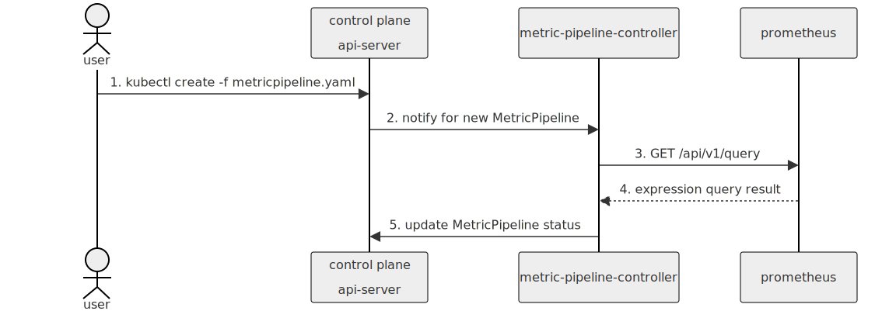
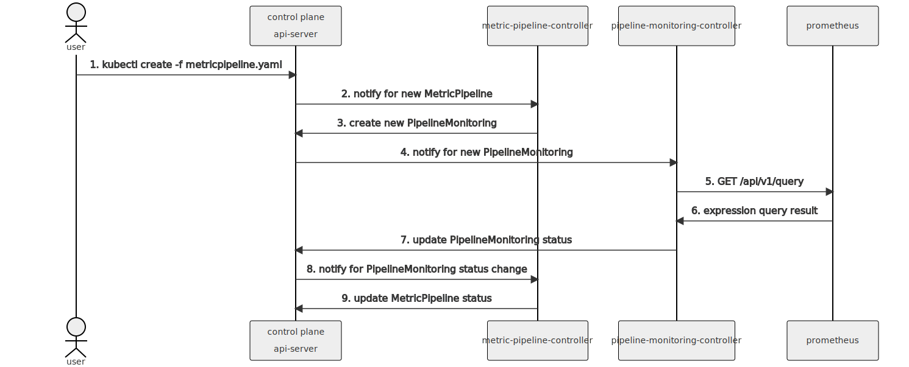
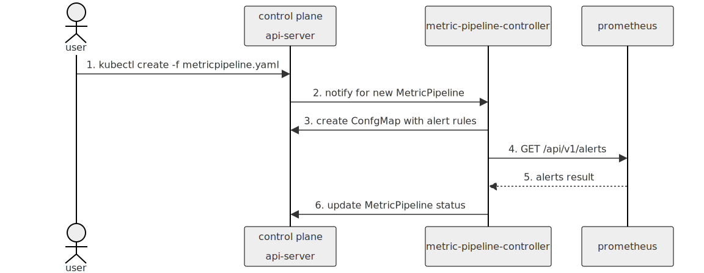

# 1. Trace/Metric Pipeline status based on OTel Collector metrics

Date: 2023-08-11

## Status

Proposed

## Context

The telemetry pipelines deploy active components to a cluster, and these components are responsible for dispatching data to third-party services.
Inevitably, interruptions can occur, potentially hindering the successful delivery of data. 
To enhance short-term resilience, we implement retries and buffering mechanisms. 
Nevertheless, there may be scenarios where data cannot be delivered, requiring user notification for prompt action.

The typical situations causing problems are:

* Connectivity problems with the third-party service.
* Backpressure or throttling due to overloading the third-party service.
* Reaching the ingestion limit of a pipeline, which may occur even with auto-scaling in place (subject to a maximum replica setting).

These situations can be monitored by collecting metrics from the relevant components, with [recently added documentation](https://github.com/kyma-project/telemetry-manager/pull/423) to guide the process. 
However, this approach can be cumbersome for users, as it requires them to identify which services to scrape and filter the relevant metrics. 
Additionally, these details delve into internal aspects that may undergo changes in the future.

### Goal

* Telemetry Manager handles the lifecycle of pipelines and should be the only entity responsible for interpreting the metrics generated by the components.
In the event of any problematic situation, Telemetry Manager should promptly report it by marking the pipeline and module status as a warning. This way, users can easily detect and address any issues.
* Additionally, we aim to make custom metrics accessible through a dedicated endpoint, providing users with only the pertinent metrics. This endpoint will be maintained over the long term, even as internal configurations may change.
* Another effective means of notifying users about problems is by emitting Kubernetes (k8s) events when a pipeline transitions into an unhealthy mode.

### Metric Analysis

We want to reflect telemetry delivery issues in the status of TracePipelines and MetricPipelines. To do this, we want to analyze metrics, provided by OTel Collectors using Prometheus text-based exposition format. Let's look at the following scenarios:

#### Direct Endpoint Scraping by Telemetry Manager (Without TSDB)

While direct endpoint scraping is the simplest approach and doesn't require Prometheus integration, it comes with a lot of limitations.
When scraping an endpoint, you receive one value per timestamp, which may suffice for gauges. However, even for commonly used query functions like rates, you would require multiple values aggregated over time.
Additionally, Prometheus automatically handles adjustments for breaks in monotonicity, such as counter resets resulting from target restarts. Manual scraping lacks this crucial feature.

#### Prometheus as a Sidecar

Now that we understand the necessity of using Prometheus for even basic metric analysis, let's explore how we can deploy it.
One deployment approach involves deploying Prometheus as a sidecar alongside Telemetry Manager.
This method remains lightweight, as it doesn't require any changes in the manager's code and can be easily achieved only using kustomize.
It also may ease security considerations since Prometheus and Telemetry Manager share the network namespace, so Prometheus can listen on localhost and no further NetworkPolicies, etc. are required.
However, this setup does come with its drawbacks:

* It relies on a static configuration with no room for parameterization, limiting flexibility. It also does not allow any kind of reconfiguration (scrape targets, metric whitelisting, etc.).
* Fine-tuning Prometheus dynamically based on the number of pipelines or other factors is not possible.
* Sidecar is deployed even when there are no pipelines, which may lead to unnecessary resource utilization.

#### Standalone Prometheus Deployment

An alternative approach would involve embedding Prometheus in the code of Telemetry Manager, similar to how we deploy Fluent Bit or Otel Collector.
This approach grants you complete control and maximum flexibility in managing Prometheus.
It's equally important to communicate to the end user that this internal Prometheus is intended exclusively for internal purposes and should not be utilized for monitoring user workloads.
Clear communication regarding its internal nature is crucial to avoid any misuses or misunderstandings.

### Integrating Prometheus Querying into Telemetry Manager Reconciliation Loop

#### Direct Prometheus Queries:
* Telemetry Manager manages a set of predefined PromQL queries and communicates with Prometheus using [expression queries API](https://prometheus.io/docs/prometheus/latest/querying/api/#expression-queries) to collect data points.
  Subsequently, it utilizes this data to evaluate the status of Pipeline CRs. 
* However, it's crucial to note that if the querying process takes an extended duration, it may impact the reconciliation of TracePipeline and MetricPipeline.

* Using [recording rules](https://prometheus.io/docs/prometheus/latest/configuration/recording_rules/) can improve query performance.

#### Prometheus Queries with Additional Controller:
* Similar to [Direct Prometheus Queries](#direct-prometheus-queries), but it addresses the potential challenge of long-running queries, which could hinder reconciliation by introducing a separate PipelineMonitoring CR with its own reconciliation loop.
  This separation effectively isolates the query execution and result storage from the TracePipeline and MetricPipeline controllers.
  It's worth noting that while this approach enhances efficiency, it can introduce increased complexity to the overall setup.

#### Prometheus Alerts:
* In this approach, PromQL expressions are defined as Prometheus alerts, with Prometheus responsible for their evaluation.
* Telemetry Manager leverages the [alerts API](https://prometheus.io/docs/prometheus/latest/querying/api/#alerts) to periodically retrieve information regarding active alerts.
* This method offers several advantages, including the avoidance of potentially long-running queries that can hinder reconciliation, as the evaluation is offloaded to Prometheus.
* Additionally, it provides better troubleshooting capabilities as Prometheus state can be observed using the dashboard.
* Prometheus can also push alerts, allowing Telemetry Manager to serve a webhook that, when called, triggers a reconciliation (see [channel watch](https://github.com/kubernetes-sigs/controller-runtime/blob/818a2e12a70c7a6d263edd180695e4448d2de823/pkg/source/example_test.go#L42))

## Decision

### Metric Analysis
Despite its inherent complexity, our preference leans toward running Prometheus as a standalone deployment. This approach offers the highest level of flexibility and ensures future-proofing, making it the most robust choice for our needs.
The following things have to be considered:
* To maintain security, we should make sure only Telemetry Manager can access Prometheus, and we can do this by deploying a NetworkPolicy.
* For cost-effectiveness, it's a good idea for Prometheus to use ephemeral storage.
* We only need to keep data for a short period, mainly focusing on current information and possibly the last few hours of historical data.

### Integrating Prometheus Querying into Telemetry Manager Reconciliation Loop

To make the right decision, we need to understand how querying Prometheus affects the time it takes for reconciliation. If it doesn't slow things down significantly (since we will use basic PromQL functions and deal with a small number of timeseries), we can go with [Direct Prometheus Queries](#direct-prometheus-queries).

However, if querying Prometheus does impact reconciliation, especially when using more complex queries, then [Prometheus Alerts](#prometheus-alerts) might be the better choice due to its simplicity.

Using [Prometheus Queries with Additional Controller](#prometheus-queries-with-additional-controller) might be an overcomplicated solution and might also create confusion for end users. This is because internal monitoring CRs would become visible to the end user, which could lead to unnecessary complexity and potential misunderstandings.

## Consequences

We can decide on how to implement [Integrating Prometheus Querying into Telemetry Manager Reconciliation Loop](#integrating-prometheus-querying-into-telemetry-manager-reconciliation-loop) by conducting a Proof of Concept (PoC). This involves running a load test with a significant number of OTel Collector replicas and various PromQL queries. The results from this testing will guide us in selecting the most suitable approach for our unique circumstances.
Future progress is tracked in https://github.com/kyma-project/telemetry-manager/issues/425.
