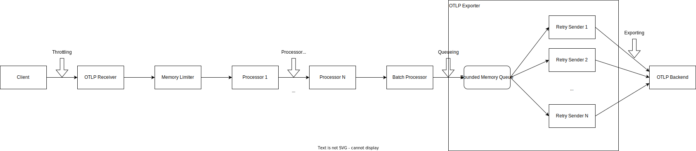

# 8. Telemetry Flow Health Status API

Date: 2024-15-02

## Status

Proposed

## Context: Key Events in the Telemetry Flow

As a follow-up of [ADR 003: Integrate Prometheus With Telemetry Manager Using Alerting](003-integrate-prometheus-with-telemetry-manager-using-alerting.md), let's define the Telemetry Health Status API for Trace and Metric Pipelines.

The Telemetry Health Status API should highlight significant events in the telemetry flow as status conditions. When issues occur, the customer must know where the problem lies.
Additionally, we should offer runbooks to help them in resolving these problems. The following diagram shows these key events:



### Throttling

* Currently, throttling can only be triggered by Memory Limiter (increase in `otelcol_receiver_refused_metric_points` and `otelcol_processor_refused_metric_points`).
There is a community discussion about incorporating a rate-limiting mechanism directly into the OTLP Receiver: https://github.com/open-telemetry/opentelemetry-collector/issues/6725.
* Throttling is often triggered by memory pressure from the exporter queue. However, during extreme traffic spikes, memory may exceed the soft limit even when the queue is empty.
* When throttling occurs, gRPC status code [Unavailable](https://grpc.github.io/grpc/core/md_doc_statuscodes.html) is returned to the client.
* Scaling may help if the backend is healthy, but could worsen things if not.

### Filter and Transform Processors Refusing Data

* Most failures are checked at startup (OTTL syntax), causing collector crashes. Errors may occur with specific functions like ParseJSON().
* When `error_mode == propagate`, the processor refuses data, and a signal goes back to the receiver for client error notification.
* This event is not relevant for us so far, because we neither use `error_mode == propagate` nor use OTTL functions that can cause errors.

### Exporter Queueing

* All batches are enqueued first.
* Queue fills up when consumers are slower than producers. It can be caused by backend issues or a mismatch between the ingestion and export rate (for example, backend is slow).
* If the exporter queue is full, data is dropped (`otelcol_exporter_enqueue_failed_metric_points` goes up).
* To watch for high queue size, use `otelcol_exporter_queue_size / otelcol_exporter_queue_capacity > THRESHOLD`.

### Exporter Retries

* For non-retryable errors, data is dropped.
* Retryable errors trigger retries until success or retry limit is reached, then data is dropped.
* For retryable and non-retryable errors: If data is dropped, `otelcol_exporter_send_failed_metric_points` is increased.
* If data is sent successfully, `otelcol_exporter_sent_metric_points` is increased.

## Decision

For the Telemetry Health Status API, we can choose between two alternatives:

* Using multiple condition types to represent various telemetry flow events (Throttling, Data Loss, High Buffer Utilization, etc.).
* Using a single condition type (`TelemetryFlowHealthy`) with a **reason** field to denote diverse telemetry flow events.

After careful consideration, we have opted for the single condition type `TelemetryFlowHealthy`, because it is easier to understand for the end user.
Ultimately, the user's primary concern is understanding whether the telemetry flow is functioning correctly. In case of any issues, the user can do the following:

* Troubleshoot the backend.
* Investigate backend connectivity.
* Reduce ingestion.
* Manually scale out the gateway (as long as no autoscaling capability is provided).

With a single condition type, the **reason** field can show a value that is most relevant for the user. We suggest the following values, ordered from most to least critical:
```
AllTelemetryDataDropped > SomeTelemetryDataDropped > BufferFillingUp > GatewayThrottling > Healthy
```

The reasons are based on the following alert rules (an example for Metric Pipelines; the actual PromQL expressions must be defined later):
| Alert Rule | Expression |
| --- | --- |
| GatewayExporterSentMetrics    | `sum(rate(otelcol_exporter_sent_metric_points{...}[5m])) > 0`           |
| GatewayExporterDroppedMetrics  | `sum(rate(otelcol_exporter_send_failed_metric_points{...}[5m])) > 0`    |
| GatewayReceiverRefusedMetrics  | `sum(rate(otelcol_receiver_refused_metric_points{...}[5m])) > 0`        |
| GatewayExporterEnqueueFailed   | `sum(rate(otelcol_exporter_enqueue_failed_metric_points{...}[5m])) > 0` |
| GatewayExporterQueueAlmostFull | `otelcol_exporter_queue_size / otelcol_exporter_queue_capacity > 0.8`   |                               |

Then, we map the alert rules to the reasons as follows:

| Reason | Alert Rules |
| --- | --- |
| AllTelemetryDataDropped           | **not** GatewayExporterSentMetrics **and** (GatewayExporterDroppedMetrics **or** GatewayExporterEnqueueFailed) |
| SomeTelemetryDataDropped          | GatewayExporterSentMetrics **and** (GatewayExporterDroppedMetrics **or** GatewayExporterEnqueueFailed)       |
| BufferFillingUp                   | GatewayExporterQueueAlmostFull                                                                           |
| GatewayThrottling                 | GatewayReceiverRefusedMetrics                                                                            |
| Healthy                           | **not** (GatewayExporterDroppedMetrics **or** GatewayExporterEnqueueFailed **or** HighBufferUtilization **or** GatewayReceiverRefusedMetrics) |

> **NOTE:** `BufferFillingUp` should not result in a negative condition status. This reason would be aggregated as warning in the Telemetry module status.
### Gateway/Agent Communication

The events mentioned above are about the Gateway Collector. Some other issues might happen with the Agent, like:
* Gateway can't be reached (network problem).
* Gateway won't accept data (gateway throttling).

In both cases, the Agent might drop data after too many retries. But because users usually can't do much about these issues, we won't include them in the `TelemetryFlowHealthy` condition.
If there's throttling, scaling horizontally might help, but it's not much different from dealing with a high OTLP ingestion rate.

In the future, we might think about adding a `TelemetryCollectionHealthy` condition for the Agent. This would help track issues like scraping problems by Prometheus Receiver.

## Consequences

The Telemetry Health Status API addresses possible obstacles in the telemetry flow. We can enhance the information in the message field and include a troubleshooting guide.

Looking ahead, as the OTel Collector evolves, we may introduce additional values for **reason**, as well as expose simplified custom metrics derived from OTel Collector metrics to the user.

