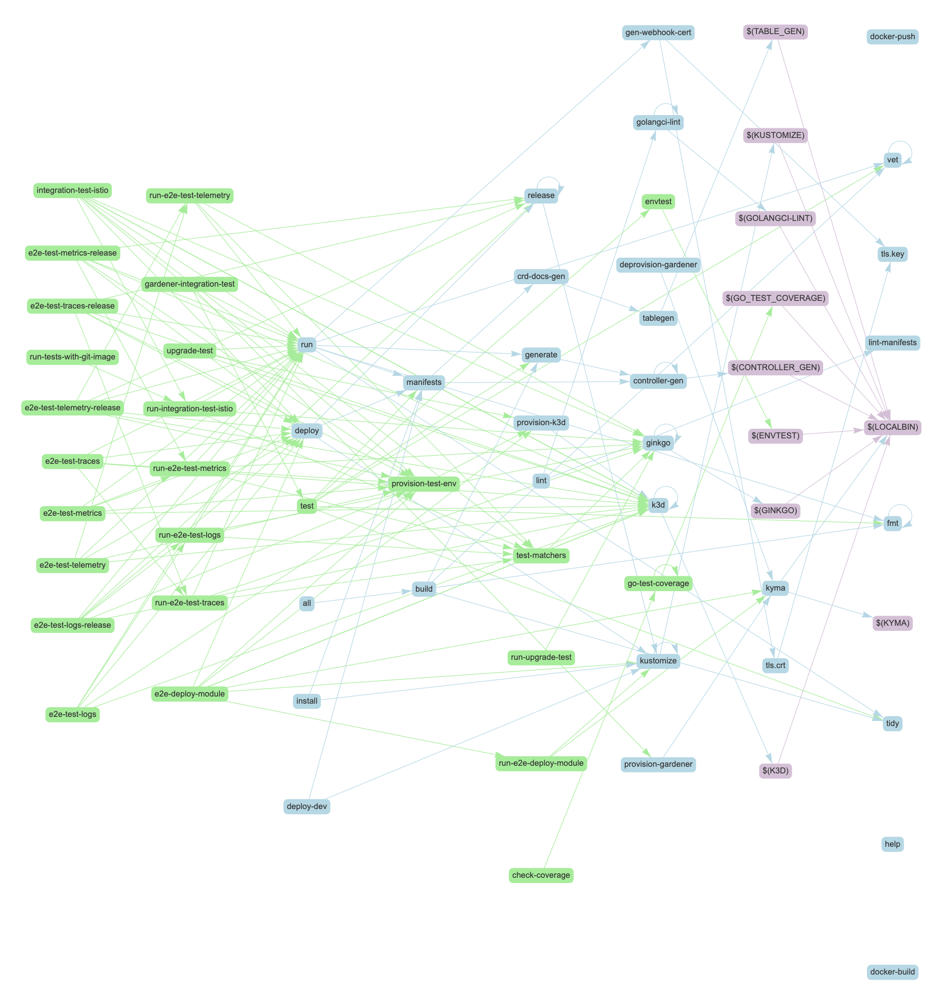
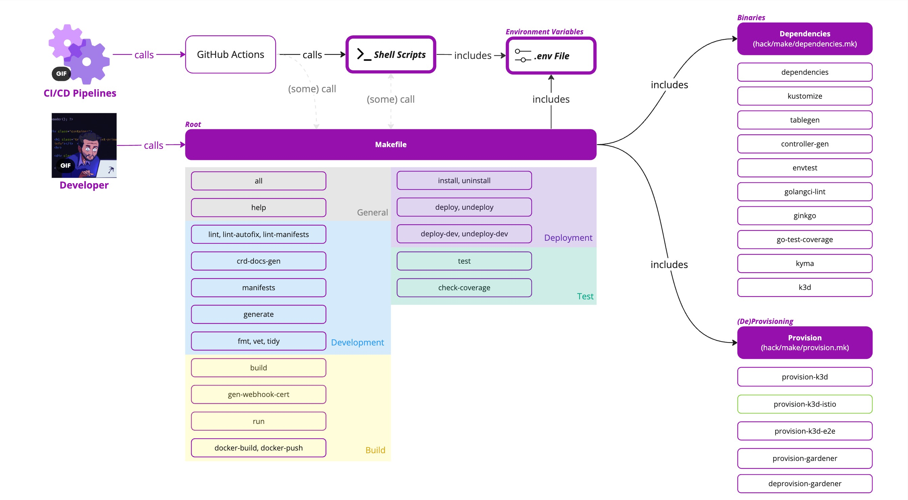
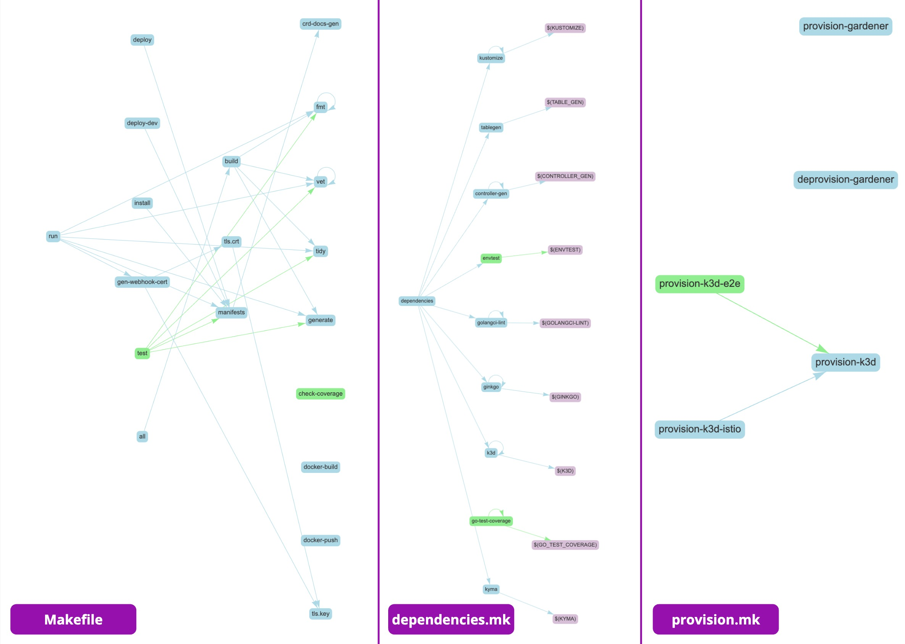

# 9. Makefile: Simplified Architecture

Date: 2024-28-02

## Status

Proposed

## Context: Cluttered Makefile Targets

Makefile targets are currently cluttered, unorganized, and redundant (see the dependency graph below). Targets are not parametrized, thus multiple make targets serve the same scope (for example, running e2e tests). Targets are also used simultaneously by developers and contributors, as well as within GitHub actions and shell scripts, which makes dependencies even more intertwined. These factors result in a complex environment that is becoming hard to manage by the developers.

## Decision

After analyzing repositories that have similar configurations as Telemetry Manager (such as Kubebuilder default configuration, Kyma modules repositories, and other Go repositories), the following decisions have been made:

1. Split general Makefile into sub-makefiles:
   - `Makefile`: root makefile, containing targets related to the development, building, deployment, and testing flow of the codebase. Includes `provision.mk` and `dependencies.mk`
   - `provision.mk`: contains all targets that (de-)provision a certain environment (such as k3d or Gardener).
   - `dependencies.mk`: contains all targets that install build dependencies (such as Kyma or Ginkgo).
2. Implement .env file that stores environment variables accessible from both makefiles and shell scripts:
   - This decision was both necessary as well as desired, because it mitigates the use of hardcoded variables (such as dependencies versions), and makes these variables accessible from both makefiles and shell scripts.
3. Remove redundant make targets (for example, e2e, upgrade, integration running targets):

   - Running tests targets (e2e, integration, upgrade): replaced with direct calls of the ginkgo CLI. [The Development Documentation](../development.md) has also been updated accordingly. Junit xml reports have also been dropped in the process.
   - Test matchers are now executed only before running the `make test` target for unit tests. Thus, the `test-matchers` target has been removed, and its logic moved directly into the `test` target. The matchers test has also been removed from other test jobs (because it was redundant).
   - Gardener integration tests: a separate shell script has been created for it, encapsulating both `gardener-integration-test` and `run-tests-with-git-image` make targets.
   - The `release` target logic was moved directly to the `release.sh` script, because that's the only place where this logic is needed.

4. Update GitHub actions and scripts that are influenced by the changes.

## Consequences

These decisions result in a simpler dependency graph (see the following image), as well as further separation of concerns and maintainability of the commands and operational flows.

