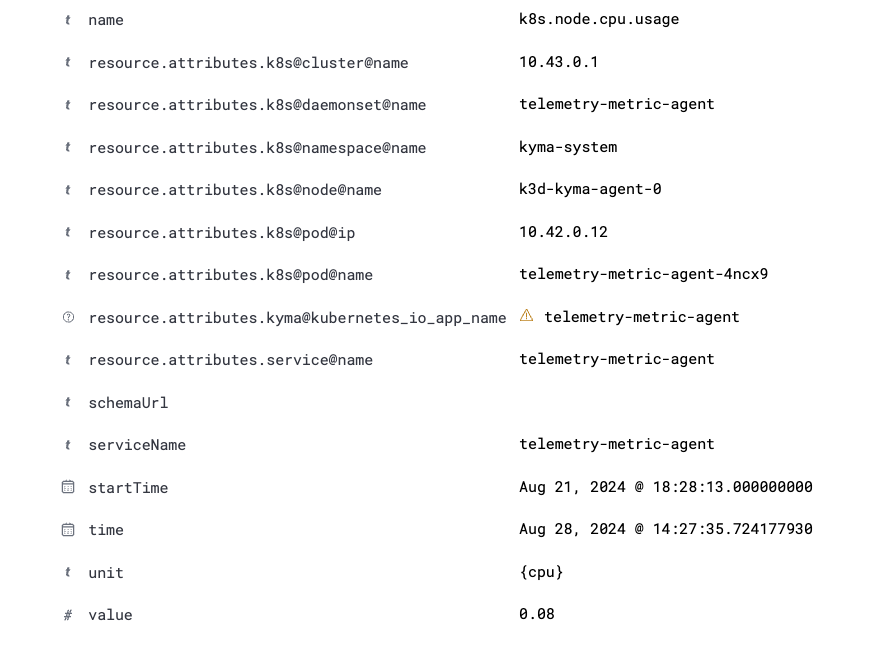

# 2. Resource Attributes Enrichment for Non-Workload Metrics

Date: 2024-08-30

## Status

Accepted

## Context

Currently, the [k8sattributes processor](https://github.com/open-telemetry/opentelemetry-collector-contrib/blob/main/processor/k8sattributesprocessor/README.md) is used in the Metric Gateway to enrich metrics resource attributes with Kubernetes metadata.
This is very useful for workload metrics (like Pod and container metrics). However, for non-workload metrics (like Node metrics), the metrics will be incorrectly associated with Metric Agent Pod, because the Metric Agent Pod is the one that emits these metrics.

For example, in the diagram shown below, the `k8s.node.cpu.usage` metric is incorrectly associated with the `telemetry-metric-agent-4ncx9` pod. This creates confusion, as the user might incorrectly think that this metric provides the amount of node CPU consumed by the `telemetry-metric-agent-4ncx9` pod. While in reality, it provides the entire node CPU usage.
In addition, the metrics from the system namespaces (including `kyma-system` namespace) are excluded by default. Thus, this metric is dropped by default even if the user enables the collection of Node metrics.

## Decision

There are different possible solutions to solve this problem:

**Option 1: Using connectors**

We can split our MetricPipeline into 3 sub-pipelines which are connected together using [Connectors](https://opentelemetry.io/docs/collector/building/connector/) as shown in the diagram above.
A `Receiver Pipeline` which contains the receivers components.
A `k8sattribute Processor Pipeline` which contains only the k8sattributes processor.
A `Processor + Exporter Pipeline` which contains the rest of the processors and the exporters. The metrics will be routed to the `k8sattribute Processor Pipeline` only if they are workload metrics.
Otherwise, the metrics will bypass the `k8sattribute Processor Pipeline` and will be routed directly to the `Processor + Exporter Pipeline`.

- <em>Pro</em>: Clean solution. The non-workload metrics will never have the unwanted resource attributes set to any value.
- <em>Con</em>: Complex setup.

**Option 2: Setting unwanted resource attributes with dummy values**

We can explicitly set the unwanted resource attributes with dummy values for non-workload metrics in the Metric Agent.
Then, we can delete all the resource attributes with dummy values in the Metric Gateway.

- <em>Pro</em>: If someone inspects the metrics emitted by the Metric Agent, it will be clear that the resource attributes with the dummy values are not desired.
- <em>Con</em>: If a user deploys his own OTel Collector and sends metrics to the Metric Gateway, then the unwanted resource attributes will not be deleted, as they will not have the dummy values.

**Option 3: Directly deleting unwanted resource attributes**

We can directly delete the unwanted resource attributes in the Metric Gateway after they have been incorrectly enriched by the k8sattributes processor.

- <em>Pro</em>: Simplest solution
- <em>Con</em>: If a user deploys his own OTel Collector and sends metrics to the Metric Gateway, he/she might be explicitly setting the resource attributes that we are deleting with custom values.

We have decided to adopt option 3 because it is the simplest solution and the probability that a customer deploys his own OTel Collector, sends metrics to the Metric Gateway and sets the resource attributes that we are deleting with custom values is low.

In addition, we will need to delete a different set of resource attributes for each non-workload metrics group.
Therefore, the logic for deleting the unwanted resource attributes will be complex and that is why we will implement a custom processor for this logic instead of using [Transform processors](https://github.com/open-telemetry/opentelemetry-collector-contrib/blob/main/processor/transformprocessor/README.md).

## Consequences

This change will ensure that non-workload metrics are not enriched with unwanted resource attributes in the Metric Gateway.
