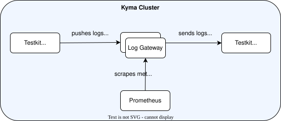
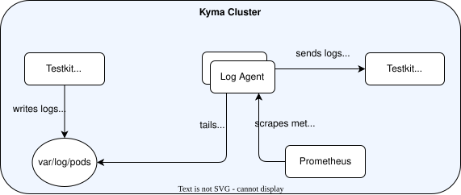

# 21. Refactor Performance Tests

## Context

Currently, [performance tests](../benchmarks/README.md) are written in bash which makes them hard to maintain. Our goal is to rewrite them in Golang so that they become easier to read, update and debug.

### Evaluation of the OpenTelemetry Collector Testbed

We evaluated using the `LoadGenerator` and `MockBackend` from the [OpenTelemetry Collector Testbed](https://github.com/open-telemetry/opentelemetry-collector-contrib/tree/main/testbed). We dockerized both components and ran them as pods in a Kubernetes cluster to test the Log Gateway and Log Agent.

The main advantage is that the testbed exposes the exact number of data items sent and received as a Prometheus metric, enabling precise validation.

The main disadvantages are:
- No built-in `DataSender` writes logs to stdout, which is required for the Log Agent. A custom implementation is needed.
- The mock backend receiver listens on `127.0.0.1:4317` (hardcoded), so the source must be copied and patched to listen on `0.0.0.0:4317` for use in Kubernetes.
- Any upstream API change in the testbed requires rebuilding custom images.

The extra precision from the testbed is not worth the maintenance overhead. We use the already existing components from our [e2e testkit](../../../test/testkit/) instead.

## Decision

- Rewrite the existing performance tests in Golang.
- Use the already existing components from our [e2e testkit](../../../test/testkit/).
- Add tests for the new Log Gateway and Log Agent. They will have similar test cases as the existing ones for Metric Gateway and Metric Agent. The setup for testing the Log Gateway and Log Agent is shown respectively in the following diagrams:

- For testing the Log Agent, it would be better to use a JSON log generator in which we can add custom attributes. This will allow us to test the performance of the [operators](https://github.com/open-telemetry/opentelemetry-collector-contrib/tree/main/receiver/filelogreceiver#operators) we use in the filelog receiver in the Log Agent. To find the operators currently used, see the [golden test files](https://github.com/kyma-project/telemetry-manager/blob/main/internal/otelcollector/config/logagent/testdata) for the Log Agent.  
