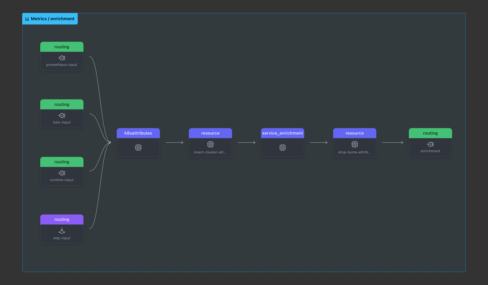
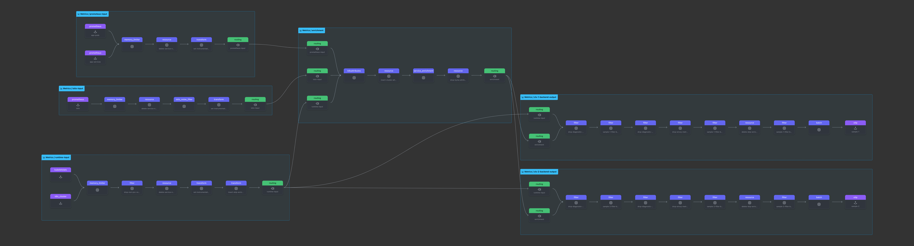
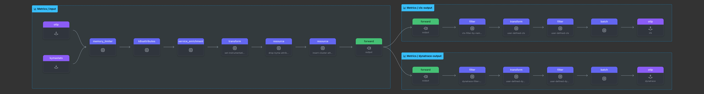

# 21. Decouple MetricPipeline Agent from Gateway

Date: 2025-07-10

## Status

Proposed

## Context

The current Telemetry module architecture defines a metric pipeline which would deploy a gateway and an agent. The gateway receives metrics data from applications and metric agents, enriches it, and dispatches it to the backend.
The agent should be decoupled from the gateway and run as a standalone component (see [Switch from Gateways to a Central Agent](019-switch-from-gateways-to-a-central-agent.md)).

In the current setup, the gateway enriches and filters data on behalf of the metric agents. Most of the enrichments are common across all inputs, such as Kubernetes metadata enrichment, but some enrichments are input-specific, such as Istio or runtime enrichments.
The current architecture requires complex cross-input filtering in multi-pipeline scenarios, which is not efficient and leads to configuration complexity.

## Proposal

The decoupling of the agent from the gateway can be done based on receiver type or input type.

- **Receiver type**: This approach would require a separate enrichment and output stage for each receiver type. This lead to unnecessary duplication of components as they share the same data path and thus increasing configuration complexity.
- **Input type**: This approach, for all metric pipelines
  - It Would define a single input stage for the input type OTLP, Prometheus, Istio, or Runtime.
  - It would define a single enrichment stage for all inputs.
 
It would define a dedicated output stage for each MetricPipeline. The connections between all those stages performed with `routing` processors. The enrichment pipeline will be shared across all inputs and outputs, allowing for maximum reuse of components.

The new agent pipeline configuration is built in three stages:

1. **Input**: Defines input-specific pipeline configurations, including input-specific receivers, processors, and an input-specific router to connect to the next stages.
2. **Enrichment**: Defines enrichment-specific pipeline configurations, including enrichment-specific processors and a router to connect to the next stages.
3. **Output**: Defines output for a specific MetricPipeline configurations, including processors and exporters (such as namespace filtering).

The input stage exists for each defined input type once (such as Prometheus, Istio, or Runtime) and shared across all MetricPipelines.
The enrichment stage is shared across all inputs, while the output stage is a MetricPipeline and configured backend specific.
The new configuration focuses on maximum reuse of components to conserve resources and maintain simplicity.

This approach offers the benefit that most components are reused rather than redundantly defined, which reduces both the configuration complexity and the number of components running in the collector. This allows us to avoid complex cross-pipeline filtering in multi-pipeline scenarios, such as dropping input-specific metrics.

See a [sample configuration for the new agent](./../assets/sample-metric-agent-config.yaml).

The metric gateway, like the agent, will also be built in three stages:
1. **Input**: Defines OTLP-input-specific pipeline configuration, and performs enrichment.
2. **Enrichment**: Defines enrichment-specific pipeline configurations, including enrichment-specific processors and a router to connect to the next stages.
3. **Output**: Defines output for a specific MetricPipeline configuration, performs MetricPipeline specific namespace filtering, and export the data.

The gateway will be simplified to support only the OTLP receiver and OTLP exporter. It will handle enrichment and filtering exclusively for OTLP input. An exception is the `kymastats` receiver, which will remain on the gateway for now. That's because, unlike other receivers on the agents, it does not collect data from node-specific resources.

See a [sample configuration for the new gateway](./../assets/sample-metric-gateway-config.yaml).

## Conclusion

1. The new MetricPipeline configuration architecture is split into three stages: input, enrichment, and output. This approach allows for a clear separation of concerns and simplifies the configuration.
2. The input stage is defined for each input type, allowing for input-specific processing. The input pipeline configurations are grouped by input type rather than by receiver type, because all receivers in the same input type share the same enrichment and output stages. Creating a separate input stage for each receiver type would lead to unnecessary duplication of components and configuration complexity.
3. The enrichment stage is shared across all inputs and outputs, allowing for maximum reuse of components and resource efficiency, otherwise, especially in multi-pipeline scenarios the `k8sattribute` processor will have own resource cache per data pipeline which can result high memory usage.
4. The output stage is MetricPipeline specific, allowing for instance-specific enrichment, filtering, and data export.
5. In multi-pipeline scenarios, each receiver appears only once per input type and processes a combined data stream. Filtering is performed at the output stage to ensure only relevant data is exported.
6. In multi-pipeline scenarios, cross-MetricPipeline filtering is no longer needed, as each MetricPipeline has its own pipeline output configuration.

