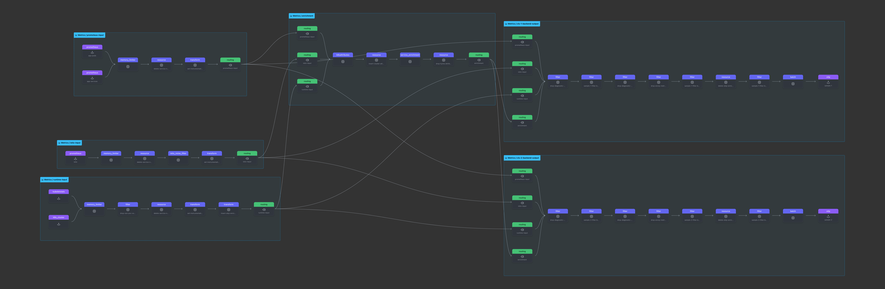

# 21. Decouple Metric Pipeline Agent from Gateway

Date: 2025-07-10

## Status

Proposed

## Context

The current Telemetry module architecture defines a metric pipeline composed of a gateway and an agent. The gateway is responsible for receiving metrics data from applications as well as agents, enriching it, and dispatching it to the backend.
The agent should be decoupled from the gateway and run as a standalone component (see [Switch from Gateways to a Central Agent](019-switch-from-gateways-to-a-central-agent.md)).

## Proposal

In the current setup, the gateway also performs enrichment and filtering tasks on behalf of the agents. Most of the enrichments are common across all inputs, such as Kubernetes metadata enrichment, but some enrichments are input-specific, such as Istio or Runtime enrichments. 
The current architecture requires complex cross-input filtering, which is not efficient and leads to configuration complexity.

The first step would be to decouple common enrichment components and move to the new pipeline configuration which can be used from any kind of input and output pipeline. The connections to and from the enrichment pipeline are performed via `routing` processors. The enrichment pipeline will be shared across all inputs and outputs, allowing for maximum reuse of components.

The new agent pipeline configuration is built on three stages:

1. **Input**: Defines input-specific pipeline configurations, including input-specific receivers, processors, and an input-specific router to connect to the next stages.
2. **Enrichment**: Defines enrichment-specific pipeline configurations, including enrichment-specific processors and a router to connect to the next stages.
3. **Output**: Defines instance-specific pipeline configurations, including processors and exporters (e.g., for namespace filtering).

The input stage exists for each defined input type (e.g., Prometheus, Istio, or Runtime). The enrichment stage is shared across all inputs, while the output stage is instance-specific.
The new configuration focuses on maximum reuse of components to conserve resources and maintain simplicity.

This approach offers the benefit that most components are reused rather than redundantly defined, which reduces both the configuration complexity and the number of components running in the collector. This allows us to avoid complex cross-pipeline filtering in multi-pipeline scenarios, such as dropping input-specific metrics.

A sample configuration for the new agent is [here](./../assets/sample-metric-agent-config.yaml).

The metric gateway, like the agent, will also be built on three stages:
1. **Input**: Defines OTLP-input-specific pipeline configuration, and performs enrichment.
2. **Enrichment**: Defines enrichment-specific pipeline configurations, including enrichment-specific processors and a router to connect to the next stages.
3. **Output**: Defines output-specific pipeline configuration, performs instance-specific namespace filtering, and export the data.

The gateway will be simplified to support only the OTLP receiver and OTLP exporter. It will handle enrichment and filtering exclusively for OTLP input. An exception is the `kymastats` receiver, which will remain on the gateway for now because, unlike other receivers on the agents, it does not collect data from node-specific resources.

A sample configuration for the new gateway is [here](./../assets/sample-metric-gateway-config.yaml).

## Conclusion

1. The new metric pipeline configuration architecture split into three stages: input, enrichment, and output.
2. The input stage is defined for each input type, allowing for input-specific processing. The input pipeline configurations are grouped by input type rather than by receiver type since all receivers in the same input type share the same enrichment and output stages.
3. The enrichment stage is shared across all inputs and outputs, allowing for maximum reuse of components and resource efficiency.
4. The output stage is instance-specific, allowing for instance-specific enrichment, filtering, and data export.
5. In multi-pipeline scenarios, each receiver appears only once per input type and processes a combined data stream. Filtering is performed at the output stage to ensure only relevant data is exported.
6. Cross-input filtering is no longer needed, as each instance has its own pipeline output configuration.

