# Configurable Collection Interval for Metric Pipelines

## Context and Problem Statement

The metric agent's receivers (kubeletstats, k8s_cluster, Prometheus scraper for app Pods/Services, and Istio proxy scraper) currently use a hardcoded collection/scrape interval of 30 seconds. While 30 seconds is a reasonable default, users have requested the ability to customize this interval per input type (see [#3125](https://github.com/kyma-project/telemetry-manager/issues/3125)).

Increasing the collection interval (for example, from 30s to 60s) can significantly reduce the amount of metric data produced. This directly lowers storage costs at the backend (for example, SAP Cloud Logging), particularly for high-volume inputs like runtime metrics. In one reported case, runtime metrics accounted for more than 90% of total metrics volume.

### Current Architecture: Shared Receivers

Today, the metric agent uses **one shared receiver per input type** across all MetricPipeline CRs. The config builder merges all active pipelines and creates a single input pipeline per source:



Because receivers are shared, all pipelines that enable the same input type must use the same collection interval. Different pipelines cannot independently set different intervals for the same receiver.

This shared model is intentional: running multiple scraping receivers of the same type (for example, two kubeletstats receivers with different intervals) would cause duplicated metric collection, increasing resource consumption on the agent and the kubelet/API server.

## Proposed Solution

### Step 1: Global Collection Interval in the Telemetry CR

Add collection interval configuration to the `MetricSpec` in the Telemetry CR. This provides a cluster-wide default for all pull-based inputs (Runtime, Prometheus, Istio), with optional per-input overrides. 

**API changes to the Telemetry CR:**

```yaml
apiVersion: operator.kyma-project.io/v1beta1
kind: Telemetry
metadata:
  name: default
spec:
  metric:
    gateway:
      scaling:
        type: Static
        static:
          replicas: 2
    # New fields
    collectionInterval: 60s    # applies to all pull-based inputs (runtime, prometheus, istio)
    runtime:
      collectionInterval: 120s # optional: override for runtime input only
    prometheus:
      collectionInterval: 30s  # optional: override for prometheus input only
    istio:
      collectionInterval: 45s  # optional: override for istio input only
```

**Precedence:**

1. Input-specific override in the Telemetry CR (for example, `metric.runtime.collectionInterval`) — highest priority
2. `metric.collectionInterval` in the Telemetry CR
3. Hardcoded default of `30s`



### Step 2: Per-MetricPipeline Collection Interval Override

In a future iteration, add a `collectionInterval` field to each pull-based input type in the MetricPipeline spec. This provides per-pipeline granularity, overriding the Telemetry CR value.

As a consequence, a separate scrape loop must be introduced for each unique collection interval. This means the same metrics are collected multiple times, which increases memory consumption on the agent.

**API changes to MetricPipeline:**

```yaml
apiVersion: telemetry.kyma-project.io/v1beta1
kind: MetricPipeline
metadata:
  name: production
spec:
  input:
    runtime:
      enabled: true
      collectionInterval: 120s   # overrides Telemetry CR value for this input
    prometheus:
      enabled: true
      # inherits from Telemetry CR
    istio:
      enabled: true
      collectionInterval: 60s    # overrides Telemetry CR value for this input
  output:
    otlp:
      endpoint:
        value: https://backend.example.com:4317
```

**Precedence (with Step 2):**

1. Input-level `collectionInterval` in MetricPipeline (highest priority)
2. Input-specific override in the Telemetry CR (for example, `metric.runtime.collectionInterval`)
3. `metric.collectionInterval` in the Telemetry CR
4. Hardcoded default of `30s`

## Decision

We implement both steps sequentially:

1. **Step 1** adds collection interval configuration to the Telemetry CR. This addresses the core feature request from [#3125](https://github.com/kyma-project/telemetry-manager/issues/3125) with minimal changes. 
2. **Step 2** adds per-MetricPipeline overrides after Step 1 is validated in production. 

## Consequences

### Positive Consequences

- Users can reduce metric volume and storage costs by increasing collection intervals.
- The approach is backwards-compatible because all new fields are optional with defaults.
- The implementation for Step 1 is minimal: the interval flows through the existing `BuildOptions` plumbing, and receiver functions only need to accept a parameter instead of using hardcoded constants.

### Negative Consequences

- Step 1 does not provide per-pipeline granularity. All pipelines sharing an input type use the same interval from the Telemetry CR.
- Step 2 increases memory consumption since the same metrics now have to be collected multiple times.
