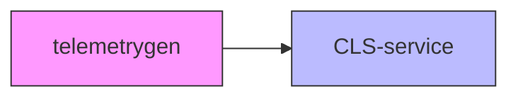

# Cluster Setup

Nodes:
- Type: beta.kubernetes.io/instance-type=n2-standard-8
- Count 10
- Memory: 32GB / node
- CPU: 8 Cores / node

### node details
```sh
➜ k get node -owide
NAME                                                     STATUS   ROLES    AGE   VERSION   INTERNAL-IP   EXTERNAL-IP   OS-IMAGE              KERNEL-VERSION       CONTAINER-RUNTIME
shoot--kyma-stage--d7ca774-cpu-worker-0-z1-68d7b-knt9m   Ready    <none>   22h   v1.31.7   10.250.0.13   <none>        Garden Linux 1592.8   6.6.84-cloud-amd64   containerd://1.7.23
shoot--kyma-stage--d7ca774-cpu-worker-0-z1-68d7b-mkklm   Ready    <none>   22h   v1.31.7   10.250.0.11   <none>        Garden Linux 1592.8   6.6.84-cloud-amd64   containerd://1.7.23
shoot--kyma-stage--d7ca774-cpu-worker-0-z1-68d7b-pf8lj   Ready    <none>   23h   v1.31.7   10.250.0.8    <none>        Garden Linux 1592.8   6.6.84-cloud-amd64   containerd://1.7.23
shoot--kyma-stage--d7ca774-cpu-worker-0-z1-68d7b-vvdtj   Ready    <none>   23h   v1.31.7   10.250.0.6    <none>        Garden Linux 1592.8   6.6.84-cloud-amd64   containerd://1.7.23
shoot--kyma-stage--d7ca774-cpu-worker-0-z2-68f79-bsvpx   Ready    <none>   23h   v1.31.7   10.250.0.5    <none>        Garden Linux 1592.8   6.6.84-cloud-amd64   containerd://1.7.23
shoot--kyma-stage--d7ca774-cpu-worker-0-z2-68f79-gq4qb   Ready    <none>   22h   v1.31.7   10.250.0.14   <none>        Garden Linux 1592.8   6.6.84-cloud-amd64   containerd://1.7.23
shoot--kyma-stage--d7ca774-cpu-worker-0-z2-68f79-nfbsp   Ready    <none>   23h   v1.31.7   10.250.0.9    <none>        Garden Linux 1592.8   6.6.84-cloud-amd64   containerd://1.7.23
shoot--kyma-stage--d7ca774-cpu-worker-0-z3-5dc4c-jwm6j   Ready    <none>   22h   v1.31.7   10.250.0.10   <none>        Garden Linux 1592.8   6.6.84-cloud-amd64   containerd://1.7.23
shoot--kyma-stage--d7ca774-cpu-worker-0-z3-5dc4c-mz8zd   Ready    <none>   23h   v1.31.7   10.250.0.7    <none>        Garden Linux 1592.8   6.6.84-cloud-amd64   containerd://1.7.23
shoot--kyma-stage--d7ca774-cpu-worker-0-z3-5dc4c-rnq2f   Ready    <none>   22h   v1.31.7   10.250.0.12   <none>        Garden Linux 1592.8   6.6.84-cloud-amd64   containerd://1.7.23
```

### cluster details
```sh
Client Version: v1.33.0
Kustomize Version: v5.6.0
Server Version: v1.31.7
WARNING: version difference between client (1.33) and server (1.31) exceeds the supported minor version skew of +/-1
```

### Log Pipeline

The test uses a basic LogPipeline with an enabled OTLP input and a default output to CLS:

[log-pipeline configuration](assets/otel-input.yaml)


# Goal

Validate if a default Telemetry module deployment can saturate one CLS-Instance (large).
Large instances support up to 30.000 logs per second if the logs are ingested using [OTLP](https://pages.github.tools.sap/perfx/cloud-logging-service/plans-and-prices/#storage-limitations).

# Direct Setup

The following setup establishes a baseline for the performance of telemetry gen. CLS is used as a sink for the logs generated by telemetry gen.

Log generation:
- Payload: ~2k (plus metadata)
- [telemetry-gen configuration](assets/telemetry-gen-direct-to-cls.yml)



(unit: logs per second)

| **workers ↓ / replicas →** | 1      | 5       | 10      |
| -------------------------- | ------ | ------- | ------- |
| **1**                      | ~475   | ~2.260  | ~4.600  |
| **5**                      | ~2.300 | ~11.600 | ~22.600 |
| **10**                     | ~4.500 | ~22.500 | ~43.600 |

## Result
To achieve more than 30000 logs per second, 10 replicas with 10 workers each are required.


# Telemetry Module Setup

The following setup measures the performance of the Telemetry module. CLS is used as a sink in the configured LogPipeline. The Telemetry module is configured to use the OTLP input. During the test, we scale the number of replicas of the telemetry-log-gateway to measure the performance of the Telemetry module.

Log generation:
- Payload: ~2k (plus metadata)
- Workers: 10
- Replicas: 10
- [telemetry-gen configuration](assets/telemetry-gen-using-log-pipeline.yaml)


| Gateway Replicas | Throughput Msg / s | Enqueue failed Msg / s | Memory per instance (MB) | CPU per instance | Bytes transmitted (MB/s) | Bytes received (MB/s) | istio Memory | istio cpu |
| ---------------- | ------------------ | ---------------------- | ------------------------ | ---------------- | ------------------------ | --------------------- | ------------ | --------- |
| 2                | 12.200             |                        | 100                      | 1,2              | 1,54                     | 28,6                  | 60           | 0,99      |
| 4                | 20.600             |                        | 110                      | 1,1              | 3,6                      | 48,0                  | 55           | 0,99      |
| 8                | 22.000             | 5.000                  | 1100                     | 0,9              | 6,2                      | 70,0                  | 56           | 0,99      |
|                  |                    |                        |                          |                  |                          |                       |              |           |

# Modified Telemetry Module Setup

The following setup measures the performance of the Telemetry module. CLS is used as a sink in the configured LogPipeline. The Telemetry module is configured to use the OTLP input. During the test, we keep the number of replicas of the telemetry-log-gateway constant and increase the CPU limits of the Istio sidecar.

Log generation:
- Payload: ~2k (plus metadata)
- Workers: 10
- Replicas: 10
-  [telemetry-gen configuration](assets/telemetry-gen-using-log-pipeline.yaml)


Istio CPU limits are increased using the `sidecar.istio.io/proxyCPULimit: "<limits>"` annotation.

Gateway Replicas: 2

| Istio Limits                                 | Throughput Msg / s | Enqueue failed Msg / s | Memory per instance (MB) | CPU per instance | Bytes transmitted (MB/s) | Bytes received (MB/s) | istio Memory | istio cpu |
| -------------------------------------------- | ------------------ | ---------------------- | ------------------------ | ---------------- | ------------------------ | --------------------- | ------------ | --------- |
| 1                                            | 12.200             |                        | 100                      | 1,2              | 1,54                     | 28,6                  | 60           | 0,99      |
| 2                                            | 20.000             |                        | 220                      | 2,2              | 2,70                     | 46,4                  | 60           | 1,7       |
| 3                                            | ~21.000            | ~1.600                 | 1.200                    | 2,5              | 3,4                      | 56,3                  | 60           | 2,5       |
| unlimited (`sidecar.istio.io/proxyCPU: "2"`) | ~21.000            | ~3.500                 | 1.000                    | 2,7              | 3,5                      | 56,0                  | 67           | 3,4       |

# Results

The tested CLS instance can to handle ~20.000 log records per second.
This performance is achieved with 2 replicas of the telemetry-log-gateway and Istio sidecar with CPU limits increased to 2.0.
Similar performance can be achieved with 4 replicas of the telemetry-log-gateway and no increased Istio sidecar CPU limits.

Higher numbers of generated logs lead to enqueuing issues on the log-gateway side. This is caused by CLS rejecting the logs.
