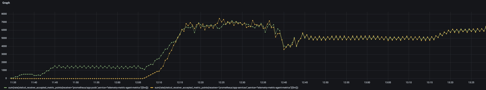
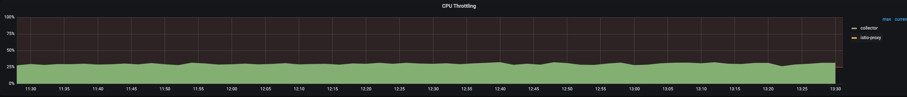
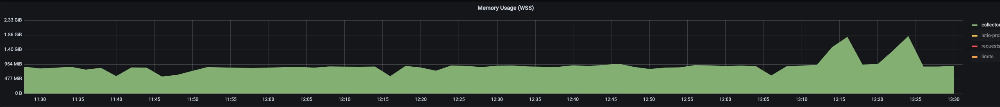

# Hardened Metric Agent setup

The aim of this exercise is to harden the metric agent so that it can satisfy the metric load of most of the use cases.

## Setup

For the test environment following things were considered:
- Provision a GCP cluster with Kubernetes (n2-standard-16)
- Deploy Telemetry operator using `make deploy-dev`
- Deploy Prometheus to visualize the metrics
- Deploy Istio deployment (needed for Prometheus)
- Machine types n2-standard-16 (16 CPU, 64Gi memory), Gardener supports max 100 pods per node

Install monitoring and istio
```unix
kyma deploy -s main --component istio --component monitoring
```

alternatively istio CRDS can be installed from [here](https://github.com/istio/api/blob/master/kubernetes/customresourcedefinitions.gen.yaml) and only monitoring stack can be installed

- [Avalanche prometheus metric load generator](https://blog.freshtracks.io/load-testing-prometheus-metric-ingestion-5b878711711c)

Config map of the metrics agent
```yaml
apiVersion: v1
data:
  relay.conf: |
    extensions:
        health_check:
            endpoint: ${MY_POD_IP}:13133
    service:
        pipelines:
            metrics/prometheus:
                receivers:
                    - prometheus/app-pods
                processors:
                    - memory_limiter
                    - resource/delete-service-name
                    - resource/insert-input-source-prometheus
                    - batch
                exporters:
                    - otlp
        telemetry:
            metrics:
                address: ${MY_POD_IP}:8888
            logs:
                level: info
        extensions:
            - health_check
    receivers:
        prometheus/app-pods:
            config:
                scrape_configs:
                    - job_name: app-pods
                      scrape_interval: 30s
                      relabel_configs:
                        - source_labels: [__meta_kubernetes_pod_node_name]
                          regex: $MY_NODE_NAME
                          action: keep
                        - source_labels: [__meta_kubernetes_pod_annotation_prometheus_io_scrape]
                          regex: "true"
                          action: keep
                        - source_labels: [__meta_kubernetes_pod_phase]
                          regex: Pending|Succeeded|Failed
                          action: drop
                        - source_labels: [__meta_kubernetes_pod_container_init]
                          regex: (true)
                          action: drop
                        - source_labels: [__meta_kubernetes_pod_container_name]
                          regex: (istio-proxy)
                          action: drop
                        - source_labels: [__meta_kubernetes_pod_label_security_istio_io_tlsMode]
                          regex: (istio)
                          target_label: __scheme__
                          replacement: https
                          action: replace
                        - source_labels: [__meta_kubernetes_pod_annotation_prometheus_io_scheme]
                          regex: (https?)
                          target_label: __scheme__
                          action: replace
                        - source_labels: [__scheme__]
                          regex: (https)
                          action: drop
                        - source_labels: [__meta_kubernetes_pod_annotation_prometheus_io_path]
                          regex: (.+)
                          target_label: __metrics_path__
                          action: replace
                        - source_labels: [__address__, __meta_kubernetes_pod_annotation_prometheus_io_port]
                          regex: ([^:]+)(?::\d+)?;(\d+)
                          target_label: __address__
                          replacement: $$1:$$2
                          action: replace
                      kubernetes_sd_configs:
                        - role: pod
        prometheus/app-services:
            config:
                scrape_configs:
                    - job_name: app-services
                      scrape_interval: 30s
                      relabel_configs:
                        - source_labels: [__meta_kubernetes_endpoint_node_name]
                          regex: $MY_NODE_NAME
                          action: keep
                        - source_labels: [__meta_kubernetes_service_annotation_prometheus_io_scrape]
                          regex: "true"
                          action: keep
                        - source_labels: [__meta_kubernetes_pod_phase]
                          regex: Pending|Succeeded|Failed
                          action: drop
                        - source_labels: [__meta_kubernetes_pod_container_init]
                          regex: (true)
                          action: drop
                        - source_labels: [__meta_kubernetes_pod_container_name]
                          regex: (istio-proxy)
                          action: drop
                        - source_labels: [__meta_kubernetes_pod_label_security_istio_io_tlsMode]
                          regex: (istio)
                          target_label: __scheme__
                          replacement: https
                          action: replace
                        - source_labels: [__meta_kubernetes_service_annotation_prometheus_io_scheme]
                          regex: (https?)
                          target_label: __scheme__
                          action: replace
                        - source_labels: [__scheme__]
                          regex: (https)
                          action: drop
                        - source_labels: [__meta_kubernetes_service_annotation_prometheus_io_path]
                          regex: (.+)
                          target_label: __metrics_path__
                          action: replace
                        - source_labels: [__address__, __meta_kubernetes_service_annotation_prometheus_io_port]
                          regex: ([^:]+)(?::\d+)?;(\d+)
                          target_label: __address__
                          replacement: $$1:$$2
                          action: replace
                        - source_labels: [__meta_kubernetes_service_name]
                          target_label: service
                          action: replace
                      kubernetes_sd_configs:
                        - role: endpoints
    processors:
        batch:
            send_batch_size: 1024
            timeout: 10s
            send_batch_max_size: 1024
        memory_limiter:
            check_interval: 0.5s
            limit_percentage: 85
            spike_limit_percentage: 10
        resource/delete-service-name:
            attributes:
                - action: delete
                  key: service.name
        resource/insert-input-source-runtime:
            attributes:
                - action: insert
                  key: kyma.source
                  value: runtime
        resource/insert-input-source-prometheus:
            attributes:
                - action: insert
                  key: kyma.source
                  value: prometheus
    exporters:
        otlp:
            endpoint: telemetry-otlp-metrics.kyma-system.svc.cluster.local:4317
            tls:
                insecure: true
            sending_queue:
                enabled: true
                queue_size: 512
            retry_on_failure:
                enabled: true
                initial_interval: 5s
                max_interval: 30s
                max_elapsed_time: 300s
kind: ConfigMap
metadata:
  labels:
    app.kubernetes.io/name: telemetry-metric-agent
  name: telemetry-metric-agent
  namespace: kyma-system
  ownerReferences:
  - apiVersion: telemetry.kyma-project.io/v1alpha1
    kind: MetricPipeline
    name: metricpipeline-sample
```
Configuration changes needed for metrics agent
```yaml
    processors:
        batch:
            send_batch_size: 1024
            timeout: 10s
            send_batch_max_size: 1024
        memory_limiter:
            check_interval: 0.5s
            limit_percentage: 85
            spike_limit_percentage: 10
```

Avalanche load generator deployment
```yaml
apiVersion: apps/v1
kind: Deployment
metadata:
  name: avalanche-metric-load-generator
spec:      
  selector:
    matchLabels:
      app: avalanche-metric-load-generator
  template:
    metadata:
      labels:
        app: avalanche-metric-load-generator
      annotations:
        prometheus.io/path: /metrics
        prometheus.io/port: "8080"
        prometheus.io/scrape: "true"
    spec:
      containers:
      - name: avalanche-metric-load-generator
        image: quay.io/freshtracks.io/avalanche
        imagePullPolicy: IfNotPresent
        args:
        - --metric-count=500
        - --series-count=20
        - --port=8080
        resources:
          limits:
            memory: "128Mi"
            cpu: "200m"
        ports:
        - containerPort: 8080
          protocol: TCP
          name: metrics
```

Service for metric agent metrics
```yaml
apiVersion: v1
kind: Service
metadata:
  annotations:
    prometheus.io/port: "8888"
    prometheus.io/scrape: "true"
    prometheus.io/scheme: "http"
  labels:
    app.kubernetes.io/name: telemetry-metric-agent
  name: telemetry-metric-agent-metrics
  namespace: kyma-system
spec:
  clusterIP: None
  ports:
  - name: http-metrics
    port: 8888
    protocol: TCP
    targetPort: 8888
  selector:
    app.kubernetes.io/name: telemetry-metric-agent
  sessionAffinity: None
  type: ClusterIP
```

## Testcases

### Assumptions

We tweak metrics and series value with 10 labels in each metric data point. The test is executed for 1 hour to have a stabilized output. Additionally, the load is scaled slowly to prevent spikes which might cause OOMs of metric agent.

We identified the following test cases:
1. Multiple pods all running on a single node and export metrics (to find how many workloads supported)
2. Workload generating huge amount of metrics (To understand how scraping works when the workload exposes several MB of metrics)
3. Have multiple workloads across different nodes (To understand prometheus SDS behaviour with multiple services)
4. Verify sample limit test
5. Multiple pods and services scraped from multiple receivers

### Multiple pods all running on a single node and export metrics
Setup:

Avalanche load generator configuration per pod:
- Metric count: 500
- Metric series: 20
- Number of labels: 10

To simulate a smooth ramp-up and avoid huge data flood at the beginning, load generator was started with 5 instances, instance count was increased at 5 instances every minute until peak was reached.

This test was executed on a single node installation to determine the limits of a single metric agent, after the load generator reached `28` instances, metric agent hits the limits and stays stable with this setup. Any load above this setup would cause memory limiter to refuse incoming traffic.

The graph below shows the average metric points processed by the `prometheus metric receiver` per second, agent reaches an average of `14K metric points/sec`


Following graph shows the refused metric points from the configured `memory_limiter`, with traffic above 14K metric points/sec results in  metrics being refused by the `memory_limiter`. 


Following graph shows memory utilization of metric agent during test phase.


Following graph shows CPU utilization of metric agent during test phase.


### Workload generating huge amount of metrics

This scenario tests a single metric endpoint with huge amount of data, Avalanche load generator deployed with a single pod instance and configured with 1000 distinct metrics and 20 metric series for each metric with 10 labels.

Setup:
Avalanche load generator configuration:
- Metric Count: 1000
- Metric Series: 20
- Number of label: 10

Metric count was increased in 1000 steps to find the limit of the metric agent.

Following graph shows max stable load from single target with huge amount of metric data.


Metric agent reached max `7K metric points/sec` from a single metric target, with 6000 and 20 metric series. In this test scenario the 
 measured raw metric payload size was `~51MB`

Another test was performed to determine the impact of different metric series on metric agent. For this the test metric series were increased from `20` to `30`, distinct metric count started from `1000` and increased in `1000` steps until the limit of metric agent was reached.
Metric agent reached a peak of `~7K metric points/sec` (yellow line from graph above) with `4000` distinct metric. In this setup the measured raw metric payload size was `~31MB`

In both the configurations metric agent reached a peak of `~7K metric points/sec` independent size of raw metric data, thus raw metric payload size has no impact on metric agent performance.

In both configurations Avalanche load generator generated `120K metric points/scrape` 

> **NOTE:** Avalanche load generator resources have to be changed for this scenario, for this test CPU settings changed to 400m and Memory to 1Gi 
### Have multiple workloads across different nodes

Setup:

Gardener GCP cluster:
- Cluster with 15 Nodes
- Machine types n2-standard-16 (16 CPU, 64Gi memory), Gardener supports max 100 pods per node

Avalanche load generator configuration:
- Metric Count: 100
- Metric Series: 20
- Number of label: 10

Prometheus:
- Instance memory increased to the 7Gi

To simulate a smooth ramp-up and avoid huge data flood at the beginning, load generator started with `100` instances, instance counts was increased every by `100` instances every 5 minutes until max pod count of cluster reached.

Following graph show metric agent received metrics 


Following graph show metric gateway received metrics


Following graph show metric gateway exported metrics


Following graph show metric agent CPU utilization


Following graph show metric agent memory utilization


Following graph show Kubernetes API server metrics


Test reached max pod count `1430` on cluster, all metrics are successfully received and exported to the metric gateway, no critical memory, cpu or network utilization observed.

Kubernetes API request duration reach for `GET` operations at peak `~750ms` and for `LIST` operations `~900ms`.

### Multiple pods and services scraped from multiple receivers

Setup:

Avalanche load generator configuration:
- Metric Count: 500
- Metric Series: 20
- Number of label: 10

Metric agent:

Metric agent pipeline configuration `metrics/prometheus` configured with an additional receiver `prometheus/app-services` as below.
```yaml
apiVersion: v1
data:
  relay.conf: |
    extensions:
        health_check:
            endpoint: ${MY_POD_IP}:13133
    service:
        pipelines:
            metrics/prometheus:
                receivers:
                    - prometheus/app-pods
                    - prometheus/app-services
                processors:
                    - memory_limiter
                    - resource/delete-service-name
                    - resource/insert-input-source-prometheus
                    - batch
                exporters:
                    - otlp
```
Following service created for Avalanche load generator to enable metric scrape from second receiver `prometheus/app-services`
```yaml
apiVersion: v1
kind: Service
metadata:
  annotations:
    prometheus.io/port: "8080"
    prometheus.io/scrape: "true"
  labels:
    app: avalanche-metric-load-generator
  name: avalanche-metric-load-generator
spec:
  clusterIP: None
  ports:
  - name: http-metrics
    port: 8080
    protocol: TCP
    targetPort: 8080
  selector:
    app: avalanche-metric-load-generator
  sessionAffinity: None
  type: ClusterIP
```

Purpose of this test was to determine scrape behavior of metric agent and especially memory impact with multiple receiver under high load.

Test metric generator started with 10 instances and metrics are scraped by the `prometheus/app-pods` receiver and `prometheus/app-services` receiver in same time independently.
Metric generator instances were increased with `2` instance every minute to simulate a ramp-up of load.

With 14 instances, metric agent reached the stable peak of `280K` metric samples per scrape loop in total, which is  similar to the single receiver performance.
Additional load on top of this setup caused refusal of incoming metrics by the `memory_limiter` processor.

Following graph shows accepted metrics during test by the both receivers


Following graph shows refused metrics during test from processor


CPU utilization of the metric agent


Memory utilization of the metric agent


### Scrape sample limit test

Setup:

Avalanche load generator configuration to generate `2000` metric points per scrape :
- Metric Count: 100
- Metric Series: 20
- Number of label: 10

Metric agent scrape job configuration:
- `prometheus/app-pods` and `prometheus/app-service`
- `sample_limit: 1000` to limit time series for each scrape loop to max `1000` time series.

```yaml
        prometheus/app-pods:
            config:
                scrape_configs:
                    - job_name: app-pods
                      sample_limit: 1000
                      scrape_interval: 30s
                      relabel_configs:
                        - source_labels: [__meta_kubernetes_pod_node_name]
                          regex: $MY_NODE_NAME
                          action: keep
```

With the above `scrap_limit`, if the target exposes more than 1000 metrics then the target wont be scraped. One would see following log messages with `up` being set to `0` as if the target is unhealthy. Example message ` "target_labels": "{__name__=\"up\", instance=\"100.64.13.133:8080\", job=\"app-pods\"}"`

```shell
2023-09-14T09:52:26.223Z	warn	internal/transaction.go:123	Failed to scrape Prometheus endpoint	{"kind": "receiver", "name": "prometheus/app-pods", "data_type": "metrics", "scrape_timestamp": 1694685140337, "target_labels": "{__name__=\"up\", instance=\"100.64.13.133:8080\", job=\"app-pods\"}"}
2023-09-14T09:52:45.755Z	warn	internal/transaction.go:123	Failed to scrape Prometheus endpoint	{"kind": "receiver", "name": "prometheus/app-pods", "data_type": "metrics", "scrape_timestamp": 1694685156843, "target_labels": "{__name__=\"up\", instance=\"100.64.13.134:8080\", job=\"app-pods\"}"}
2023-09-14T09:52:56.344Z	warn	internal/transaction.go:123	Failed to scrape Prometheus endpoint	{"kind": "receiver", "name": "prometheus/app-pods", "data_type": "metrics", "scrape_timestamp": 1694685170337, "target_labels": "{__name__=\"up\", instance=\"100.64.13.133:8080\", job=\"app-pods\"}"}
2023-09-14T09:53:12.202Z	warn	internal/transaction.go:123	Failed to scrape Prometheus endpoint	{"kind": "receiver", "name": "prometheus/app-pods", "data_type": "metrics", "scrape_timestamp": 1694685186843, "target_labels": "{__name__=\"up\", instance=\"100.64.13.134:8080\", job=\"app-pods\"}"}
2023-09-14T09:53:24.989Z	warn	internal/transaction.go:123	Failed to scrape Prometheus endpoint	{"kind": "receiver", "name": "prometheus/app-pods", "data_type": "metrics", "scrape_timestamp": 1694685200337, "target_labels": "{__name__=\"up\", instance=\"100.64.13.133:8080\", job=\"app-pods\"}"}
2023-09-14T09:53:45.643Z	warn	internal/transaction.go:123	Failed to scrape Prometheus endpoint	{"kind": "receiver", "name": "prometheus/app-pods", "data_type": "metrics", "scrape_timestamp": 1694685216843, "target_labels": "{__name__=\"up\", instance=\"100.64.13.134:8080\", job=\"app-pods\"}"}
2023-09-14T09:53:56.041Z	warn	internal/transaction.go:123	Failed to scrape Prometheus endpoint	{"kind": "receiver", "name": "prometheus/app-pods", "data_type": "metrics", "scrape_timestamp": 1694685230337, "target_labels": "{__name__=\"up\", instance=\"100.64.13.133:8080\", job=\"app-pods\"}"}
```

## Summary

Overall test result following findings

Setup and parameters
- Used metric size was `20` metric data points with `10` labels per each distinct metric
- `1Gi` memory and `1` CPU
- `memory_limiter` configured for `85%` memory limit, `10%` spike limit with `0.5` second check interval which result (85 -10) `75%` hard limit equivalent to `750Mi` memory.
- Batch processor configured to create batches with `1024` metrics, default batch size `8192` was exceeded grpc client default payload limit `4MB`
- Metric gateway configured with a log exporter to avoid possible outages by the gateway back pressure (default 2 gateway instances are available) 


Findings:
- Test results with a single agent instance and single receiver configuration, a single target scrape reach max `~120K` metric data point.
- Single agent instance with single receiver reached `~280K` metric points per scrape (`~14K metric point/sec`) and stay stable, anything above result metric data refused by the `memory_limiter` processor.
- Multi node test with single receiver performed on 15 Nodes cluster `1430` pods (this was the max pod count can be deployed on this cluster), agent was able to scrape in total `~2.800K` metrics data per scrape loop and was pushed successfully to the agent without any data dropping by agent side.
  - No Memory issues identified and no additional memory impact found
  - K8s Api server request duration reach for `GET` operations to the `~750ms` and for `LIST` operations `~900ms`, there was only one short peak of `21s` detected for `GET` operation
- `sample_limit` configuration tested for multiple receivers, it's work but there are no metrics identified to see limit violations when occurs, only logs are present in this case
- Multi receiver test reach same stable limit of `~280K` metrics per scrape in total but anything over this limit can cause OOM, OOM observed only when test execution with high load run over 2 hours. Further investigation and analysis required here to improve memory setting to get more resilience. 


## Conclusion

To achieve a stable and resilient metric agent setup following configuration parameters added or adjusted.

To avoid metric agent to overrun with huge amount of data floods from single scrape target and run in OOM, configuration parameter `sample_limit: 50000` added each prometheus receiver scrape configuration.
The metric agent can handle higher values, but analyzing current Kyma production deployments shows values around `50000` in average.

For more memory resilience, the processor `memory_limiter` was configured with a hard limit of `75%`,  and hard and soft memory limit check intervals were configured to `0.5 second` to allow the processor to react faster when limits are exceed.

Batch processor was configured with a batch size of `1024` to avoid hitting the gRPC client payload size limit while metrics are exported to the gateway instances.
Default batch size of `8192` was over the default gRPC client payload limit of `4MByte`.

The following ConfigMap contains all configuration adjustments for the metric agent, as well as the Prometheus receiver configuration changes. This configuration should be used as reference to implement Telemetry manager changes.

```yaml
apiVersion: v1
data:
  relay.conf: |
    extensions:
        health_check:
            endpoint: ${MY_POD_IP}:13133
    service:
        pipelines:
            metrics/prometheus:
                receivers:
                    - prometheus/app-pods
                    - prometheus/app-services
                processors:
                    - memory_limiter
                    - resource/delete-service-name
                    - resource/insert-input-source-prometheus
                    - batch
                exporters:
                    - otlp
        telemetry:
            metrics:
                address: ${MY_POD_IP}:8888
            logs:
                level: info
        extensions:
            - health_check
    receivers:
        prometheus/app-pods:
            config:
                scrape_configs:
                    - job_name: app-pods
                      sample_limit: 50000
                      scrape_interval: 30s
                      relabel_configs:
                        - source_labels: [__meta_kubernetes_pod_node_name]
                          regex: $MY_NODE_NAME
                          action: keep
                        - source_labels: [__meta_kubernetes_pod_annotation_prometheus_io_scrape]
                          regex: "true"
                          action: keep
                        - source_labels: [__meta_kubernetes_pod_phase]
                          regex: Pending|Succeeded|Failed
                          action: drop
                        - source_labels: [__meta_kubernetes_pod_container_init]
                          regex: (true)
                          action: drop
                        - source_labels: [__meta_kubernetes_pod_container_name]
                          regex: (istio-proxy)
                          action: drop
                        - source_labels: [__meta_kubernetes_pod_label_security_istio_io_tlsMode]
                          regex: (istio)
                          target_label: __scheme__
                          replacement: https
                          action: replace
                        - source_labels: [__meta_kubernetes_pod_annotation_prometheus_io_scheme]
                          regex: (https?)
                          target_label: __scheme__
                          action: replace
                        - source_labels: [__scheme__]
                          regex: (https)
                          action: drop
                        - source_labels: [__meta_kubernetes_pod_annotation_prometheus_io_path]
                          regex: (.+)
                          target_label: __metrics_path__
                          action: replace
                        - source_labels: [__address__, __meta_kubernetes_pod_annotation_prometheus_io_port]
                          regex: ([^:]+)(?::\d+)?;(\d+)
                          target_label: __address__
                          replacement: $$1:$$2
                          action: replace
                      kubernetes_sd_configs:
                        - role: pod
        prometheus/app-services:
            config:
                scrape_configs:
                    - job_name: app-services
                      sample_limit: 50000
                      scrape_interval: 30s
                      relabel_configs:
                        - source_labels: [__meta_kubernetes_endpoint_node_name]
                          regex: $MY_NODE_NAME
                          action: keep
                        - source_labels: [__meta_kubernetes_service_annotation_prometheus_io_scrape]
                          regex: "true"
                          action: keep
                        - source_labels: [__meta_kubernetes_pod_phase]
                          regex: Pending|Succeeded|Failed
                          action: drop
                        - source_labels: [__meta_kubernetes_pod_container_init]
                          regex: (true)
                          action: drop
                        - source_labels: [__meta_kubernetes_pod_container_name]
                          regex: (istio-proxy)
                          action: drop
                        - source_labels: [__meta_kubernetes_pod_label_security_istio_io_tlsMode]
                          regex: (istio)
                          target_label: __scheme__
                          replacement: https
                          action: replace
                        - source_labels: [__meta_kubernetes_service_annotation_prometheus_io_scheme]
                          regex: (https?)
                          target_label: __scheme__
                          action: replace
                        - source_labels: [__scheme__]
                          regex: (https)
                          action: drop
                        - source_labels: [__meta_kubernetes_service_annotation_prometheus_io_path]
                          regex: (.+)
                          target_label: __metrics_path__
                          action: replace
                        - source_labels: [__address__, __meta_kubernetes_service_annotation_prometheus_io_port]
                          regex: ([^:]+)(?::\d+)?;(\d+)
                          target_label: __address__
                          replacement: $$1:$$2
                          action: replace
                        - source_labels: [__meta_kubernetes_service_name]
                          target_label: service
                          action: replace
                      kubernetes_sd_configs:
                        - role: endpoints
    processors:
        batch:
            send_batch_size: 1024
            timeout: 10s
            send_batch_max_size: 1024
        memory_limiter:
            check_interval: 0.5s
            limit_percentage: 85
            spike_limit_percentage: 10
        resource/delete-service-name:
            attributes:
                - action: delete
                  key: service.name
        resource/insert-input-source-runtime:
            attributes:
                - action: insert
                  key: kyma.source
                  value: runtime
        resource/insert-input-source-prometheus:
            attributes:
                - action: insert
                  key: kyma.source
                  value: prometheus
    exporters:
        otlp:
            endpoint: telemetry-otlp-metrics.kyma-system.svc.cluster.local:4317
            tls:
                insecure: true
            sending_queue:
                enabled: true
                queue_size: 512
            retry_on_failure:
                enabled: true
                initial_interval: 5s
                max_interval: 30s
                max_elapsed_time: 300s
kind: ConfigMap
metadata:
  labels:
    app.kubernetes.io/name: telemetry-metric-agent
  name: telemetry-metric-agent
  namespace: kyma-system
  ownerReferences:
  - apiVersion: telemetry.kyma-project.io/v1alpha1
    kind: MetricPipeline
    name: metricpipeline-sample
```


