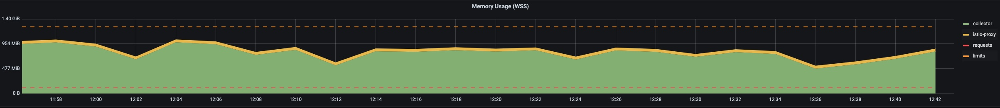

# Hardened Metric Agent setup

The aim of this exercise is to harden the metric agent such that it can satisfy the metric load of most of the use cases.

## Setup

For the test environment following things were considered:
- Provisioned a GCP cluster with kubernetes (n2-standard-16)
- Deploy Telemetry operator using `make deploy-dev`
- Deploy prometheus for visualizing the metrics
- Istio deployment is needed due to Prometheus

Install monitoring and istio
```unix
kyma deploy -s main --component istio --component monitoring
```

alternatively istio CRDS can be installed from [here](https://github.com/istio/api/blob/master/kubernetes/customresourcedefinitions.gen.yaml) and only monitoring stack can be installed


- [Avalanche prometheus metric load generator](https://blog.freshtracks.io/load-testing-prometheus-metric-ingestion-5b878711711c)

Config map of the metrics agent
```yaml
apiVersion: v1
data:
  relay.conf: |
    extensions:
        health_check:
            endpoint: ${MY_POD_IP}:13133
    service:
        pipelines:
            metrics/prometheus:
                receivers:
                    - prometheus/app-pods
                processors:
                    - memory_limiter
                    - resource/delete-service-name
                    - resource/insert-input-source-prometheus
                    - batch
                exporters:
                    - otlp
        telemetry:
            metrics:
                address: ${MY_POD_IP}:8888
            logs:
                level: info
        extensions:
            - health_check
    receivers:
        prometheus/app-pods:
            config:
                scrape_configs:
                    - job_name: app-pods
                      scrape_interval: 30s
                      relabel_configs:
                        - source_labels: [__meta_kubernetes_pod_node_name]
                          regex: $MY_NODE_NAME
                          action: keep
                        - source_labels: [__meta_kubernetes_pod_annotation_prometheus_io_scrape]
                          regex: "true"
                          action: keep
                        - source_labels: [__meta_kubernetes_pod_phase]
                          regex: Pending|Succeeded|Failed
                          action: drop
                        - source_labels: [__meta_kubernetes_pod_container_init]
                          regex: (true)
                          action: drop
                        - source_labels: [__meta_kubernetes_pod_container_name]
                          regex: (istio-proxy)
                          action: drop
                        - source_labels: [__meta_kubernetes_pod_label_security_istio_io_tlsMode]
                          regex: (istio)
                          target_label: __scheme__
                          replacement: https
                          action: replace
                        - source_labels: [__meta_kubernetes_pod_annotation_prometheus_io_scheme]
                          regex: (https?)
                          target_label: __scheme__
                          action: replace
                        - source_labels: [__scheme__]
                          regex: (https)
                          action: drop
                        - source_labels: [__meta_kubernetes_pod_annotation_prometheus_io_path]
                          regex: (.+)
                          target_label: __metrics_path__
                          action: replace
                        - source_labels: [__address__, __meta_kubernetes_pod_annotation_prometheus_io_port]
                          regex: ([^:]+)(?::\d+)?;(\d+)
                          target_label: __address__
                          replacement: $$1:$$2
                          action: replace
                      kubernetes_sd_configs:
                        - role: pod
        prometheus/app-services:
            config:
                scrape_configs:
                    - job_name: app-services
                      scrape_interval: 30s
                      relabel_configs:
                        - source_labels: [__meta_kubernetes_endpoint_node_name]
                          regex: $MY_NODE_NAME
                          action: keep
                        - source_labels: [__meta_kubernetes_service_annotation_prometheus_io_scrape]
                          regex: "true"
                          action: keep
                        - source_labels: [__meta_kubernetes_pod_phase]
                          regex: Pending|Succeeded|Failed
                          action: drop
                        - source_labels: [__meta_kubernetes_pod_container_init]
                          regex: (true)
                          action: drop
                        - source_labels: [__meta_kubernetes_pod_container_name]
                          regex: (istio-proxy)
                          action: drop
                        - source_labels: [__meta_kubernetes_pod_label_security_istio_io_tlsMode]
                          regex: (istio)
                          target_label: __scheme__
                          replacement: https
                          action: replace
                        - source_labels: [__meta_kubernetes_service_annotation_prometheus_io_scheme]
                          regex: (https?)
                          target_label: __scheme__
                          action: replace
                        - source_labels: [__scheme__]
                          regex: (https)
                          action: drop
                        - source_labels: [__meta_kubernetes_service_annotation_prometheus_io_path]
                          regex: (.+)
                          target_label: __metrics_path__
                          action: replace
                        - source_labels: [__address__, __meta_kubernetes_service_annotation_prometheus_io_port]
                          regex: ([^:]+)(?::\d+)?;(\d+)
                          target_label: __address__
                          replacement: $$1:$$2
                          action: replace
                        - source_labels: [__meta_kubernetes_service_name]
                          target_label: service
                          action: replace
                      kubernetes_sd_configs:
                        - role: endpoints
    processors:
        batch:
            send_batch_size: 1024
            timeout: 10s
            send_batch_max_size: 1024
        memory_limiter:
            check_interval: 0.5s
            limit_percentage: 85
            spike_limit_percentage: 10
        resource/delete-service-name:
            attributes:
                - action: delete
                  key: service.name
        resource/insert-input-source-runtime:
            attributes:
                - action: insert
                  key: kyma.source
                  value: runtime
        resource/insert-input-source-prometheus:
            attributes:
                - action: insert
                  key: kyma.source
                  value: prometheus
    exporters:
        otlp:
            endpoint: telemetry-otlp-metrics.kyma-system.svc.cluster.local:4317
            tls:
                insecure: true
            sending_queue:
                enabled: true
                queue_size: 512
            retry_on_failure:
                enabled: true
                initial_interval: 5s
                max_interval: 30s
                max_elapsed_time: 300s
kind: ConfigMap
metadata:
  labels:
    app.kubernetes.io/name: telemetry-metric-agent
  name: telemetry-metric-agent
  namespace: kyma-system
  ownerReferences:
  - apiVersion: telemetry.kyma-project.io/v1alpha1
    kind: MetricPipeline
    name: metricpipeline-sample
```
Configuration changes needed for metrics agent
```yaml
    processors:
        batch:
            send_batch_size: 1024
            timeout: 10s
            send_batch_max_size: 1024
        memory_limiter:
            check_interval: 0.5s
            limit_percentage: 85
            spike_limit_percentage: 10
```

Avalanche load generator deployment
```yaml
apiVersion: apps/v1
kind: Deployment
metadata:
  name: avalanche-metric-load-generator
spec:      
  selector:
    matchLabels:
      app: avalanche-metric-load-generator
  template:
    metadata:
      labels:
        app: avalanche-metric-load-generator
      annotations:
        prometheus.io/path: /metrics
        prometheus.io/port: "8080"
        prometheus.io/scrape: "true"
    spec:
      containers:
      - name: avalanche-metric-load-generator
        image: quay.io/freshtracks.io/avalanche
        imagePullPolicy: IfNotPresent
        args:
        - --metric-count=500
        - --series-count=20
        - --port=8080
        resources:
          limits:
            memory: "128Mi"
            cpu: "200m"
        ports:
        - containerPort: 8080
          protocol: TCP
          name: metrics
```

Service for metric agent metrics
```yaml
apiVersion: v1
kind: Service
metadata:
  annotations:
    prometheus.io/port: "8888"
    prometheus.io/scrape: "true"
    prometheus.io/scheme: "http"
  labels:
    app.kubernetes.io/name: telemetry-metric-agent
  name: telemetry-metric-agent-metrics
  namespace: kyma-system
spec:
  clusterIP: None
  ports:
  - name: http-metrics
    port: 8888
    protocol: TCP
    targetPort: 8888
  selector:
    app.kubernetes.io/name: telemetry-metric-agent
  sessionAffinity: None
  type: ClusterIP
```

### Install test setup

.....

## Testcases

### Assumptions

We tweak metrics and series value `20` series per metric with 10 labels each metric data point. Run it for 1 hour to have stabilized output as we don't want to scale at once (which would cause OOM)

We identified following test cases:
1. Multiple pods all running on a single node and export metrics (to find how many workloads supported)
2. Workload generating huge amount of metrics (To understand how scraping works when the workload exposes several MB of metrics)
3. Have multiple workloads across different nodes (To understand prometheus SDS behaviour with multiple services)
4. Verify istio metrics
5. Test with huge metric payload where we don't scale gradually more like a spike

### Multiple pods all running on a single node and export metrics
Setup:

Avalanche load generator configuration per pod:
- Metric count: 500
- Metric series: 20
- Number of labels: 10

To simulate a smooth ramp-up and avoid huge data flood at the beginning, load generator was started with 5 instances, instance count was increased at 5 instances every minute until peak was reached.

This test was executed on a single node installation to determine the limits of a single metric agent, after the load generator reaches `30` instances, metric agent hits the limits and stays stable with this setup. Any load above this setup will cause memory limiter to refuse incoming traffic.

The graph below shows the average metric points processed by the `prometheus metric receiver` per second, agent reaches an average of `14K metric points/sec`


Following graph shows the refused metric points from the configured `memory_limiter`, with traffic above 14K metric points/sec results in  metrics being refused by the `memory_limiter`. 


Following graph shows memory utilization of metric agent during test phase.



Following graph shows CPU utilization of metric agent during test phase.


### Workload generating huge amount of metrics

This scenario tests a single metric endpoint with huge amount of data, Avalanche load generator deployed with a single pod instance and configured with 1000 distinct metrics and 20 metric series for each metric with 10 labels.

Setup:

Avalanche load generator configuration:
- Metric Count: 1000
- Metric Series: 20
- Number of label: 10

Metric count was increased in 1000 steps to find the limit of the metric agent.

Following graph shows max stable load from single target with huge amount of metric data.


Metric agent reached max `7K metric points/sec` from a single metric target, with 6000 metrics with 20 metric series. In this test scenario the 
 measured raw metric payload size was `~51MB`

Another test was performed to determine the impact of different metric series on metric agent. For this the test metric series were increased from `20` to `30`, distinct metric count started from `1000` and increased in `1000` steps until the limit of metric agent was reached.
Metric agent reached a peak of `~7K metric points/sec` (yellow line from graph above) with `4000` distinct metric. In this setup the measured raw metric payload size was `~31MB`

In both the configurations metric agent reached a peak of `~7K metric points/sec` independent size of raw metric data, thus raw metric payload size has no impact on metric agent performance.

In both configurations Avalanche load generator generated `120K metric points/scrape` 

> **NOTE:** Avalanche load generator resources have to be changed for this scenario, for this test CPU settings changed to 400m and Memory to 1Gi 
### Have multiple workloads across different nodes

-

## Summary


