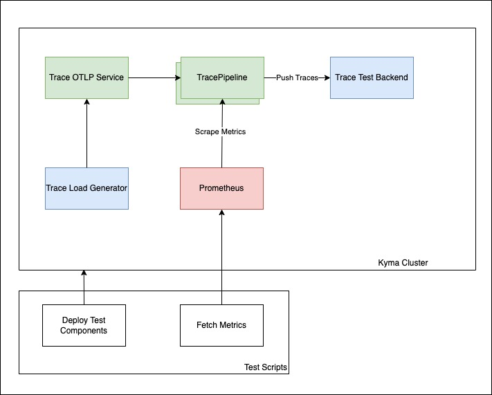

# Traces KPIs and Limit Test

This document describes a reproducible test setup to determine the limits and KPis of the Kyma TracePipeline.

## Prerequisites

- Kyma as the target deployment environment, 2 Nodes with 4 CPU and 16G Memory (n1-standard-4 on GCP)
- Telemetry Module installed
- Istio Module installed
- Kubectl > 1.22.x
- Helm 3.x
- curl 8.4.x
- jq 1.6

## Test Cases

### Assumptions

The tests are executed for 20 minutes for each test case to have a stabilized output and reliable KPIs. Generated traces contains at least 2 spans and each span have 40 attributes to simulate an average trace span size.  

Following test cases identified:

1. Test average throughput end-to-end. 
2. Test queuing and retry capabilities of TracePipeline with simulated backend outages.
3. Test average throughput with 3 TracePipelines simultaneously end-to-end.
4. Test queuing and retry capabilities of 3 TracePipeline with simulated backend outages.


## Setup

The following diagram shows test setup used for all test cases. 



In all test scenarios a preconfigured trace load generator deployed on test cluster, the trace load generator feed test TracePipeline over pipeline service instance to ensure all trace gateway instances get loaded with test data.

A prometheus instance deployed on the test cluster to collect relevant metrics from trace gateway instances and fetch the metrics end of test as test scenario result.

All test scenarios also get a Test Backend deployed to simulate end-to-end behaviour.

Each test scenario has own test scripts responsible for preparing test scenario and deploying on test cluster, run the scenario, and fetch relevant metrics/KPIs end of test run. The test results end of test printed out.

A typical test result output will look like following:

```shell
 Receiver accepted spans,Average,12867.386144069678
 Exporter exported spans,Average,38585.09404079456
 Exporter queue size,Average,0
 Pod memory,telemetry-trace-collector-9fd48899-7l6f7,147464192
 Pod memory,telemetry-trace-collector-9fd48899-wdx2g,160010240
 Pod CPU,telemetry-trace-collector-9fd48899-72knt,1.4228919657370949
 Pod CPU,telemetry-trace-collector-9fd48899-7l6f7,1.414138202062809
```

## Test Script

All test scenarios will use single test script [run-load-test.sh](assets/run-load-test.sh), script provides two parameter `-m` for multi TracePipeline scenarios and `-b` for backpressure scenarios
1. To run test case Test average throughput end-to-end, execute

```shell
./run-load-test.sh
```
2. To run test case Test queuing and retry capabilities of TracePipeline with simulated backend outages, execute

```shell
./run-load-test.sh -b
```

3. To run test case Test average throughput with 3 TracePipelines simultaneously end-to-end, execute

```shell
./run-load-test.sh -m
```

4. To run test case Test queuing and retry capabilities of 3 TracePipeline with simulated backend outages, execute

```shell
./run-load-test.sh -m -b
```

## Test Results

|          Test Name          |  Receiver Accepted Spans / sec |  Exporter Exported Spans / sec |  Exporter Queue Size |  Pod Memory Usage |  Pod CPU Usage |
|:---------------------------:|-------------------------------:|-------------------------------:|---------------------:|------------------:|---------------:|
|  OTEL Image Version 0.91.0  |                              0 |                              0 |                    0 |                 0 |              0 |


