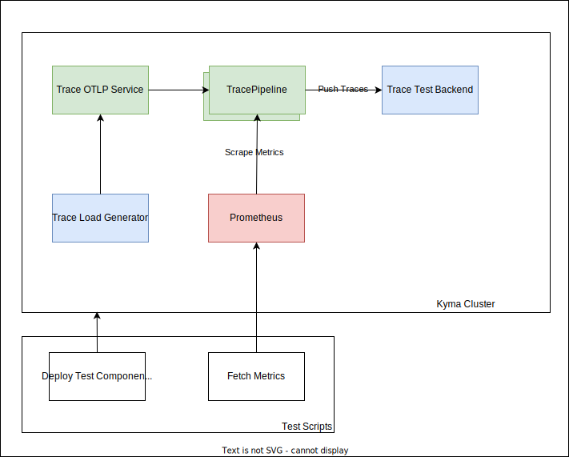

# Traces KPIs and Limit Test

This document describes a reproducible test setup to determine the limits and KPis of the Kyma TracePipeline.

## Prerequisites

- Kyma as the target deployment environment, 2 Nodes with 4 CPU and 16G Memory (n1-standard-4 on GCP)
- Telemetry Module installed
- Istio Module installed
- Kubectl > 1.22.x
- Helm 3.x
- curl 8.4.x
- jq 1.6

## Test Cases

### Assumptions

The tests are executed for 20 minutes for each test case to have a stabilized output and reliable KPIs. Generated traces contain at least 2 spans, and each span has 40 attributes to simulate an average trace span size.  

The following test cases are identified:

1. Test average throughput end-to-end. 
2. Test queuing and retry capabilities of TracePipeline with simulated backend outages.
3. Test average throughput with 3 TracePipelines simultaneously end-to-end.
4. Test queuing and retry capabilities of 3 TracePipeline with simulated backend outages.


## Setup

The following diagram shows the test setup used for all test cases. 



In all test scenarios, a preconfigured trace load generator is deployed on the test cluster. To ensure all trace gateway instances are loaded with test data, the trace load generator feeds the test TracePipeline over a pipeline service instance .

A Prometheus instance is deployed on the test cluster to collect relevant metrics from trace gateway instances and to fetch the metrics at the end of the test as test scenario result.

All test scenarios also have a test backend deployed to simulate end-to-end behaviour.

Each test scenario has its own test scripts responsible for preparing test scenario and deploying on test cluster, running the scenario, and fetching relevant metrics/KPIs at the end of the test run. After the test, the test results are printed out.

A typical test result output looks like the following example:

```shell
 Receiver accepted spans,Average,12867.386144069678
 Exporter exported spans,Average,38585.09404079456
 Exporter queue size,Average,0
 Pod memory,telemetry-trace-collector-9fd48899-7l6f7,147464192
 Pod memory,telemetry-trace-collector-9fd48899-wdx2g,160010240
 Pod CPU,telemetry-trace-collector-9fd48899-72knt,1.4228919657370949
 Pod CPU,telemetry-trace-collector-9fd48899-7l6f7,1.414138202062809
```

## Test Script

All test scenarios use a single test script [run-load-test.sh](assets/run-load-test.sh), which provides two parameters: `-m` for multi TracePipeline scenarios, and `-b` for backpressure scenarios
1. To test the average throughput end-to-end, run:

```shell
./run-load-test.sh
```
2. To test the queuing and retry capabilities of TracePipeline with simulated backend outages, run:

```shell
./run-load-test.sh -b true
```

3. To test the average throughput with 3 TracePipelines simultaneously end-to-end, run:

```shell
./run-load-test.sh -m true
```

4. To test the queuing and retry capabilities of 3 TracePipelines with simulated backend outages, run:

```shell
./run-load-test.sh -m true -b true
```

## Test Results

|                   Test Description                   |                  Receiver Accepted Spans / sec |    Exporter Exported Spans / sec | Exporter Queue Size | Pod Memory Usage (MBytes) |     Pod CPU Usage |
|:----------------------------------------------------:|-----------------------------------------------:|---------------------------------:|--------------------:|--------------------------:|------------------:|
|         OTEL Image Version 0.91.0 Throughput         |                                       19815.05 |                         19815.05 |                   0 |               137, 139.92 |      0.979, 0.921 |
|        OTEL Image Version 0.91.0 Backpressure        |                                         9574.4 |                             1280 |                 509 |              1929.4, 1726 |      0.723, 0.702 |
|  OTEL Image Version 0.91.0 MultiPipeline Throughput  |                                        13158.4 |                         38929.06 |                   0 |                 117, 98.5 |      1.307, 1.351 |
| OTEL Image Version 0.91.0 MultiPipeline Backpressure |                                         9663.8 |                           1331.2 |                 510 |              2029.8, 1686 |      0.733, 0.696 |
                                                                                                                                                             


