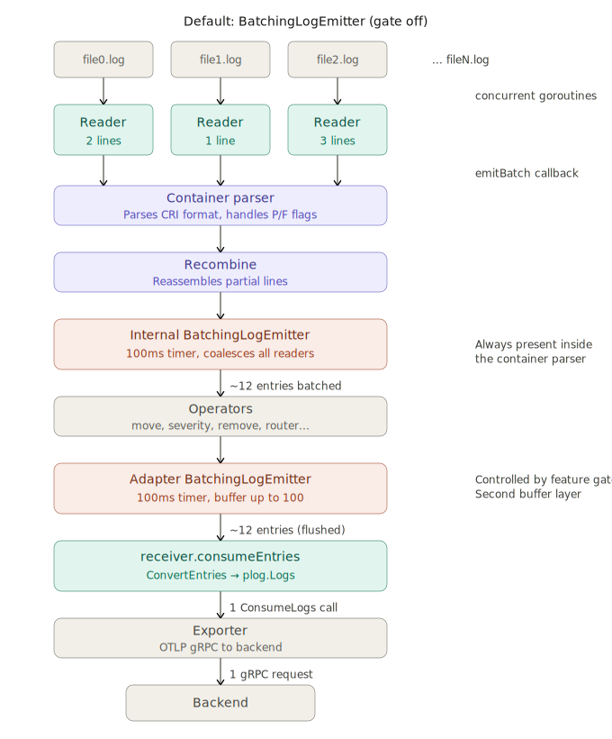
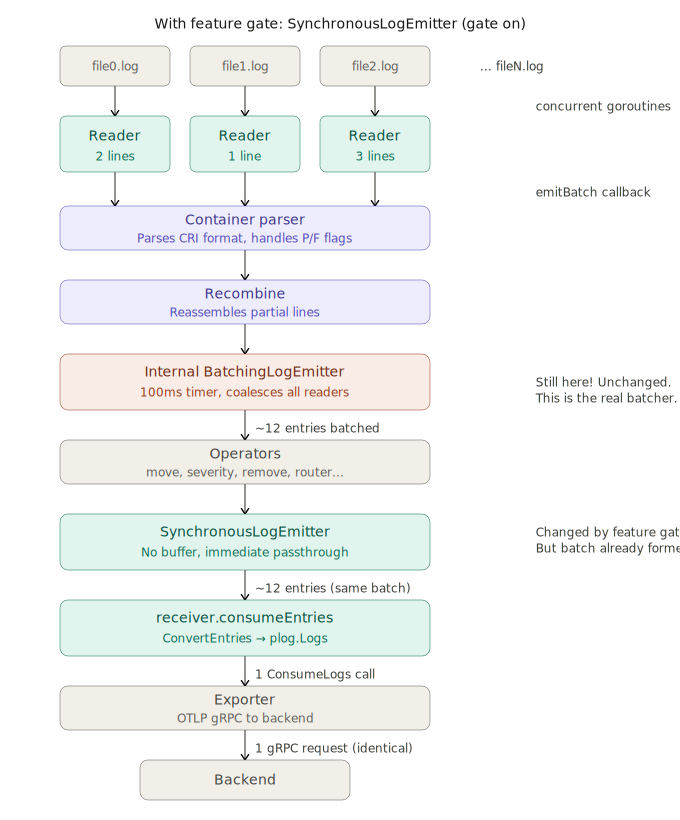

# Investigate Stanza Batching Behavior and the SynchronousLogEmitter Feature Gate

## Provide Context

This investigation examines the `stanza.synchronousLogEmitter` feature gate, introduced in v0.122.0 at alpha stage, in the OpenTelemetry Collector's `filelog` receiver. The gate prevents data loss on non-graceful shutdown by replacing the asynchronous `BatchingLogEmitter` with a synchronous passthrough emitter at the adapter level.

This investigation targets collector version 0.149.0, tailing Kubernetes CRI container logs in the `/var/log/pods/` directory structure.

Repository: `github.com/open-telemetry/opentelemetry-collector-contrib`
Package: `pkg/stanza`
Feature gate ID: `stanza.synchronousLogEmitter`
Reference issue: https://github.com/open-telemetry/opentelemetry-collector-contrib/issues/35456

## Understand the Architecture

The `filelog` receiver uses the stanza framework to tail log files. The data path is:

1. **FileConsumer** in `fileconsumer/` polls the filesystem every `200ms`, configurable with `poll_interval`. For each matched file, a `Reader` goroutine scans new lines since the last poll.

2. **Reader batching** - The reader accumulates tokens, that is, scanned lines, into a slice capped at `DefaultMaxBatchSize = 100`. When it reaches EOF or hits `100` tokens, it calls `emitFunc`, a callback wired to `Input.emitBatch`. There is no minimum batch size and no flush timer at this level. If a file has 3 new lines, the batch is 3. If it has 0, nothing is emitted.

3. **Input.emitBatch** - Converts raw `[][]byte` tokens into `[]*entry.Entry` and calls `WriteBatch`, pushing the batch to the first operator in the stanza pipeline.

4. **Operator pipeline** - Entries flow through configured operators such as container parser, move, severity parser, remove, router, and json parser using `ProcessBatch` or `Process` calls. Each operator transforms entries and forwards them using `WriteBatch` or `Write`.

5. **Adapter emitter** - The final operator in the pipeline. The feature gate controls its behavior:
    - **Gate off (default)** - `BatchingLogEmitter` appends entries to an in-memory `[]*entry.Entry` slice and flushes when the buffer reaches `100` entries or every `100ms` using a background goroutine.
    - **Gate on** - `SynchronousLogEmitter` immediately forwards entries to the consumer with no buffering.

6. **receiver.consumeEntries** - Converts `[]*entry.Entry` to `plog.Logs` and calls `ConsumeLogs` on the downstream OTel pipeline consisting of processors and exporters.

### Examine the Container Parser's Internal Sub-Pipeline

When you configure the `container` operator, used for CRI log format parsing, it creates an internal sub-pipeline for handling CRI partial lines with `P` and `F` flags:

```
[recombine operator] → [internal BatchingLogEmitter] → consumeEntries → WriteBatch to main pipeline
```

- The **recombine** operator holds `P` partial lines until a matching `F` final line arrives, then flushes the combined entry.
- The **internal BatchingLogEmitter** named `criLogEmitter` is hardcoded as `helper.NewBatchingLogEmitter(set, p.consumeEntries)` with default settings of a `100`-entry buffer and `100ms` flush timer. It does not check the `stanza.synchronousLogEmitter` feature gate.
- The recombine operator also has a background timer called `forceFlushTimeout` that force-flushes incomplete partial lines using `Write` singular to the `criLogEmitter`.

This internal emitter is the same `BatchingLogEmitter` type used at the adapter level, with the same struct, the same package `operator/helper`, and the same async buffer behavior.

## Describe the Test Methodology

All tests ran with Docker containers on a local machine tailing simulated Pod logs from a log generator using the `filelog` receiver. The backend was a separate OTel Collector instance with an OTLP gRPC receiver.

The following metrics were observed:

- `rpc_server_call_duration_seconds_count` - Number of export gRPC calls to the backend
- `otelcol_exporter_sent_log_records_total` - Total records delivered
- `otelcol_exporter_enqueue_failed_log_records_total` - Records dropped due to full exporter queue
- `otelcol_receiver_accepted_log_records_total` - Records accepted by the receiver
- `otelcol_receiver_refused_log_records_total` - Records refused by the receiver, that is, records lost
- `otelcol_process_cpu_seconds_total` and `otelcol_process_runtime_total_alloc_bytes_total` - Resource usage for CPU and memory allocation

The test parameters were:

- Same binary version, 0.149.0 `otelcol-contrib`, for both modes
- Feature gate toggled with `--feature-gates=stanza.synchronousLogEmitter`
- 10 open log files, low-to-moderate write rate
- Log size of ~150 bytes
- Exporter queue size set to `1024`, min and max batch size to `1024`, flush timeout to `10s`, to match batching configurations of other components
- Configurations with full operator chain and with no operators using a raw pipeline


## Present Findings

This section covers the results, test setup, and configuration for each finding.

### Finding 1: With Container Parser, the Feature Gate Has No Observable Effect

Test setup:
- 10 Pods
- 1 log/s per Pod

Multiple tests on v0.149.0 with the full operator chain, including the container parser, showed identical results between the two emitter modes:

| Metric                             | Synchronous | Batching |
|------------------------------------|-------------|----------|
| Export requests (rpc_server count) | 317         | 301      |
| Records delivered                  | 2940        | 2940     |
| Avg records/request                | 9.3         | 9.8      |

The container parser's internal `BatchingLogEmitter` pre-coalesces entries from all concurrent reader goroutines within its `100ms` flush window. By the time entries reach the adapter's emitter, they are already batched. Whether the adapter's emitter buffers again in batching mode or passes through in synchronous mode, the downstream receives similarly-sized batches.

### Finding 2: Feature Gate Effect on RPC Calls Depends on Log Rate per Pod

Test configuration: all stanza operators removed, raw fileconsumer to adapter emitter to exporter.

**Low throughput: 1 log/s per Pod, 10 Pods, 300s**

Total lines written: 2930

| Metric                             | Sync  | Batching |
|------------------------------------|-------|----------|
| Export requests (rpc_server count) | 2,930 | 297      |
| Records delivered                  | 2930  | 2930     |
| Avg records / filelog batch        | 1.0   | 9.8      |

**High throughput: 100 logs/s per Pod, 10 Pods, 2146s, queue saturated**

Total lines written: 147956

| Metric                             | Sync   | Batching |
|------------------------------------|--------|----------|
| Export requests (rpc_server count) | 2389   | 2259     |
| Records delivered                  | 147256 | 146656   |
| Avg records / filelog batch        | 61.6   | 65       |

At low throughput, readers rarely fill their 100-entry batch, so the `SynchronousLogEmitter` passes through many small batches while the `BatchingLogEmitter` coalesces them, producing a ~10x difference in export requests.

At high throughput, readers saturate at ~100 entries per batch regardless of emitter mode, collapsing the difference. The number of records delivered differs due to backpressure and lost data.

### Finding 3: The Container Parser's Internal Emitter Is a Blind Spot for the Feature Gate

The `stanza.synchronousLogEmitter` feature gate is only checked in one place, `adapter/factory.go` line 79. The container parser hardcodes `helper.NewBatchingLogEmitter` in `operator/parser/container/config.go` line 84 without checking the gate.

This means the following:

- Users who enable the gate expecting synchronous end-to-end behavior don't get it when using the container parser.
- The internal emitter's async buffer can still lose entries on non-graceful shutdown, undermining the gate's stated goal of preventing data loss.
- The internal emitter masks the difference between the two modes, making it appear as if the gate has no effect. In reality, the gate works correctly but is being shadowed.

### Finding 4: The Exporter Batcher Normalizes Backend-Observable Behavior

Test configuration:
- No stanza operators, raw fileconsumer to adapter emitter to exporter
- Exporter batcher `queue_size`, `min_batch_size`, and `max_batch_size` set to `1024`
- Exporter batcher `flush_timeout` set to `10s`

gRPC call count converges between emitter modes in two distinct scenarios:

**Low throughput: 1 log/s per Pod, 10 Pods, 300s**

| Metric                                 | Sync   | Batching |
|----------------------------------------|--------|----------|
| Total batches                          | 2,930  | 297      |
| Avg records / filelog batch            | 1.0    | 9.9      |
| **Export requests (rpc_server count)** | **30** | **30**   |
| Avg records / exporter batch           | 97.6   | 97.6     |

The batcher's `flush_timeout` accumulates whatever arrives within `10s` and sends it as one request, coalescing 2,930 individual queue items into 30 gRPC calls, or about 98 log records per batch.

**High throughput: 100 logs/s per Pod, 10 Pods, 300s, queue saturated**

| Metric                                 | Sync    | Batching |
|----------------------------------------|---------|----------|
| Total batches                          | 2389    | 2259     |
| Avg records / filelog batch            | 61.6    | 65       |
| **Export requests (rpc_server count)** | **148** | **148**  |
| Avg records / exporter batch           | 994     | 992      |

At high throughput, readers saturate at ~100 entries per batch regardless of emitter mode, so the difference in batch count collapses and gRPC calls converge naturally.

With the exporter batcher configured, or at high enough throughput, the feature gate is irrelevant to what the backend observes. The only remaining distinctions between emitter modes are the following:

- **Crash safety** - The synchronous emitter has no in-memory buffer that can lose data. However, the exporter batcher itself has an in-memory buffer with entries waiting for the `200ms` flush, which is also lost on non-graceful shutdown. A persistent queue with `sending_queue.storage: file_storage/...` mitigates this.

- **Backpressure** - The synchronous emitter propagates backpressure from the exporter to the file readers. The batching emitter does not.

- **CPU under queue saturation** - The synchronous emitter uses ~47% less CPU when the queue is full, because the batching emitter's flusher goroutine spins on failed `Offer` calls.

### Finding 5: The Collector Resource Consumption Changes with the Feature Gate Under Heavy Load

The `synchronousLogEmitter` feature gate does not affect the resource consumption of the collector by any substantial amount. CPU and memory usage stays relatively similar under low load.

**Low throughput: 1 log/s per Pod, 10 Pods, 300s**

| Metric                      | Sync (gate on) | Batching (gate off) |
|-----------------------------|----------------|---------------------|
| Queue batch send size count | 2,930          | 293                 |
| Queue batch send size avg   | 1.0            | 10.0                |
| gRPC calls                  | 30             | 30                  |
| CPU total                   | 7.03s          | 6.90s               |
| `total_alloc`               | 438 MB         | 420 MB              |
| `total_alloc` rate          | ~1.30 MB/s     | ~1.24 MB/s          |

**High throughput: 50 logs/s per Pod, 10 Pods, 1286s, queue saturated**

| Metric                      | Sync (gate on) | Batching (gate off) |
|-----------------------------|----------------|---------------------|
| Queue batch send size count | 1,495          | 1,344               |
| Queue batch send size avg   | 88.5           | 99.4                |
| gRPC calls                  | 96             | 95                  |
| CPU total                   | 2.99s          | 4.82s               |
| `total_alloc`               | 256 MB         | 228 MB              |
| `total_alloc` rate          | ~199 KB/s      | ~177 KB/s           |

At low throughput, both emitter modes are virtually identical in resource consumption. The small differences of 1.3% CPU and 4% allocation are within noise and do not constitute a meaningful finding.

At high throughput with a saturated queue, CPU usage is 61% higher on the batching emitter, 2.99s compared to 4.82s. This is consistent across two independent runs and is attributable to the batching emitter's flusher goroutine repeatedly waking up every `100ms`, acquiring the buffer lock, and attempting `Offer` against a full queue, doing real work that produces nothing. The sync emitter has no such goroutine. Backpressure is absorbed by the reader goroutines blocking, which costs no CPU.

The `total_alloc` rate is slightly higher on sync under saturation, 199 compared to 177 KB/s, but the difference is small and negligible.

The dominant resource conclusion is that the batching emitter wastes CPU under queue saturation. Otherwise, the two modes are equivalent.

## Examine Technical Details

This section provides additional technical context on the components discussed in the findings.

### Understand BatchingLogEmitter Flush Behavior

The `BatchingLogEmitter` has two flush triggers:

- **Size** - When `ProcessBatch` or `Process` appends entries and the buffer reaches `maxBatchSize` with a default of `100`, it flushes immediately on the calling goroutine.
- **Time** - A background goroutine ticks every `flushInterval` with a default of `100ms` and flushes whatever has accumulated, even if it is just 1 entry.

On graceful shutdown with `Stop`, the flusher does a final flush with a 5-second timeout context. On non-graceful shutdown such as SIGKILL or OOM, the buffer is lost.

### Understand FileConsumer Reader Batching

The reader has no minimum batch size and no flush timer for batching. It scans until EOF, then emits whatever it collected. The 100-token cap `DefaultMaxBatchSize` is a memory guard, not a batching strategy. The number of lines that appeared in the file since the last poll determines the actual batch size.

The `FlushPeriod` with a default of `500ms` is unrelated to batch size. It handles incomplete tokens, that is, lines without trailing newlines, at the scanner/splitfunc level.

### Understand Concurrent Reader Behavior

The `Manager.consume()` method launches all readers as concurrent goroutines within a single poll cycle. With 8 files, 8 goroutines run simultaneously, each producing a batch and calling `emitBatch` then `WriteBatch`. These batches arrive at the emitter roughly at the same time, within a few milliseconds.

With the `BatchingLogEmitter`, these concurrent arrivals are coalesced. Each reader's batch gets appended to the shared buffer under a mutex, and the combined result is flushed as fewer, larger batches.

With the `SynchronousLogEmitter`, each reader's batch immediately becomes a separate `ConsumeLogs` call, producing as many export requests as there are active files.

### Compare Pipeline Flow Before and After Feature Gate

<p>

<em>Pipeline Flow with BatchingLogEmitter</em>
</p>

<p>

<em>Pipeline Flow with SynchronousLogEmitter</em>
</p>

Without the feature gate, on the left, the container parser's internal `BatchingLogEmitter` runs and coalesces entries tailed from all readers into one batch. After that, the adapter's `BatchingLogEmitter` buffers it again up to `100` entries and then flushes them together.

With the feature gate enabled, on the right, the container parser still runs `BatchingLogEmitter` internally, but the adapter delivers entries synchronously to the next consumer instead of batching them into a buffer.

The `BatchingLogEmitter` used internally by the container parser behaves exactly the same as the one in the adapter. In the left diagram, the second `BatchingLogEmitter` therefore has little additional effect.

## Conclusions

This section summarizes the investigation results and provides recommendations.

### Use the Filelog Receiver with the Container Parser

The feature gate is safe to enable. It provides theoretical crash-safety and backpressure benefits with no observable impact on throughput, export request count, or resource usage, because the container parser's internal emitter already handles the coalescing.

Enabling the synchronous emitter significantly increases the number of export requests to the backend, depending on the number of files tailed and the log production rate. If the backend rate-limits by request count, this matters. Enabling batching in the exporter mitigates this.

### Enable the Exporter Batcher with Synchronous Emitter

The exporter batcher `sending_queue.batch` makes the feature gate choice irrelevant to backend behavior. With the batcher enabled, both emitter modes produce the same number of gRPC requests and the same batch sizes at the wire level. The feature gate remains useful for crash safety and backpressure semantics, but has no impact on export request count or backend load.

Additionally, enabling the `SynchronousLogEmitter` with an exporter batcher reduces CPU usage under high load scenarios as shown in [Finding 5](#finding-5-the-collector-resource-consumption-changes-with-the-feature-gate-under-heavy-load).

For maximum data safety, combine the feature gate with a persistent queue:

```yaml
exporters:
  otlp_grpc/test:
    sending_queue:
      storage: file_storage/logs
      queue_size: 1024
      batch:
        min_size: 1024
        max_size: 1024
        flush_timeout: 10s
```

This eliminates all volatile in-memory buffers in the path. The synchronous emitter removes the adapter buffer, and the persistent queue backs the exporter buffer to disk.

### Contact the OpenTelemetry Collector Maintainers

The container parser's internal `BatchingLogEmitter` must respect the `stanza.synchronousLogEmitter` feature gate. The required change is:

```go
// config.go line 84, currently:
cLogEmitter := helper.NewBatchingLogEmitter(set, p.consumeEntries)

// proposed:
var cLogEmitter helper.LogEmitter
if metadata.StanzaSynchronousLogEmitterFeatureGate.IsEnabled() {
    cLogEmitter = helper.NewSynchronousLogEmitter(set, p.consumeEntries)
} else {
    cLogEmitter = helper.NewBatchingLogEmitter(set, p.consumeEntries)
}
```

The `criLogEmitter` field type changes from `*helper.BatchingLogEmitter` to `helper.LogEmitter`, the interface both types satisfy. The `SynchronousLogEmitter` handles both `Process`, used by recombine's background flush timer for stray partial lines, and `ProcessBatch`, used by recombine's normal output path.

This makes the feature gate's behavior consistent regardless of whether the container parser is in the pipeline.
