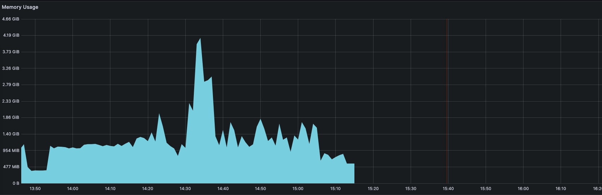
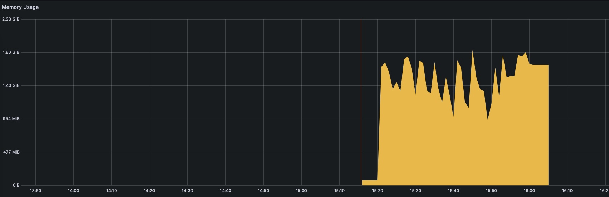
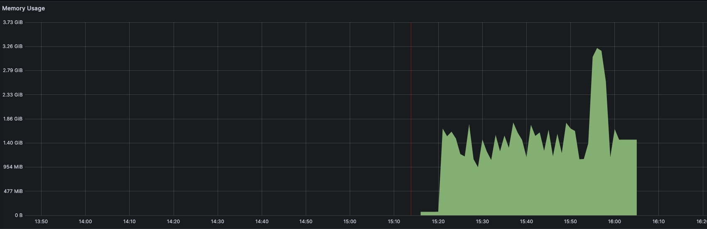

# Optimizing Memory Management in OpenTelemetry Applications

This document aims to guide developers in managing memory usage in OpenTelemetry applications. The primary challenge is mitigating the risk of out-of-memory (OOM) errors while optimizing application performance. The solution involves understanding memory management, garbage collection in Go runtime, and the impact of memory allocation strategies.

## Memory Allocation and OOM Errors

Memory can be allocated on the stack or heap. Stack allocations are short-lived and cheap, requiring no garbage collection (GC). Heap allocations are long-lived, more expensive, and require GC when no longer in use. Unintentional heap allocations can lead to OOM errors by putting pressure on the GC.

## Balancing Memory Usage and Garbage Collection

The goal is to balance memory usage and GC to prevent OOM errors while maintaining efficient application performance. This involves delaying GC cycles until necessary, ensuring the application never exceeds the memory threshold.

## Garbage Collection Targets in Go

Before Go 1.19, the GOGC environment variable was the only tool available to manage GC. It accepts a relative target compared to the current live heap size. However, this approach can be problematic for applications with large permanent live heaps.

## Introducing GOMEMLIMIT

Go 1.19 introduced GOMEMLIMIT, a feature that allows the specification of a soft memory cap. It complements GOGC, making the garbage collector more aggressive when necessary. It's a "soft" limit, meaning the Go runtime uses it as a target rather than a strict constraint.

## Evaluating GOMEMLIMIT with TracePipeline

We tested GOMEMLIMIT with TracePipeline, a memory-intensive application. Without GOMEMLIMIT, TracePipeline exceeded available memory, leading to OOM errors. With GOMEMLIMIT set, garbage collection behavior was more controlled, and memory usage remained within the specified limit.

## Conclusion

GOMEMLIMIT effectively mitigates OOM errors in heavily utilized Go applications. However, efficient memory allocation strategies remain crucial for optimal performance. While GOMEMLIMIT provides valuable guidance, careful consideration of application requirements and workload characteristics is imperative for robust memory management.

## Is GOMEMLIMIT Safe to Avoid OOM?

GOMEMLIMIT can help mitigate the risk of OOM errors, but it does not provide foolproof protection. Even with GOMEMLIMIT in place, a heavily utilized Go application must still prioritize efficient memory allocation strategies. Despite configuring an application with a GOMEMLIMIT, the application may encounter an OOM situation if circumstances necessitate additional memory allocation.

