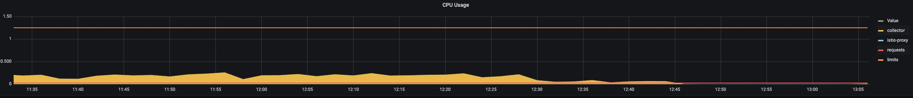
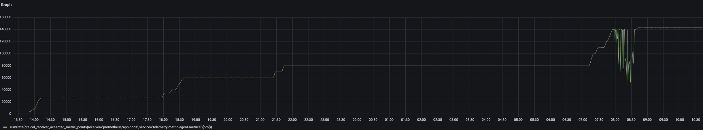
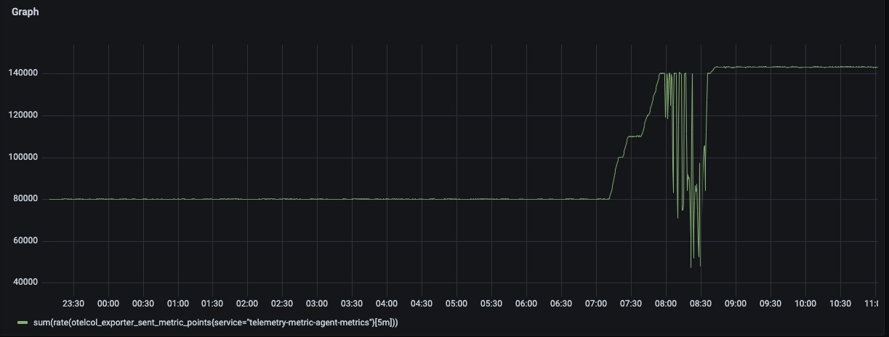
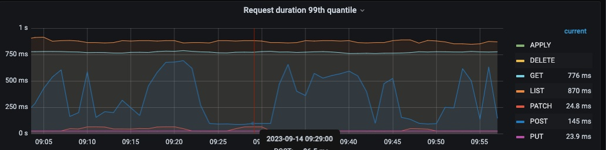
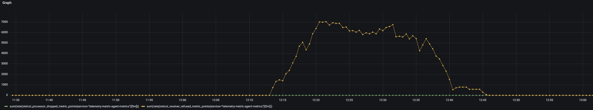

# Hardened Metric Agent Setup

The aim of this exercise is to harden the metric agent so that it can satisfy the metric load of most of the use cases.

## Setup

For the test environment, the following setup was used:

- Provision a GCP cluster with Kubernetes (n2-standard-16, 16 CPU, 64Gi memory)
- Deploy Telemetry Manager
- Deploy Prometheus to visualize the metrics
- Deploy Istio (needed for Prometheus)
- Deploy [Avalanche Prometheus metric load generator](https://blog.freshtracks.io/load-testing-prometheus-metric-ingestion-5b878711711c)

### Preparing Test Environment

1. Deploy Telemetry Manager:

   ```shell
   make deploy-dev
   ```

2. Deploy monitoring and Istio:

   ```unix
   kyma deploy -s main --component istio --component monitoring
   ```

> NOTE: alternatively istio CRDS can be installed from [here](https://github.com/istio/api/blob/master/kubernetes/customresourcedefinitions.gen.yaml) and only monitoring stack can be installed with `kyma deploy -s main --component monitoring`

3. Deploy Metricpipeline
    <details>
      <summary>Expand</summary>

    ```yaml
    ---
    apiVersion: v1
    kind: Namespace
    metadata:
      name: metric-receiver
    ---
    apiVersion: v1
    kind: ConfigMap
    metadata:
      name: mock-metric-receiver
      namespace: metric-receiver
      labels:
        app: mock-metric-receiver
    data:
      config.yaml: |
        receivers:
          otlp:
            protocols:
              grpc: {}
              http: {}
        exporters:
          debug:
            verbosity: detailed
        service:
          pipelines:
            metrics:
              receivers:
                - otlp
              exporters:
                - debug
    ---
    apiVersion: apps/v1
    kind: Deployment
    metadata:
      labels:
        app: mock-metric-receiver
      name: mock-metric-receiver
      namespace: metric-receiver
    spec:
      replicas: 1
      selector:
        matchLabels:
          app: mock-metric-receiver
      strategy: {}
      template:
        metadata:
          labels:
            app: mock-metric-receiver
        spec:
          volumes:
            - name: collector-config
              configMap:
                name: mock-metric-receiver
          securityContext:
            fsGroup: 101
          containers:
            - image: otel/opentelemetry-collector-contrib:0.70.0
              name: otel-collector
              volumeMounts:
                - name: collector-config
                  mountPath: /etc/collector
              args:
                - --config=/etc/collector/config.yaml
    ---
    apiVersion: v1
    kind: Service
    metadata:
      labels:
        app: mock-metric-receiver
      name: mock-metric-receiver
      namespace: metric-receiver
    spec:
      ports:
        - name: http-otlp
          port: 4317
          protocol: TCP
          targetPort: 4317
        - name: grpc-otlp
          port: 4318
          protocol: TCP
          targetPort: 4318
      selector:
        app: mock-metric-receiver
    ---
    apiVersion: telemetry.kyma-project.io/v1alpha1
    kind: MetricPipeline
    metadata:
      labels:
        app.kubernetes.io/name: metricpipeline
        app.kubernetes.io/instance: metricpipeline-sample
        app.kubernetes.io/part-of: telemetry-manager
        app.kubernetes.io/managed-by: kustomize
        app.kubernetes.io/created-by: telemetry-manager
      name: metricpipeline-sample
    spec:
      input:
        application:
          runtime:
            enabled: true
          prometheus:
            enabled: true
      output:
        otlp:
          endpoint:
            value: http://mock-metric-receiver.metric-receiver:4317
    ---
    apiVersion: v1
    kind: Service
    metadata:
      annotations:
        prometheus.io/port: "8888"
        prometheus.io/scrape: "true"
        prometheus.io/scheme: "http"
      labels:
        app.kubernetes.io/name: telemetry-metric-agent
      name: telemetry-metric-agent-metrics
      namespace: kyma-system
    spec:
      clusterIP: None
      ports:
        - name: http-metrics
          port: 8888
          protocol: TCP
          targetPort: 8888
      selector:
        app.kubernetes.io/name: telemetry-metric-agent
      type: ClusterIP
    ```
    </details>

   Following configurations are changed for metric agent
    <details>
      <summary>Expand</summary>

    ```yaml
        processors:
            batch:
                send_batch_size: 1024
                timeout: 10s
                send_batch_max_size: 1024
            memory_limiter:
                check_interval: 0.5s
                limit_percentage: 85
                spike_limit_percentage: 10
    ```
    </details>

   Final ConfigMap of the metrics agent should look like for

    <details>
      <summary>Expand</summary>

    ```yaml
    apiVersion: v1
    data:
      relay.conf: |
        extensions:
            health_check:
                endpoint: ${MY_POD_IP}:13133
        service:
            pipelines:
                metrics/prometheus:
                    receivers:
                        - prometheus/app-pods
                    processors:
                        - memory_limiter
                        - resource/delete-service-name
                        - resource/insert-input-source-prometheus
                        - batch
                    exporters:
                        - otlp
            telemetry:
                metrics:
                    address: ${MY_POD_IP}:8888
                logs:
                    level: info
            extensions:
                - health_check
        receivers:
            prometheus/app-pods:
                config:
                    scrape_configs:
                        - job_name: app-pods
                          scrape_interval: 30s
                          relabel_configs:
                            - source_labels: [__meta_kubernetes_pod_node_name]
                              regex: $MY_NODE_NAME
                              action: keep
                            - source_labels: [__meta_kubernetes_pod_annotation_prometheus_io_scrape]
                              regex: "true"
                              action: keep
                            - source_labels: [__meta_kubernetes_pod_phase]
                              regex: Pending|Succeeded|Failed
                              action: drop
                            - source_labels: [__meta_kubernetes_pod_container_init]
                              regex: (true)
                              action: drop
                            - source_labels: [__meta_kubernetes_pod_container_name]
                              regex: (istio-proxy)
                              action: drop
                            - source_labels: [__meta_kubernetes_pod_label_security_istio_io_tlsMode]
                              regex: (istio)
                              target_label: __scheme__
                              replacement: https
                              action: replace
                            - source_labels: [__meta_kubernetes_pod_annotation_prometheus_io_scheme]
                              regex: (https?)
                              target_label: __scheme__
                              action: replace
                            - source_labels: [__scheme__]
                              regex: (https)
                              action: drop
                            - source_labels: [__meta_kubernetes_pod_annotation_prometheus_io_path]
                              regex: (.+)
                              target_label: __metrics_path__
                              action: replace
                            - source_labels: [__address__, __meta_kubernetes_pod_annotation_prometheus_io_port]
                              regex: ([^:]+)(?::\d+)?;(\d+)
                              target_label: __address__
                              replacement: $$1:$$2
                              action: replace
                          kubernetes_sd_configs:
                            - role: pod
            prometheus/app-services:
                config:
                    scrape_configs:
                        - job_name: app-services
                          scrape_interval: 30s
                          relabel_configs:
                            - source_labels: [__meta_kubernetes_endpoint_node_name]
                              regex: $MY_NODE_NAME
                              action: keep
                            - source_labels: [__meta_kubernetes_service_annotation_prometheus_io_scrape]
                              regex: "true"
                              action: keep
                            - source_labels: [__meta_kubernetes_pod_phase]
                              regex: Pending|Succeeded|Failed
                              action: drop
                            - source_labels: [__meta_kubernetes_pod_container_init]
                              regex: (true)
                              action: drop
                            - source_labels: [__meta_kubernetes_pod_container_name]
                              regex: (istio-proxy)
                              action: drop
                            - source_labels: [__meta_kubernetes_pod_label_security_istio_io_tlsMode]
                              regex: (istio)
                              target_label: __scheme__
                              replacement: https
                              action: replace
                            - source_labels: [__meta_kubernetes_service_annotation_prometheus_io_scheme]
                              regex: (https?)
                              target_label: __scheme__
                              action: replace
                            - source_labels: [__scheme__]
                              regex: (https)
                              action: drop
                            - source_labels: [__meta_kubernetes_service_annotation_prometheus_io_path]
                              regex: (.+)
                              target_label: __metrics_path__
                              action: replace
                            - source_labels: [__address__, __meta_kubernetes_service_annotation_prometheus_io_port]
                              regex: ([^:]+)(?::\d+)?;(\d+)
                              target_label: __address__
                              replacement: $$1:$$2
                              action: replace
                            - source_labels: [__meta_kubernetes_service_name]
                              target_label: service
                              action: replace
                          kubernetes_sd_configs:
                            - role: endpoints
        processors:
            batch:
                send_batch_size: 1024
                timeout: 10s
                send_batch_max_size: 1024
            memory_limiter:
                check_interval: 0.5s
                limit_percentage: 85
                spike_limit_percentage: 10
            resource/delete-service-name:
                attributes:
                    - action: delete
                      key: service.name
            resource/insert-input-source-runtime:
                attributes:
                    - action: insert
                      key: kyma.source
                      value: runtime
            resource/insert-input-source-prometheus:
                attributes:
                    - action: insert
                      key: kyma.source
                      value: prometheus
        exporters:
            otlp:
                endpoint: telemetry-otlp-metrics.kyma-system.svc.cluster.local:4317
                tls:
                    insecure: true
                sending_queue:
                    enabled: true
                    queue_size: 512
                retry_on_failure:
                    enabled: true
                    initial_interval: 5s
                    max_interval: 30s
                    max_elapsed_time: 300s
    kind: ConfigMap
    metadata:
      labels:
        app.kubernetes.io/name: telemetry-metric-agent
      name: telemetry-metric-agent
      namespace: kyma-system
      ownerReferences:
      - apiVersion: telemetry.kyma-project.io/v1alpha1
        kind: MetricPipeline
        name: metricpipeline-sample
    ```
   </details>

4. Deploy Avalanche load generator deployment
   <details>                   
     <summary>Expand</summary>

   ```yaml
   apiVersion: apps/v1
   kind: Deployment
   metadata:
     name: avalanche-metric-load-generator
   spec:      
     selector:
       matchLabels:
         app: avalanche-metric-load-generator
     template:
       metadata:
         labels:
           app: avalanche-metric-load-generator
         annotations:
           prometheus.io/path: /metrics
           prometheus.io/port: "8080"
           prometheus.io/scrape: "true"
       spec:
         containers:
         - name: avalanche-metric-load-generator
           image: quay.io/freshtracks.io/avalanche
           imagePullPolicy: IfNotPresent
           args:
           - --metric-count=500
           - --series-count=20
           - --port=8080
           resources:
             limits:
               memory: "128Mi"
               cpu: "200m"
           ports:
           - containerPort: 8080
             protocol: TCP
             name: metrics
   ```
   </details>

## Test Cases

### Assumptions

We tweak metrics and series value with 10 labels in each metric data point. The test is executed for 1 hour to have a stabilized output. Additionally, the load is scaled slowly to prevent spikes which might cause OOMs of metric agent.

We identified the following test cases:

1. To test how many workloads are supported: [Multiple Pods, All Running on a Single Node, Export Metrics](#multiple-pods-all-running-on-a-single-node-export-metrics).
2. To understand how scraping works when the workload exposes several MB of metrics: [One Workload Generating Huge Amount of Metrics](#one-workload-generating-huge-amount-of-metrics).
3. To understand prometheus SDS behaviour with multiple services: [Multiple Workloads Across Different Nodes](#multiple-workloads-across-different-nodes).
4. [Scrape Multiple Pods and Services From Multiple Receivers](#scrape-multiple-pods-and-services-from-multiple-receivers).
5. [Scrape Sample Limit Test](#scrape-sample-limit-test).

### Multiple Pods, All Running on a Single Node, Export Metrics

Setup:

Avalanche load generator configuration per Pod:

- Metric count: 500
- Metric series: 20
- Number of labels: 10

To simulate a smooth ramp-up and avoid huge data flood at the beginning, the load generator was started with 5 instances. The instance count was increased at 5 instances every minute until peak load was reached.

To determine the limits of a single metric agent, this test was executed on a single Node installation. After the load generator reached 28 instances, metric agent hits the limits and stays stable with this setup. Any load above this setup would cause memory limiter to refuse incoming traffic.

The following graph shows the average metric points processed by the prometheus metric receiver per second. The agent reaches an average of 14K metric points/sec.


The following graph shows the refused metric points from the configured memory_limiter, with traffic above 14K metric points/sec results in  metrics being refused by the memory_limiter.


The following graph shows memory utilization of metric agent during test phase.


The following graph shows CPU utilization of metric agent during test phase.


### One Workload Generating Huge Amount of Metrics

This scenario tests a single metric endpoint with huge amount of data. The Avalanche load generator is deployed with a single Pod instance and configured with 1000 distinct metrics and 20 metric series for each metric with 10 labels.

To find the limit of the metric agent, metric count was increased in 1000 steps.

The following graph shows the highest stable load from a single target with a huge amount of metric data.


Metric agent reached max 7K metric points/sec from a single metric target, with 6000 and 20 metric series. In this test scenario, the measured raw metric payload size was ~51MB.

To determine the impact of different metric series on metric agent, another test was performed: For this the test, the metric series were increased from 20 to 30, distinct metric count started from 1000 and increased in 1000 steps until the limit of metric agent was reached.
Metric agent reached a peak of ~7K metric points/sec (yellow line from the previous graph) with 4000 distinct metric. In this setup, the measured raw metric payload size was ~31MB.

In both configurations, the metric agent reached a peak of ~7K metric points/sec independent size of raw metric data. Thus, the raw metric payload size has no impact on metric agent performance.

In both configurations, the Avalanche load generator generated 120K metric points/scrape.

> **NOTE:** Avalanche load generator resources must be changed for this scenario. For this test, CPU settings were changed to 400m and Memory to 1Gi.

### Multiple Workloads Across Different Nodes

Setup:

Gardener GCP cluster:

- Cluster with 15 Nodes
- Machine types n2-standard-16 (16 CPU, 64Gi memory), Gardener supports max 100 Pods per Node

Avalanche load generator configuration:

- Metric Count: 100
- Metric Series: 20
- Number of label: 10

Prometheus:

- Instance memory increased to 7Gi

To simulate a smooth ramp-up and avoid huge data flood at the beginning, load generator started with `100` instances. Instance count was increased every by `100` instances every 5 minutes until the max Pod count of cluster was reached.

The following graph shows average metric data received by the metric agent:


The following graph shows average metric data received by the metric gateway:


The following graph shows exported metric data by the metric gateway:


The following graph shows the metric agent CPU utilization:


The following graph shows the metric agent memory utilization:


The following graph shows the Kubernetes API server metrics:


The test reached a max Pod count 1430 in the cluster. All metrics were successfully received and exported to the metric gateway; no critical memory, cpu or network utilization was observed.

The Kubernetes API request duration reach for `GET` operations at peak was ~750ms, and for `LIST` operations ~900ms.

### Scrape Multiple Pods and Services From Multiple Receivers

Setup:

Avalanche load generator configuration:

- Metric Count: 500
- Metric Series: 20
- Number of label: 10

Metric agent:

The metric agent pipeline metrics/prometheus has been configured with an additional receiver prometheus/app-services; see the following configuration:
<details>                    
  <summary>Expand</summary>

```yaml
apiVersion: v1
data:
  relay.conf: |
    extensions:
        health_check:
            endpoint: ${MY_POD_IP}:13133
    service:
        pipelines:
            metrics/prometheus:
                receivers:
                    - prometheus/app-pods
                    - prometheus/app-services
                processors:
                    - memory_limiter
                    - resource/delete-service-name
                    - resource/insert-input-source-prometheus
                    - batch
                exporters:
                    - otlp
```
</details>

To enable metric scraping from the second receiver prometheus/app-services, the following service was created for the Avalanche load generator:
<details>                    
   <summary>Expand</summary>

```yaml
apiVersion: v1
kind: Service
metadata:
  annotations:
    prometheus.io/port: "8080"
    prometheus.io/scrape: "true"
  labels:
    app: avalanche-metric-load-generator
  name: avalanche-metric-load-generator
spec:
  clusterIP: None
  ports:
  - name: http-metrics
    port: 8080
    protocol: TCP
    targetPort: 8080
  selector:
    app: avalanche-metric-load-generator
  type: ClusterIP
```
</details>

The purpose of this test was to determine the scraping behavior of the metric agent, and especially the memory impact with multiple receivers under high load.

The test metric generator started with 10 instances. Metrics are scraped by the prometheus/app-pods receiver and prometheus/app-services receiver at the same time independently.
Metric generator instances were increased with 2 instance every minute to simulate a ramp-up of load.

With 14 instances, metric agent reached the stable peak of 280K metric samples per scrape loop in total, which is  similar to the single receiver performance.
Additional load on top of this setup caused refusal of incoming metrics by the memory_limiter processor.

The following graph shows the metrics that were accepted during the test by both receivers:


The following graph shows the refused metrics during test from the processor:


The following graph shows the CPU utilization of the metric agent:


The following graph shows the memory utilization of the metric agent:


### Scrape Sample Limit Test

Setup:

Avalanche load generator was configured to generate `2000` metric points per scrape:

- Metric Count: 100
- Metric Series: 20
- Number of label: 10

Metric agent scrape job configuration:

- prometheus/app-pods and prometheus/app-service configured with parameter `sample_limit: 1000` to limit time series for each scrape loop to max 1000 time series.
   <details>                    
     <summary>Expand</summary>  

  ```yaml
          prometheus/app-pods:
              config:
                  scrape_configs:
                      - job_name: app-pods
                        sample_limit: 1000
                        scrape_interval: 30s
                        relabel_configs:
                          - source_labels: [__meta_kubernetes_pod_node_name]
                            regex: $MY_NODE_NAME
                            action: keep
  ```
</details>

With this limit, if the target exposes more than 1000 metrics, the target won't be scraped. Instead, log messages show `up` label being set to 0 as if the target is unhealthy.
Example message ` "target_labels": "{__name__=\"up\", instance=\"100.64.13.133:8080\", job=\"app-pods\"}"`:

```shell
2023-09-14T09:52:26.223Z	warn	internal/transaction.go:123	Failed to scrape Prometheus endpoint	{"kind": "receiver", "name": "prometheus/app-pods", "data_type": "metrics", "scrape_timestamp": 1694685140337, "target_labels": "{__name__=\"up\", instance=\"100.64.13.133:8080\", job=\"app-pods\"}"}
2023-09-14T09:52:45.755Z	warn	internal/transaction.go:123	Failed to scrape Prometheus endpoint	{"kind": "receiver", "name": "prometheus/app-pods", "data_type": "metrics", "scrape_timestamp": 1694685156843, "target_labels": "{__name__=\"up\", instance=\"100.64.13.134:8080\", job=\"app-pods\"}"}
2023-09-14T09:52:56.344Z	warn	internal/transaction.go:123	Failed to scrape Prometheus endpoint	{"kind": "receiver", "name": "prometheus/app-pods", "data_type": "metrics", "scrape_timestamp": 1694685170337, "target_labels": "{__name__=\"up\", instance=\"100.64.13.133:8080\", job=\"app-pods\"}"}
2023-09-14T09:53:12.202Z	warn	internal/transaction.go:123	Failed to scrape Prometheus endpoint	{"kind": "receiver", "name": "prometheus/app-pods", "data_type": "metrics", "scrape_timestamp": 1694685186843, "target_labels": "{__name__=\"up\", instance=\"100.64.13.134:8080\", job=\"app-pods\"}"}
2023-09-14T09:53:24.989Z	warn	internal/transaction.go:123	Failed to scrape Prometheus endpoint	{"kind": "receiver", "name": "prometheus/app-pods", "data_type": "metrics", "scrape_timestamp": 1694685200337, "target_labels": "{__name__=\"up\", instance=\"100.64.13.133:8080\", job=\"app-pods\"}"}
2023-09-14T09:53:45.643Z	warn	internal/transaction.go:123	Failed to scrape Prometheus endpoint	{"kind": "receiver", "name": "prometheus/app-pods", "data_type": "metrics", "scrape_timestamp": 1694685216843, "target_labels": "{__name__=\"up\", instance=\"100.64.13.134:8080\", job=\"app-pods\"}"}
2023-09-14T09:53:56.041Z	warn	internal/transaction.go:123	Failed to scrape Prometheus endpoint	{"kind": "receiver", "name": "prometheus/app-pods", "data_type": "metrics", "scrape_timestamp": 1694685230337, "target_labels": "{__name__=\"up\", instance=\"100.64.13.133:8080\", job=\"app-pods\"}"}
```

## Summary

The test resulted in the following findings:

### Setup and Parameters

- Used metric size was 20 metric data points with 10 labels per each distinct metric
- 1200Mi memory and 1 CPU
- memory_limiter configured for 80% memory limit, 15% spike limit with 0.5 second check interval which results in (80 -15) 75% hard limit equivalent to 780Mi memory.
- Batch processor configured to create batches with 1024 metrics, default batch size 8192 was exceeded by the gRPC client default payload limit 4MB.
- Metric gateway configured with a broken exporter to simulate backpressure from metric gateway to metric agent

### Findings

- Test results with a single agent instance and single receiver configuration: A single target scrape reached max ~120K metric data point.
- Single agent instance with single receiver reached ~280K metric points per scrape (~14K metric point/sec) and stayed stable. For anything above, the memory_limiter processor refuses the metric data.
- Multi-Node test with single receiver performed on 15 Nodes cluster 1430 Pods (this was the max Pod count can be deployed on this cluster): Agent was able to scrape in total ~2.800K metrics data per scrape loop, and data was pushed successfully to the agent without any data dropping by agent side.
  - No memory issues identified and no additional memory impact found.
  - Kubernetes API server request duration for `GET` operations reached ~750ms and for `LIST` operations ~900ms. There was only one short peak of 21s detected for the `GET` operation.
- `sample_limit` configuration tested for multiple receivers. Configured limitation works but there are no metrics identified to see limit violations when they occur, only logs are present in this case.
- Multi-receiver test reached same stable limit of ~280K metrics per scrape in total, to test OOM resilience of setup, 45% more load added on peak stable load. Metric agent stay stable over 12 hour running test, no OOM observed, load over ~280K refused successfully.
- In all test cases backpressure from broken metric gateway handled by the metric agent successfully, no serious impact on metric agent observed, metric agent exporter successfully queued metric data and drop after unsuccessfully retry.

## Conclusion

To achieve a stable and resilient metric agent setup, the following configuration parameters must be added or adjusted.

To avoid metric agent to overrun with a huge amount of data floods from single scrape target and run in OOM, configuration parameter `sample_limit: 50000` were added to each Prometheus receiver scrape configuration.
The metric agent can handle higher values, but analyzing current Kyma production deployments shows values around 50000 in average.

For more memory resilience, the processor memory_limiter was configured with a hard limit of 75%,  and hard and soft memory limit check intervals were configured to 0.5 second to allow the processor to react faster when limits are exceed.

Batch processor was configured with a batch size of 1024 to avoid hitting the gRPC client payload size limit while metrics are exported to the gateway instances.
Default batch size of 8192 was over the default gRPC client payload limit of 4MByte.

By the multi-receiver test some OOM observed, after further analysis result following finding:

- Under high load, memory limiter triggers garbage collector (GC) to free memory and go back for normal operation
- Between GC cycles approximately 200MByte on top of live memory occupied
- Frequent GC result fragmented memory because go GC has no compaction (only Mark and Sweep)
- In certain cases memory get heavily fragmented, despite there are in total enough memory but none of free memory blocks are big enough for in coming data

To solve that problem, metric agent memory limit was increased from 1Gi to 1200Mi, and `memory_limiter` check intervals were decreased from 0.5 second to 0.1 second. When the test was repeated with this new configuration and 45% more load over 12 hours, no OOM issues occurred.

The following ConfigMap contains all configuration adjustments for the metric agent, as well as the Prometheus receiver configuration changes. This configuration should be used as reference to implement Telemetry manager changes.
<details>                    
  <summary>Expand</summary>

```yaml
apiVersion: v1
data:
  relay.conf: |
    extensions:
        health_check:
            endpoint: ${MY_POD_IP}:13133
    service:
        pipelines:
            metrics/prometheus:
                receivers:
                    - prometheus/app-pods
                    - prometheus/app-services
                processors:
                    - memory_limiter
                    - resource/delete-service-name
                    - resource/insert-input-source-prometheus
                    - batch
                exporters:
                    - otlp
        telemetry:
            metrics:
                address: ${MY_POD_IP}:8888
            logs:
                level: info
        extensions:
            - health_check
    receivers:
        prometheus/app-pods:
            config:
                scrape_configs:
                    - job_name: app-pods
                      sample_limit: 50000
                      scrape_interval: 30s
                      relabel_configs:
                        - source_labels: [__meta_kubernetes_pod_node_name]
                          regex: $MY_NODE_NAME
                          action: keep
                        - source_labels: [__meta_kubernetes_pod_annotation_prometheus_io_scrape]
                          regex: "true"
                          action: keep
                        - source_labels: [__meta_kubernetes_pod_phase]
                          regex: Pending|Succeeded|Failed
                          action: drop
                        - source_labels: [__meta_kubernetes_pod_container_init]
                          regex: (true)
                          action: drop
                        - source_labels: [__meta_kubernetes_pod_container_name]
                          regex: (istio-proxy)
                          action: drop
                        - source_labels: [__meta_kubernetes_pod_label_security_istio_io_tlsMode]
                          regex: (istio)
                          target_label: __scheme__
                          replacement: https
                          action: replace
                        - source_labels: [__meta_kubernetes_pod_annotation_prometheus_io_scheme]
                          regex: (https?)
                          target_label: __scheme__
                          action: replace
                        - source_labels: [__scheme__]
                          regex: (https)
                          action: drop
                        - source_labels: [__meta_kubernetes_pod_annotation_prometheus_io_path]
                          regex: (.+)
                          target_label: __metrics_path__
                          action: replace
                        - source_labels: [__address__, __meta_kubernetes_pod_annotation_prometheus_io_port]
                          regex: ([^:]+)(?::\d+)?;(\d+)
                          target_label: __address__
                          replacement: $$1:$$2
                          action: replace
                      kubernetes_sd_configs:
                        - role: pod
        prometheus/app-services:
            config:
                scrape_configs:
                    - job_name: app-services
                      sample_limit: 50000
                      scrape_interval: 30s
                      relabel_configs:
                        - source_labels: [__meta_kubernetes_endpoint_node_name]
                          regex: $MY_NODE_NAME
                          action: keep
                        - source_labels: [__meta_kubernetes_service_annotation_prometheus_io_scrape]
                          regex: "true"
                          action: keep
                        - source_labels: [__meta_kubernetes_pod_phase]
                          regex: Pending|Succeeded|Failed
                          action: drop
                        - source_labels: [__meta_kubernetes_pod_container_init]
                          regex: (true)
                          action: drop
                        - source_labels: [__meta_kubernetes_pod_container_name]
                          regex: (istio-proxy)
                          action: drop
                        - source_labels: [__meta_kubernetes_pod_label_security_istio_io_tlsMode]
                          regex: (istio)
                          target_label: __scheme__
                          replacement: https
                          action: replace
                        - source_labels: [__meta_kubernetes_service_annotation_prometheus_io_scheme]
                          regex: (https?)
                          target_label: __scheme__
                          action: replace
                        - source_labels: [__scheme__]
                          regex: (https)
                          action: drop
                        - source_labels: [__meta_kubernetes_service_annotation_prometheus_io_path]
                          regex: (.+)
                          target_label: __metrics_path__
                          action: replace
                        - source_labels: [__address__, __meta_kubernetes_service_annotation_prometheus_io_port]
                          regex: ([^:]+)(?::\d+)?;(\d+)
                          target_label: __address__
                          replacement: $$1:$$2
                          action: replace
                        - source_labels: [__meta_kubernetes_service_name]
                          target_label: service
                          action: replace
                      kubernetes_sd_configs:
                        - role: endpoints
    processors:
        batch:
            send_batch_size: 1024
            timeout: 10s
            send_batch_max_size: 1024
        memory_limiter:
            check_interval: 0.1s
            limit_percentage: 80
            spike_limit_percentage: 15
        resource/delete-service-name:
            attributes:
                - action: delete
                  key: service.name
        resource/insert-input-source-runtime:
            attributes:
                - action: insert
                  key: kyma.source
                  value: runtime
        resource/insert-input-source-prometheus:
            attributes:
                - action: insert
                  key: kyma.source
                  value: prometheus
    exporters:
        otlp:
            endpoint: telemetry-otlp-metrics.kyma-system.svc.cluster.local:4317
            tls:
                insecure: true
            sending_queue:
                enabled: true
                queue_size: 512
            retry_on_failure:
                enabled: true
                initial_interval: 5s
                max_interval: 30s
                max_elapsed_time: 300s
kind: ConfigMap
metadata:
  labels:
    app.kubernetes.io/name: telemetry-metric-agent
  name: telemetry-metric-agent
  namespace: kyma-system
  ownerReferences:
  - apiVersion: telemetry.kyma-project.io/v1alpha1
    kind: MetricPipeline
    name: metricpipeline-sample
```
</details>

## Metric Gateway 

For the metric gateway test, the same test setup as for the metric agent (see above) was used. Additionally, metric gateway was configured with a Cloud Logging Service backend for more realistic results.

The metric agent is used as source to push metric data with gRPC protocol and OTLP format. To ensure both metric gateway instances are load balanced and get their load evenly distributed, metric agent is configured with the annotation `"traffic.sidecar.istio.io/includeOutboundPorts": "4317"`.

The Avalanche load generator is configured with the parameters `metric-count=500` and `series-count=20`. The generated metric data is collected by the metric agent (with Pod and service receivers at the same time) and pushed to the metric gateway instances. The Avalanche load generator started with 2 instances and added 2 more instances every minute until the metric gateway instances reach peak throughput.

### Summary

#### Setup and Parameters

- Metric size was 20 metric data points with 10 labels for each distinct metric.
- 1Gi memory and 1 CPU
- memory_limiter is configured for 75% memory limit and 10% spike limit with 0.1 second check interval, which results in (75 -10) 65% hard limit equivalent to 650Mi memory.
- Batch processor is configured to create batches with 1024 metrics.
- Exporter queue is configured with size 256 batches.
- Metric gateway is configured with a Cloud Logging Service instance as backend to push metric data.

#### Findings

- When the sending queue is full, metric gateway runs out of memory.

### Conclusion

During the test, some OOM is observed when the exporter sending queue is full.
Further analysis results in the following findings (same as for metric agent):

- Under high load, memory limiter triggers garbage collector (GC) to free memory and return to normal operation.
- Frequent use of the GC results in fragmented memory because the Go GC has no compaction (only Mark and Sweep).
- If none of the free memory blocks is big enough for incoming data, memory becomes very fragmented, even though in total there is enough memory.

To solve that problem, the metric agent memory limit was increased from 1Gi to 1200Mi, and the `memory_limiter` **spike_limit_percentage** parameter was set to `20`.
<details>                    
  <summary>Expand</summary>

```yaml
    processors:
        batch:
            send_batch_size: 1024
            timeout: 10s
            send_batch_max_size: 1024
        memory_limiter:
            check_interval: 0.1s
            limit_percentage: 75
            spike_limit_percentage: 20
```
</details>

The metric gateway with a configured CLS instance reaches max ~34K metric data points/sec in peak. Any higher load is rejected by the configured CLS instance. At the peak limit of ~34K metric data points/sec, metric gateway instance memory utilization is around 20%. Any load over this value yields the following results:

- CLS instance returns a 520 bad gateway HTTP result.
- Metric gateway starts queueing the data to export.
- After the sending queue size reaches the configured limit 256, metric gateway memory utilization reaches ~780 MB and memory_limiter starts refusing incoming data.
