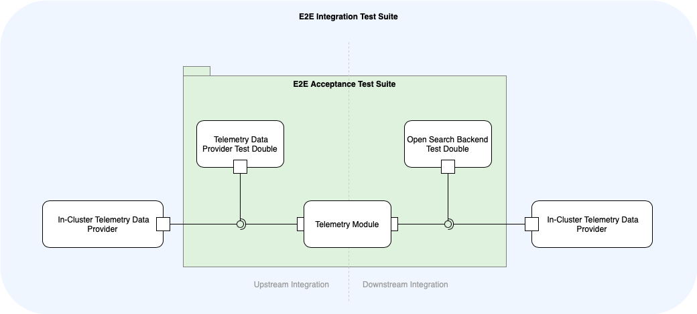

# Testing Strategy​

This document summarises the software development testing life cycle activities and artefacts for the Telemetry module.

## Roles and Responsibilities

Software Testing Life Cycle phases:
​
| Phase | When | How | Result |
| --- | --- | --- | --- |
| Requirement analysis | Sprint planning, grooming and triaging meetings | Brainstorm the feature implementation, design and its implications on the testability. | A clarified implementation design with a focus on testability, the acceptance tests criteria are collected, and the testing surface is defined as a part of the story. |
| Test planning, design and development | Development phase during the sprint | Implement Unit and Acceptance tests for new functionalities. | All functionalities are covered with Unit and Acceptance tests. |
| Test validation | Acceptance phase during the sprint | During the code review and iteration review, verify that the Test Suite correctly and completely covers the Acceptance Criteria. | The Acceptance Criteria are integrated into the E2E test suite and become a regression suite for future verification. |
| Test execution | A part of the CI process | | |
​

The roles and responsibilities during the STLC:
​
| Role | Responsibilities | Performed by |
| --- | --- | --- |
| `PO` | Define acceptance criteria for the user stories, assess risks | Product Owner |
| `DEV` | Implement tests for new functionality, extend the test suites, adhere to the test coverage expectations | Development team |
| `ARCHITECT` | Devise system design with a focus on testability | Development team |
| `QA`| Define the testing coverage for each story, ensure the test suite is delivered along with each new piece of functionality. | Development team |

## Testing Levels​

### Functional Tests

​
| Test suite | Testing level | Purpose |
| --- | --- | --- |
| Unit (located along with the individual source files) | Unit | It tests the individual units of application logic in isolation, focusing on the implementation correctness. |
| [E2E Acceptance](../../test/e2e) | Acceptance  (high-level) | It tests the usability scenarios of Telemetry Manager in a cluster. This test suite assesses the functional correctness of Telemetry Controller. |
| E2E Operational | System | It validates the operational aspects of the module (successful module upgrades, deletions, etc.). |
| [E2E integration](https://github.com/kyma-project/telemetry-manager/issues/261#issuecomment-1647336680) |Integration (high-level)|tests the Telemetry Module integration with 3rd party components and modules (with a focus on contract fulfilment).|

#### Testing of New Functionality

Testing a new functionality encompasses two activities: capturing the acceptance criteria for each new functionality and providing the requirements traceability. `Requirement` and `Test Suite` are linked by the Behavioural-Driven Testing DSL of the [Ginkgo](https://onsi.github.io/ginkgo/) testing framework. `User Story` and `Acceptance Criteria` are linked semi-automatically because acceptance criteria are a mandatory part of each user story with new functionality (using the PR-template checklist).

#### Testing of Existing Functionality

The regression test suite validates the correctness of the product's previously released functionalities using the "retest all" technique. It encompasses the end-to-end and operational test suites.
​

### Non-Functional Tests​

| Type | Automation     | Frequency                                                                                               | Results                      |
| --- |----------------|---------------------------------------------------------------------------------------------------------|------------------------------|
| Performance tests | Semi-automated | Automated performance tests are manually triggered when bumping images for Fluent Bit or OTel Collector | `PR Load Test` Github action |
| Security tests (done SAP-internally) | Automated      |                                                                                                         |                              |

### Source Code Quality

Most of the source code quality prerequisites are checked automatically in the following ways:

- The code-style requirements are collected and stored as a [configuration](governance.md#linters-in-action) for the fine-grained static analysis linters.
- The cognitive and cyclomatic complexity quality gateways are agreed upon and imposed using static analysis linters.
- Static code checks are implemented using [golangci-lint](https://golangci-lint.run).
- The Continuous Integration pipeline for each PR controls the violations of static code rules.
- In the case of a problem, the PR is prevented from moving forward, and all involved parties are notified.
- This static code validation covers the whole codebase, including the test suites.
