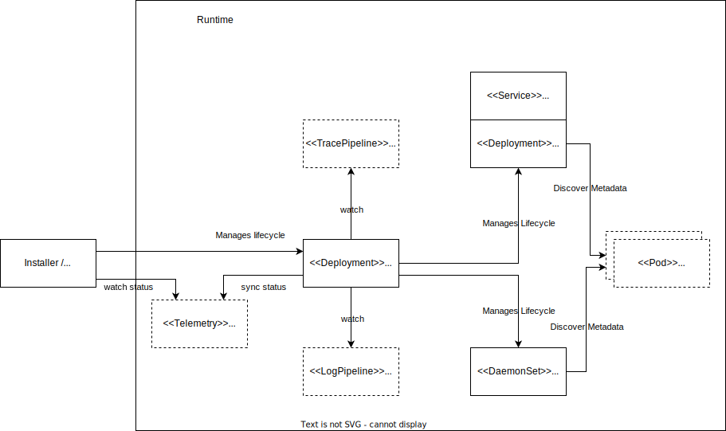

# Telemetry Operator

## Module lifecycle

The module on its own ships a single component only, namely the Telemetry Operator, which is described by a custom resource of type Telemetry. The operator implements the Kubernetes controller pattern and manages the whole lifecycle of all other components relevant to this module. The operator watches for the Kubernetes LogPipeline, TracePipeline, and, in the future, MetricPipeline resources created by the user. With these, the user describes in a declarative way what data of a signal type to collect and where to ship it.
If the Telemetry operator detects a configuration, it rolls out the relevant collector components on demand.

## Module Configuration

At the moment, the operator has no dedicated configuration options. It is planned to support configuration in the specification of the related [Telemetry](./resources/01-telemetry.md) resource.

## Module Status
The Telemetry operator syncs the overall status of the module into the [Telemetry](./resources/01-telemetry.md) resource and can be found in the `status` section. In future, the status will be enhanced with more runtime information.
