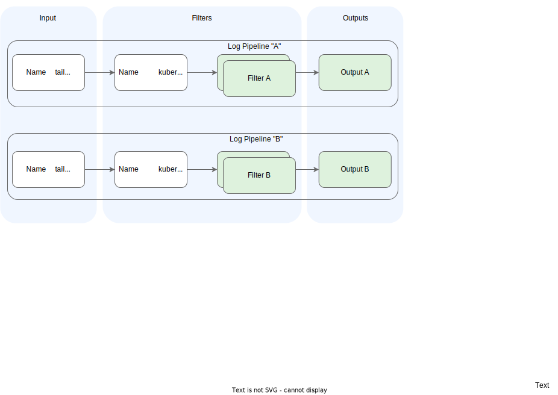
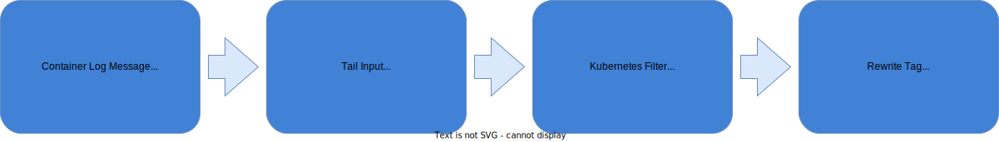

# Application Logs

With application logs, you can debug an application and derive the internal state of an application. They can be very useful if the logs are emitted with the correct severity level and context, and are essential for observing an application. However, they usually lack contextual information, such as where they were called from.

The Telemetry module provides the [Fluent Bit](https://fluentbit.io/) log agent for the collection and shipment of application logs of any container running in the Kyma runtime. You can configure the log agent with external systems using runtime configuration with a dedicated Kubernetes API (CRD) named `LogPipeline`. With the LogPipeline's HTTP output, you can natively integrate with vendors that support this output, or with any vendor using a [Fluentd integration](https://medium.com/hepsiburadatech/fluent-logging-architecture-fluent-bit-fluentd-elasticsearch-ca4a898e28aa). The support for the aimed vendor-neutral OTLP protocol will be [added in future](https://github.com/kyma-project/kyma/issues/16307). To overcome the missing flexibility of the current proprietary protocol, you can run the agent in the [unsupported mode](#unsupported-mode), leveraging the full vendor-specific output options of Fluent Bit. If you need advanced configuration options, you can also bring your own log agent.

## Prerequisites

Your application must log to `stdout` or `stderr`, which is the recommended way by Kubernetes to [emit logs](https://kubernetes.io/docs/concepts/cluster-administration/logging/). It ensures that the logs can be processed by Kubernetes primitives like `kubectl logs`. Any other way of instrumentation is not supported yet. In the future, a log gateway might be added to send logs from the application to a an OTLP push-based endpoint.

## Architecture

### Fluent Bit

The Telemetry module provides [Fluent Bit](https://fluentbit.io/) as a log agent. Fluent Bit collects all application logs of the cluster workload and ships them to a backend.


1. Container logs are stored by the Kubernetes container runtime under the `var/log` directory and its subdirectories.
2. Fluent Bit runs as a [DaemonSet](https://kubernetes.io/docs/concepts/workloads/controllers/daemonset/) (one instance per Node), detects any new log files in the folder, and tails them using a filesystem buffer for reliability.
3. Fluent Bit queries the [Kubernetes API Server](https://kubernetes.io/docs/reference/command-line-tools-reference/kube-apiserver/) for additional Pod metadata, such as Pod annotations and labels.
4. The Telemetry module configures Fluent Bit with your custom output configuration.
5. As specified in your LogPipeline configuration, Fluent Bit sends the log data to observability systems outside or inside the Kyma cluster. Here, you can use the integration with HTTP to integrate a system directly or with an additional Fluentd installation.
6. To analyze and visualize your logs, access the internal or external observability system.

### Pipelines

Fluent Bit comes with a pipeline concept, which supports a flexible combination of inputs with outputs and filtering in between; for details, see [Fluent Bit: Output](https://docs.fluentbit.io/manual/concepts/data-pipeline/output).
Kyma's Telemetry module brings a predefined setup of the Fluent Bit DaemonSet and a base configuration, which assures that the application logs of the workloads in the cluster are processed reliably and efficiently. Additionally, the telemetry module provides a Kubernetes API called `LogPipeline` to configure outputs with some filtering capabilities.



1. A dedicated `tail` input plugin reads the application logs, which are selected in the input section of the `LogPipeline`. Each `tail` input uses a dedicated `tag` with the name `<logpipeline>.*`.

2. The application logs are enriched by the `kubernetes` filter. You can add your own filters to the default filters.

3. Based on the default and custom filters, you get the desired output for each `LogPipeline`.

This approach assures a reliable buffer management and isolation of pipelines, while keeping flexibility on customizations.

### Telemetry Manager

The LogPipeline resource is managed by Telemetry Manager, a typical Kubernetes [operator](https://kubernetes.io/docs/concepts/extend-kubernetes/operator/) responsible for managing the custom parts of the Fluent Bit configuration.


Telemetry Manager watches all LogPipeline resources and related Secrets. Whenever the configuration changes, Telemetry Manager validates the configuration (with a [validating webhook](https://kubernetes.io/docs/reference/access-authn-authz/extensible-admission-controllers/)) and generates a new configuration for the Fluent Bit DaemonSet, where several ConfigMaps for the different aspects of the configuration are generated. Furthermore, referenced Secrets are copied into one Secret that is also mounted to the DaemonSet.

## Setting up a LogPipeline

In the following steps, you can see how to construct and deploy a typical LogPipeline. Learn more about the available [parameters and attributes](resources/02-logpipeline.md).

### Step 1: Create a LogPipeline and Output

To ship application logs to a new output, create a resource of the kind `LogPipeline`:

```yaml
kind: LogPipeline
apiVersion: telemetry.kyma-project.io/v1alpha1
metadata:
  name: http-backend
spec:
  output:
    http:
      dedot: false
      port: "80"
      uri: "/"
      host:
        value: https://myhost/logs
      user:
        value: "user"
      password:
        value: "not-required"
```

An output is a data destination configured by a [Fluent Bit output](https://docs.fluentbit.io/manual/pipeline/outputs) of the relevant type. The LogPipeline supports the following output types:

- **http**, which sends the data to the specified HTTP destination. The output is designed to integrate with a [Fluentd HTTP Input](https://docs.fluentd.org/input/http), which opens up a huge ecosystem of integration possibilities.
- **custom**, which supports the configuration of any destination in the Fluent Bit configuration syntax.
  > [!WARNING]
  > If you use a `custom` output, you put the LogPipeline in the [unsupported mode](#unsupported-mode).

  See the following example of the `custom` output:

  ```yaml
  spec:
    output:
      custom: |
        Name               http
        Host               https://myhost/logs
        Http_User          user
        Http_Passwd        not-required
        Format             json
        Port               80
        Uri                /
        Tls                on
        tls.verify         on
  ```

### Step 2: Add Filters

If you need selection mechanisms for application logs on the namespace or container level, you can use an input spec to restrict or specify from which resources logs are included.
If you don't define any input, it's collected from all namespaces, except the system namespaces `kube-system`, `istio-system`, `kyma-system`, which are excluded by default. For example, you can define the namespaces to include in the input collection, exclude namespaces from the input collection, or choose that only system namespaces are included. Learn more about the available [parameters and attributes](resources/02-logpipeline.md).

The following example collects input from all namespaces excluding `kyma-system` and only from the `istio-proxy` containers:

```yaml
kind: LogPipeline
apiVersion: telemetry.kyma-project.io/v1alpha1
metadata:
  name: http-backend
spec:
  input:
    application:
      namespaces:
        exclude:
          - kyma-system
      containers:
        include:
          - istio-proxy
  output:
    ...
```

It might happen that Fluent Bit prints an error per processed log line, which is then collected and re-processed.
To avoid problems with such recursive logs, it is recommended that you exclude the logs of the Fluent Bit container. The following example collects input from all namespaces including system namespaces, but excludes the Fluent Bit container:

```yaml
spec:
  input:
    application:
      namespaces:
        system: true
      containers:
        exclude:
        - fluent-bit
```

Alternatively, add filters to enrich logs with attributes or drop whole lines.
The following example contains three filters, which are executed in sequence.

```yaml
kind: LogPipeline
apiVersion: telemetry.kyma-project.io/v1alpha1
metadata:
  name: http-backend
spec:
  filters:
    - custom: |
        Name    grep
        Regex   $kubernetes['labels']['app'] my-deployment
    - custom: |
        Name    grep
        Exclude $kubernetes['namespace_name'] kyma-system|kube-system|istio-system
    - custom: |
        Name    record_modifier
        Record  cluster_identifier ${KUBERNETES_SERVICE_HOST}
  input:
    ...
  output:
    ...
```

> [!WARNING]
> If you use a `custom` output, you put the LogPipeline in the [unsupported mode](#unsupported-mode).

Telemetry Manager supports different types of [Fluent Bit filter](https://docs.fluentbit.io/manual/concepts/data-pipeline/filter). The example uses the filters [grep](https://docs.fluentbit.io/manual/pipeline/filters/grep) and [record_modifier](https://docs.fluentbit.io/manual/pipeline/filters/record-modifier).

- The first filter keeps all log records that have the **kubernetes.labels.app** attribute set with the value `my-deployment`; all other logs are discarded. The **kubernetes** attribute is available for every log record. For more details, see [Kubernetes filter (metadata)](#stage-3-kubernetes-filter-metadata).
- The second filter drops all log records fulfilling the given rule. In the example, typical namespaces are dropped based on the **kubernetes** attribute.
- A log record is modified by adding a new attribute. In the example, a constant attribute is added to every log record to record the actual cluster Node name at the record for later filtering in the backend system. As a value, a placeholder is used referring to a Kubernetes-specific environment variable.

### Step 3: Add Authentication Details From Secrets

Integrations into external systems usually need authentication details dealing with sensitive data. To handle that data properly in Secrets, the LogPipeline supports the reference of Secrets. At the moment, mutual TLS (mTLS) and Basic Authentication are supported.

Using the **http** output definition and the **valueFrom** attribute, you can map Secret keys as in the following examples:

<!-- tabs:start -->

#### **Mutual TLS**

```yaml
apiVersion: telemetry.kyma-project.io/v1alpha1
kind: LogPipeline
metadata:
  name: http-backend
spec:
  output:
    http:
      dedot: false
      port: "80"
      uri: "/"
      host:
        valueFrom:
            secretKeyRef:
              name: http-backend-credentials
              namespace: default
              key: HTTP_ENDPOINT
      tls:
        cert:
          valueFrom:
            secretKeyRef:
              name: http-backend-credentials
              namespace: default
              key: TLS_CERT
        key:
          valueFrom:
            secretKeyRef:
              name: http-backend-credentials
              namespace: default
              key: TLS_KEY
  input:
    ...
  filters:
    ...
```

#### **Basic Authentication**

```yaml
apiVersion: telemetry.kyma-project.io/v1alpha1
kind: LogPipeline
metadata:
  name: http-backend
spec:
  output:
    http:
      dedot: false
      port: "80"
      uri: "/"
      host:
        valueFrom:
          secretKeyRef:
            name: http-backend-credentials
            namespace: default
            key: HTTP_ENDPOINT
      user:
        valueFrom:
          secretKeyRef:
            name: http-backend-credentials
            namespace: default
            key: HTTP_USER
      password:
        valueFrom:
          secretKeyRef:
            name: http-backend-credentials
            namespace: default
            key: HTTP_PASSWORD
  input:
    ...
  filters:
    ...
```

<!-- tabs:end -->

The related Secret must fulfill the referenced name and namespace, and contain the mapped key as in the following example:

```yaml
kind: Secret
apiVersion: v1
metadata:
  name: http-backend-credentials
stringData:
  HTTP_ENDPOINT: https://myhost/logs
  HTTP_USER: myUser
  HTTP_PASSWORD: XXX
  TLS_CERT: ...
  TLS_KEY: ...
```

To use data provided by the Kubernetes Secrets in a `custom` output definition, use placeholder expressions for the data provided by the Secret, then specify the actual mapping to the Secret keys in the **variables** section, like in the following example:

```yaml
kind: LogPipeline
apiVersion: telemetry.kyma-project.io/v1alpha1
metadata:
  name: http-backend
spec:
  output:
    custom: |
      Name               http
      Host               ${ENDPOINT} # Defined in Secret
      HTTP_User          ${USER} # Defined in Secret
      HTTP_Password      ${PASSWORD} # Defined in Secret
      Tls                On
  variables:
    - name: ENDPOINT
      valueFrom:
        secretKeyRef:
        - name: http-backend-credentials
          namespace: default
          key: HTTP_ENDPOINT
  input:
    ...
  filters:
    ...
```

> [!NOTE]
> If you use a `custom` output, you put the LogPipeline in the [unsupported mode](#unsupported-mode).

### Step 4: Rotate the Secret

Telemetry Manager continuously watches the Secret referenced with the **secretKeyRef** construct. You can update the Secret’s values, and Telemetry Manager detects the changes and applies the new Secret to the setup.
If you use a Secret owned by the [SAP BTP Operator](https://github.com/SAP/sap-btp-service-operator), you can configure an automated rotation using a `credentialsRotationPolicy` with a specific `rotationFrequency` and don’t have to intervene manually.

### Step 5: Deploy the Pipeline

To activate the constructed LogPipeline, follow these steps:

1. Place the snippet in a file named for example `logpipeline.yaml`.
2. Apply the resource file in your cluster:

    ```bash
    kubectl apply -f logpipeline.yaml
    ```

### Result

You activated a LogPipeline and logs start streaming to your backend. To verify that the pipeline is running, verify that the status of the LogPipeline in your cluster is `Ready`:

  ```bash
  kubectl get logpipeline
  NAME              STATUS    AGE
  backend           Ready     44s
  ```

## Log Record Processing

After a log record has been read, it is preprocessed by configured plugins, like the `kubernetes` filter. Thus, when a record is ready to be processed by the sections defined in the LogPipeline definition, it has several attributes available for processing and shipment.



Learn more about the flow of the log record through the general pipeline and the available log attributes in the following sections.

### Stage 1: Container Log Message

In the example, we assume there's a container `myContainer` of Pod `myPod`, running in namespace `myNamespace`, logging to `stdout` with the following log message in the JSON format:

```json
{
  "level": "warn",
  "message": "This is the actual message",
  "tenant": "myTenant",
  "traceID": "123"
}
```

### Stage 2: Tail Input

The `tail` input plugin reads the log message from a log file managed by the container runtime. The input plugin brings a dedicated filesystem buffer for the pipeline. The file name contains the namespace, Pod, and container information that will be available later as part of the [tag](https://docs.fluentbit.io/manual/concepts/key-concepts#tag). The tag is prefixed with the pipeline name. The resulting log record available in an internal Fluent Bit representation looks similar to the following example:

```json
{
  "time": "2022-05-23T15:04:52.193317532Z",
  "stream": "stdout",
  "_p": "F",
  "log": "{\"level\": \"warn\",\"message\": \"This is the actual message\",\"tenant\": \"myTenant\",\"traceID\": \"123\"}
}
```

The attributes in the example have the following meaning:

| Attribute | Description |
|-|-|
| time | The timestamp generated by the container runtime at the moment the log was written to the log file. |
| stream | The stream to which the application wrote the log, either `stdout` or `stderr`. |
| _p | Indicates if the log message is partial (`P`) or final (`F`). Optional, dependent on container runtime. Because a CRI multiline parser is applied for the tailing phase, all multilines on the container runtime level are aggregated already and no partial entries must be left. |
| log | The raw and unparsed log message. |

### Stage 3: Kubernetes Filter (Metadata)

In the next stage, the [Kubernetes filter](https://docs.fluentbit.io/manual/pipeline/filters/kubernetes) is applied. The container information from the log file name (available in the tag) is interpreted and used for a Kubernetes API Server request to resolve more metadata of the container. All the resolved metadata enrich the existing record as a new attribute `kubernetes`:

```json
{
  "kubernetes":
  {
      "pod_name": "myPod-74db47d99-ppnsw",
      "namespace_name": "myNamespace",
      "pod_id": "88dbd1ef-d977-4636-804d-ef220454be1c",
      "host": "myHost1",
      "container_name": "myContainer",
      "docker_id": "5649c36fcc1e956fc95e3145441f427d05d6e514fa439f4e4f1ccee80fb2c037",
      "container_hash": "myImage@sha256:1f8d852989c16345d0e81a7bb49da231ade6b99d51b95c56702d04c417549b26",
      "container_image": "myImage:myImageTag",
      "labels":
      {
          "app": "myApp",
          "sidecar.istio.io/inject": "true",
          ...
      }
  }
}
```

### Stage 4: Kubernetes Filter (JSON Parser)

After the enrichment of the log record with the Kubernetes-relevant metadata, the [Kubernetes filter](https://docs.fluentbit.io/manual/pipeline/filters/kubernetes) also tries to parse the record as a JSON document. If that is successful, all the parsed root attributes of the parsed document are added as new individual root attributes of the log.

The record **before** applying the JSON parser:

```json
{
  "time": "2022-05-23T15:04:52.193317532Z",
  "stream": "stdout",
  "_p": "F",
  "log": "{\"level\": \"warn\",\"message\": \"This is the actual message\",\"tenant\": \"myTenant\",\"traceID\": \"123\"}",
  "kubernetes": {...}
}
```

The record **after** applying the JSON parser:

```json
{
  "time": "2022-05-23T15:04:52.193317532Z",
  "stream": "stdout",
  "_p": "F",
  "log": "{\"level\": \"warn\",\"message\": \"This is the actual message\",\"tenant\": \"myTenant\",\"traceID\": \"123\"}",
  "kubernetes": {...},
  "level": "warn",
  "message": "This is the actual message",
  "tenant": "myTenant",
  "traceID": "123"
}
```

## Operations

A LogPipeline creates a DaemonSet running one Fluent Bit instance per Node in your cluster. That instance collects and ships application logs to the configured backend. The Telemetry module assures that the Fluent Bit instances are operational and healthy at any time. The Telemetry module delivers the data to the backend using typical patterns like buffering and retries (see [Limitations](#limitations)). However, there are scenarios where the instances will drop logs because the backend is either not reachable for some duration, or cannot handle the log load and is causing back pressure.

To avoid and detect these scenarios, you must monitor the instances by collecting relevant metrics. For that, two Services `telemetry-fluent-bit-metrics` and `telemetry-fluent-bit-exporter-metrics` are located in the `kyma-system` namespace. For easier discovery, they have the `prometheus.io` annotation.

The relevant metrics are:

| Name | Threshold | Description |
|---|---|---|
| telemetry_fsbuffer_usage_bytes | (bytes/1000000000) * 100 > 90 | The metric indicates the current size (in bytes) of the persistent log buffer running on each instance. If the size reaches 1GB, logs are dropped at that instance. At 90% buffer size, an alert should be raised. |
| fluentbit_output_dropped_records_total| total[5m] > 0 | The metric indicates that the instance is actively dropping logs. That typically happens when a log message was rejected with a un-retryable status code like a 400. If logs are dropped, an alert should be raised. |

## Limitations

Currently, there are the following limitations for LogPipelines that are served by Fluent Bit:

### Unsupported Mode

The `unsupportedMode` attribute of a LogPipeline indicates that you are using a `custom` filter and/or `custom` output. The Kyma team does not provide support for a custom configuration.

### Fluent Bit Plugins

You cannot enable the following plugins, because they potentially harm the stability:

- Multiline Filter
- Kubernetes Filter
- Rewrite_Tag Filter

### Reserved Log Attributes

The log attribute named `kubernetes` is a special attribute that's enriched by the `kubernetes` filter. When you use that attribute as part of your structured log payload, the metadata enriched by the filter are overwritten by the payload data. Filters that rely on the original metadata might no longer work as expected.

### Buffer Limits

Fluent Bit buffers up to 1 GB of logs if a configured output cannot receive logs. The oldest logs are dropped when the limit is reached or after 300 retries.

### Throughput

Each Fluent Bit Pod can process up to 10 MB/s of logs for a single LogPipeline. With multiple pipelines, the throughput per pipeline is reduced. The used logging backend or performance characteristics of the output plugin might limit the throughput earlier.

### Max Amount of Pipelines

The maximum amount of LogPipelines is 5.
