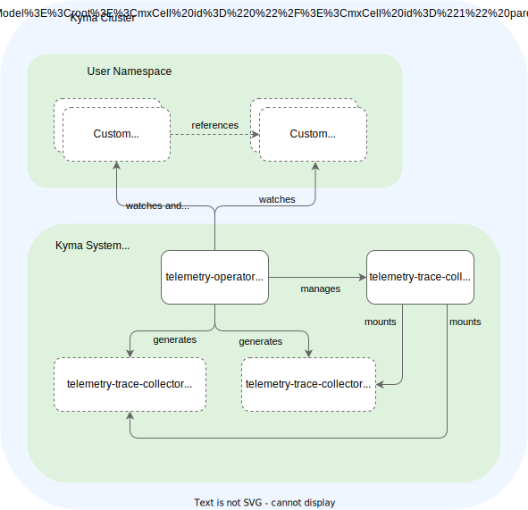

# Traces

Observability tools aim to show the big picture, no matter if you're monitoring just a few or many components. In a cloud-native microservice architecture, a user request often flows through dozens of different microservices. Logging and monitoring tools help to track the request's path. However, they treat each component or microservice in isolation. This individual treatment results in operational issues.

[Distributed tracing](https://opentelemetry.io/docs/concepts/observability-primer/#understanding-distributed-tracing) charts out the transactions in cloud-native systems, helping you to understand the application behavior and relations between the frontend actions and backend implementation.

The diagram shows how distributed tracing helps to track the request path:


## Prerequisites

For a complete recording of a distributed trace, it is [essential](https://www.w3.org/TR/trace-context/#problem-statement) that every involved component is at least propagating the trace context. In Kyma, all components involved in users' requests support the [W3C Trace Context protocol](https://www.w3.org/TR/trace-context), which is a vendor-neutral protocol gaining more and more support by all kinds of vendors and tools. The involved Kyma components are mainly Istio, Serverless, and Eventing.

With that, your application must also propagate the W3C Trace Context for any user-related activity. This can be achieved easily using the [Open Telemetry SDKs](https://opentelemetry.io/docs/instrumentation/) available for all common programming languages. If an application follows that guidance and is part of the Istio Service Mesh, it's already outlined with dedicated span data in the trace data collected by the Kyma telemetry setup.

Furthermore, an application should enrich a trace with additional span data and send these data to the cluster-central telemetry services. That can also be achieved with the help of the mentioned [Open Telemetry SDKs](https://opentelemetry.io/docs/instrumentation/).

## Architecture

The Telemetry module provides an in-cluster central deployment of an [OTel Collector](https://opentelemetry.io/docs/collector/) acting as a gateway. The gateway exposes endpoints for the OTLP protocol for GRPC and HTTP-based communication using the dedicated `telemetry-otlp-traces` service, where all Kyma components and users' applications should send the trace data to.


1. An end-to-end request is triggered and populates across the distributed application. Every involved component propagates the trace context using the [W3C Trace Context](https://www.w3.org/TR/trace-context/) protocol.
2. The involved components that have contributed a new span to the trace send the related span data to the trace gateway using the `telemetry-otlp-traces` service. The communication happens based on the [OTLP](https://github.com/open-telemetry/opentelemetry-specification/blob/main/specification/protocol/otlp.md) protocol either using GRPC or HTTP.
1. The trace gateway enriches the span data with relevant metadata, typical for sources running on Kubernetes, like Pod identifiers.
1. With the `TracePipeline` resource, the trace gateway is configured with a target backend.
1. The backend can run in-cluster.
1. The backend can also run out-cluster, if authentication has been set up.
1. The trace data can be consumed using the backend system.

### OTel Collector
The OTel Collector comes with a [concept](https://opentelemetry.io/docs/collector/configuration/) of pipelines consisting of receivers, processors, and exporters, with which you can flexibly plug pipelines together. Kyma's TracePipeline provides a hardened setup of an OTel Collector and also abstracts the underlying pipeline concept. Such abstraction has the following benefits:
- Supportability - all features are tested and supported
- Migratability - smooth migration experiences when switching underlying technologies or architectures
- Native Kubernetes support - API provided by Kyma allows for an easy integration with Secrets, for example, served by the SAP BTP Operator. The Telemetry Operator takes care of the full lifecycle.
- Focus - the user doesn't need to understand underlying concepts

The downside is that only a limited set of features is available. If you want to avoid this downside, bring your own collector setup. The current feature set focuses on providing the full configurability of backends integrated by OTLP. As a next step, meaningful filter options will be provided, especially head- and tail-based sampling configurations.

### Telemetry Manager
The TracePipeline resource is managed by the Telemetry Manager, a typical Kubernetes operator responsible for managing the custom parts of the OTel Collector configuration.



The Telemetry Manager watches all TracePipeline resources and related Secrets. Whenever the configuration changes, it validates the configuration and generates a new configuration for the OTel Collector, where a ConfigMap for the configuration is generated. Referenced Secrets are copied into one Secret that is mounted to the OTel Collector as well.
Furthermore, the manager takes care of the full lifecycle of the OTel Collector Deployment itself. Only if there is a TracePipeline defined, the collector is deployed. At anytime, you can opt out of using the tracing feature by not specifying a TracePipeline.

## Setting up a TracePipeline

In the following steps, you can see how to set up a typical TracePipeline. For an overview of all available attributes, see the [reference document](./resources/04-tracepipeline.md).

### Step 1. Create a TracePipeline with an output
1. To ship traces to a new OTLP output, create a resource file of the kind `TracePipeline`:

   ```yaml
   apiVersion: telemetry.kyma-project.io/v1alpha1
   kind: TracePipeline
   metadata:
     name: jaeger
   spec:
     output:
       otlp:
         endpoint:
           value: http://jaeger-collector.jaeger.svc.cluster.local:4317
   ```

   This configures the underlying OTel Collector with a pipeline for traces. The receiver of the pipeline will be of the OTLP type and be accessible using the `telemetry-otlp-traces` service. As an exporter, an `otlp` or an `otlphttp` exporter is used, dependent on the configured protocol.

2. To create the instance, apply the resource file in your cluster:
    ```bash
    kubectl apply -f path/to/my-trace-pipeline.yaml
    ```

3. Check that the status of the TracePipeline in your cluster is `Ready`:
    ```bash
    kubectl get tracepipeline
    NAME              STATUS    AGE
    http-backend      Ready     44s
    ```

### Step 2. Enable Istio tracing

>**CAUTION:** The provided Istio feature uses an API in alpha state, which may change in future releases.

By default, the tracing feature of the Istio module is disabled to avoid increased network utilization if there is no TracePipeline.
To activate the Istio tracing feature with a sampling rate of 5% (for recommendations, see [Istio](#istio)), use a resource similar to the following:

```yaml
apiVersion: telemetry.istio.io/v1alpha1
kind: Telemetry
metadata:
  name: tracing-default
  namespace: istio-system
spec:
  tracing:
  - providers:
    - name: "kyma-traces"
  randomSamplingPercentage: 5.00
```

### Step 3. Switch the protocol to HTTP

To use the HTTP protocol instead of the default GRPC, use the `protocol` attribute and ensure that the proper port is configured as part of the endpoint. Typically, port `4317` is used for GRPC and port `4318` for HTTP.
```yaml
apiVersion: telemetry.kyma-project.io/v1alpha1
kind: TracePipeline
metadata:
  name: jaeger
spec:
  output:
    otlp:
      protocol: http
      endpoint:
        value: http://jaeger-collector.jaeger.svc.cluster.local:4318
```

### Step 4: Add authentication details

To integrate with external systems, you must configure authentication details. At the moment, Basic Authentication and custom headers are supported.

<div tabs>
  <details>
    <summary>Basic authentication</summary>

  ```yaml
  apiVersion: telemetry.kyma-project.io/v1alpha1
  kind: TracePipeline
  metadata:
    name: jaeger
  spec:
    output:
      otlp:
        endpoint:
          value: http://jaeger-collector.jaeger.svc.cluster.local:4317
        authentication:
          basic:
            user:
              value: myUser
            password:
              value: myPwd
  ```
  </details>
  <details>
    <summary>Token-based with custom headers</summary>

  ```yaml
  apiVersion: telemetry.kyma-project.io/v1alpha1
  kind: TracePipeline
  metadata:
    name: jaeger
  spec:
    output:
      otlp:
        endpoint:
          value: http://jaeger-collector.jaeger.svc.cluster.local:4317
        headers:
          - name: Authorization
            value: "Bearer myToken"
  ```
  </details>
</div>

### Step 5: Add authentication details from Secrets

Integrations into external systems usually require authentication details dealing with sensitive data. To handle that data properly in Secrets, TracePipeline supports the reference of Secrets.

Use the **valueFrom** attribute to map Secret keys as in the following examples:

<div tabs>
  <details>
    <summary>Basic authentication</summary>
      
  ```yaml
  apiVersion: telemetry.kyma-project.io/v1alpha1
  kind: TracePipeline
  metadata:
    name: jaeger
  spec:
    output:
      otlp:
        endpoint:
          valueFrom:
              secretKeyRef:
                  name: backend
                  namespace: default
                  key: endpoint
        authentication:
          basic:
            user:
              valueFrom:
                secretKeyRef:
                  name: backend
                  namespace: default
                  key: user
            password:
              valueFrom:
                secretKeyRef:
                  name: backend
                  namespace: default
                  key: password
  ```
</details>
  <details>
    <summary>Token-based with custom headers</summary>

  ```yaml
  apiVersion: telemetry.kyma-project.io/v1alpha1
  kind: TracePipeline
  metadata:
    name: jaeger
  spec:
    output:
      otlp:
        endpoint:
          value: http://jaeger-collector.jaeger.svc.cluster.local:4317
        headers:
          - name: Authorization
            valueFrom:
              secretKeyRef:
                  name: backend
                  namespace: default
                  key: token 
  ```
  </details>
</div>

The related Secret must have the referenced name and needs to be located in the referenced Namespace, and contain the mapped key as in the following example:

```yaml
kind: Secret
apiVersion: v1
metadata:
  name: backend
  namespace: default
stringData:
  endpoint: https://myhost:4317
  user: myUser
  password: XXX
  token: Bearer YYY
```

### Step 6: Rotate the Secret

The Telemetry Manager continuously watches the Secret referenced with the **secretKeyRef** construct. You can update the Secret’s values, and the Telemetry Manager detects the changes and applies the new Secret to the setup.
If you use a Secret owned by the [SAP BTP Operator](https://github.com/SAP/sap-btp-service-operator), you can configure an automated rotation using a `credentialsRotationPolicy` with a specific `rotationFrequency` and don’t have to intervene manually.

## Kyma Components with tracing capabilities

Kyma bundles several modules which are potentially involved in user flows. Applications involved in a distributed trace must propagate the trace context to keep the trace complete. Optionally, they can enrich the trace with custom spans, which requires reporting them to the backend.

### Istio

The Istio module is crucial in distributed tracing because it provides the [ingress gateway](https://istio.io/latest/docs/tasks/traffic-management/ingress/ingress-control/). Usually, this is where external requests enter the cluster scope and are enriched with trace context if it hasn't happened yet. Furthermore, every component that's part of the Istio Service Mesh runs an Istio proxy, which propagates the context properly but also creates span data. If Istio tracing is activated and taking care of trace propagation in your application, you get a complete picture of a trace, because every component automatically contributes span data. Also, Istio tracing is pre-configured to be based on the vendor-neutral [w3c-tracecontext](https://www.w3.org/TR/trace-context/) protocol.

>**CAUTION:** The provided Istio feature uses an API in alpha state, which may change in future releases.

 The Istio module is configured with an [extension provider](https://istio.io/latest/docs/tasks/observability/telemetry/) called `kyma-traces`. To activate the provider on the global mesh level using the Istio [Telemetry API](https://istio.io/latest/docs/reference/config/telemetry/#Tracing), place a resource to the `istio-system` Namespace.

<div tabs name="Configure Istio traces" group="configuration-options">
  <details>
  <summary label="extension-provider">
  Set up extension provider
  </summary>
    The following example configures all Istio proxies with the `kyma-traces` extension provider, which, by default, reports span data to the trace gateway of the Telemetry module.
  
  ```yaml
  apiVersion: telemetry.istio.io/v1alpha1
  kind: Telemetry
  metadata:
    name: tracing-default
    namespace: istio-system
  spec:
    tracing:
    - providers:
      - name: "kyma-traces"
  ```

  </details>
  <details>
  <summary label="sampling-rate">
  Set sampling rate
  </summary>
  By default, the sampling rate is configured to 1 percent. That means that only 1 trace out of 100 traces is reported to the trace gateway, and all others are dropped. Hereby, the sampling decision itself is propagated as part of the [trace context](https://www.w3.org/TR/trace-context/#sampled-flag) so that either all involved components are reporting the span data of a trace, or none. Increasing the sampling rate results in much higher network utilization in the cluster and also increases the amount of data sent to your tracing backend. Usually, a very low percentage of around 5% is used in a production setup to reduce costs and performance impacts.

  To configure an "always-on" sampling, configure a sampling rate of 100%:

  ```yaml
  apiVersion: telemetry.istio.io/v1alpha1
  kind: Telemetry
  metadata:
    name: tracing-default
    namespace: istio-system
  spec:
    tracing:
    - providers:
      - name: "kyma-traces"
        randomSamplingPercentage: 100.00
  ```

  </details>
  <details>
  <summary label="namespaces-workload-settings">
  Configure single Namespaces or workloads
  </summary>
  Namespaces or workloads can selectively be configured with individual settings by placing further resources. If you don't want to report spans at all for a specific workload, activate the `disableSpanReporting` flag with the selector expression.

```yaml
apiVersion: telemetry.istio.io/v1alpha1
kind: Telemetry
metadata:
  name: tracing-default
  namespace: my-namespace
spec:
  selector:
    matchLabels:
      kubernetes.io/name: "my-app"
  tracing:
  - providers:
    - name: "kyma-traces"
    randomSamplingPercentage: 100.00
```

  </details>
  <details>
  <summary label="trace-context-only">
  Collect trace context without spans
  </summary>
  
  To enable the propagation of the [w3c-tracecontext](https://www.w3.org/TR/trace-context/) only, without reporting any spans (so the actual tracing feature is disabled), you must enable the `kyma-traces` provider with a sampling rate of 0. With this configuration, you get the relevant trace context into the [access logs](https://kyma-project.io/docs/kyma/latest/04-operation-guides/operations/obsv-03-enable-istio-access-logs/) without any active trace reporting.

  ```yaml
  apiVersion: telemetry.istio.io/v1alpha1
  kind: Telemetry
  metadata:
    name: tracing-default
    namespace: istio-system
  spec:
    tracing:
    - providers:
      - name: "kyma-traces"
      randomSamplingPercentage: 0
  ```

  </details>
</div>

### Eventing
The Kyma [Eventing](https://kyma-project.io/docs/kyma/latest/01-overview/main-areas/eventing/) component dispatches events from an in- or out-cluster backend to your workload. It leverages the [CloudEvents](https://cloudevents.io/) protocol, which natively supports the [W3C Trace Context](https://www.w3.org/TR/trace-context) propagation. That said, the Eventing component already propagates trace context properly but does not enrich a trace with more advanced span data.

### Serverless
By default, all engines for the [Serverless](https://kyma-project.io/docs/kyma/latest/01-overview/main-areas/serverless/) module integrate the [Open Telemetry SDK](https://opentelemetry.io/docs/reference/specification/metrics/sdk/). With that, trace propagation no longer is your concern, because the used middlewares are configured to automatically propagate the context for chained calls. Because the Telemetry endpoints are configured by default, Serverless also reports custom spans for incoming and outgoing requests. With the provided [tooling](https://kyma-project.io/docs/kyma/latest/03-tutorials/00-serverless/svls-12-customize-function-traces/), you can add more spans as part of your Serverless source code.

## Limitations

The trace gateway setup is designed using the following assumptions:
- The collector has no autoscaling options yet and has a limited resource setup of 1 CPU and 1 GiB memory.
- Batching is enabled, and a batch will contain up to 512 Spans/batch.
- An unavailability of a destination must be survived for 5 minutes without direct loss of trace data.
- An average span consists of 40 attributes with 64 character length.

This leads to the following limitations:
### Throughput
The maximum throughput is 4200 span/sec ~= 15.000.000 spans/hour. If more data must be ingested, it can result in a refusal of more data.

### Unavailability of output
For up to 5 minutes, a retry for data is attempted when the destination is unavailable. After that, data is dropped.

### No guaranteed delivery
The used buffers are volatile. If the OTel collector instance crashes, trace data can be lost.

### Single TracePipeline support

Only one TracePipeline resource at a time is supported at the moment.

### System span filtering
System-related spans reported by Istio are filtered out without the opt-out option. Here are a few examples of such spans:
- `/healthz` endpoint of a component deployed in the `kyma-system` Namespace
- `/metrics` endpoint of a component deployed in the `kyma-system` Namespace
- All outgoing spans reported by Grafana and Jaeger
- All spans related to Fluent Bit and Loki communication

## Troubleshooting

- Symptom: Traces are not arriving at the destination at all.

   Cause: That might be due to {add reasons}.

   Remedy: Investigate the cause with the following steps:
   1. Check the `telemetry-trace-collector` Pods for error logs by calling `kubectl logs -n kyma-system {POD_NAME}`.
   1. In the monitoring dashboard for Kyma Telemetry, check if the data is exported.
   1. Verify that you activated Istio tracing.

- Symptom: Custom spans don't arrive at the destination, but Istio spans do.

   Cause: Your SDK version is incompatible with the OTel collector version.
   
   Remedy:
   1. Check which SDK version you are using for instrumentation. 
   1. Investigate whether it is compatible with the OTel collector version.
   1. If required, upgrade to a supported SDK version.
