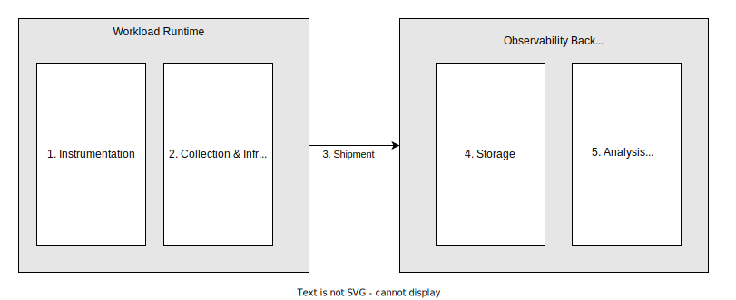
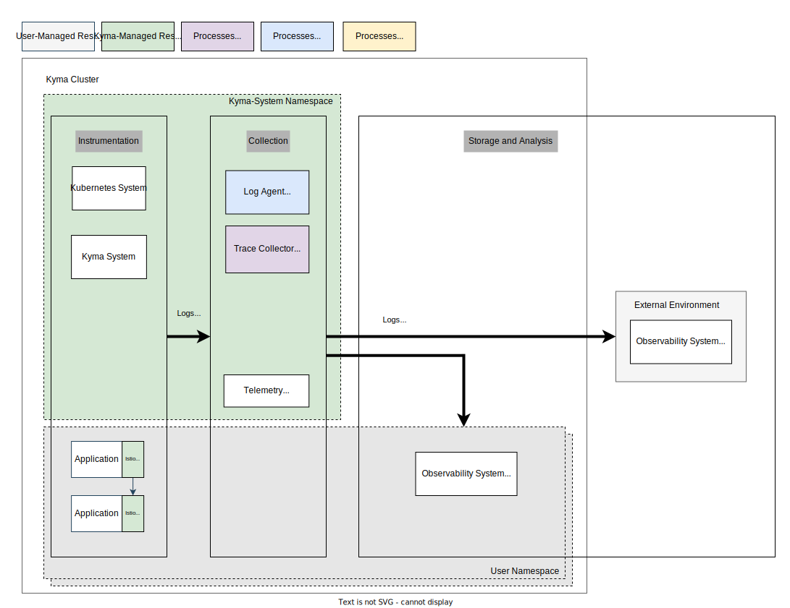

# Kyma Telemetry Module

Fundamentally, ["Observability"](https://opentelemetry.io/docs/concepts/observability-primer/) is a measure of how well the application's external outputs can reflect the internal states of single components. The insights that an application and the surrounding infrastructure expose are displayed in the form of metrics, traces, and logs - collectively, that's called "telemetry" or ["signals"](https://opentelemetry.io/docs/concepts/signals/). These can be exposed by employing modern instrumentation.

In order to implement Day-2 operations for a distributed application running in a container runtime, the single components of an application must expose these signals by employing modern instrumentation. Furthermore, the signals must be collected and enriched with the infrastructural metadata in order to ship them to a target system.

There are plenty of observability backends available either as a service or as a self-manageable solution focusing on different aspects and scenarios. One approach will never fit all requirements, and the need to integrate with a specific backend will always be present. That's why Kyma supports you with instrumenting and shipping your telemetry data easily in a vendor-neutral way to enable observability for your application with little effort by integrating it into existing backends. These aspects must happen alongside your application, and managed tooling with guidance can benefit your initial investment and maintenance effort. Also, Kyma does not focus on providing a managed in-cluster backend solution, because a solution for an enterprise-grade setup demands a central out-cluster solution.

The Telemetry module focuses exactly on the aspects of instrumentation, collection, and shipment that happen in the runtime and explicitly defocuses on backends. If you want to install lightweight in-cluster backends for demo or development purposes, check the [tutorials](05-tutorials.md).

## Features

The Telemetry module enables your application with the telemetry support by providing the following:

- Guidance for the instrumentation: Based on [Open Telemetry](https://opentelemetry.io/), community samples are provided on how to instrument your code using the [Open Telemetry SDKs](https://opentelemetry.io/docs/instrumentation/) in nearly every programming language.
- Tooling for collection, filtering, and shipment: Based on the [Open Telemetry Collector](https://opentelemetry.io/docs/collector/), you can configure basic pipelines to filter and ship telemetry data.
- Integration in a vendor-neutral way to a vendor-specific observability system: Based on the [OpenTelemetry protocol (OTLP)](https://opentelemetry.io/docs/reference/specification/protocol/), you can integrate backend systems.
- Opt-out from features for advanced scenarios: At any time, you can opt out for each data type, and use custom tooling to collect and ship the telemetry data.
- SAP BTP as first-class integration: Integration into BTP Observability services is prioritized.
- Enterprise-grade qualities: The setup is battle-tested and satisfies typical development standards.

## Scope

The Telemetry module focuses only on the signals of application logs, distributed traces, and metrics. Other kinds of signals are not considered. Also, logs like audit logs or operational logs are not in scope.

Supported integration scenarios are neutral to the vendor of the target system.

Currently, logs are based on the Fluent Bit protocol. If you're curious about the progress to switch to the vendor-neutral OTLP protocol, follow this [epic](https://github.com/kyma-project/kyma/issues/16307).

## Components

### Telemetry Manager

The module ships the Telemetry Manager as its core component. The manager implements the Kubernetes controller pattern and manages the whole lifecycle of all other components covered in the module. The manager watches for LogPipeline, TracePipeline, and MetricPipeline resources created by the user. With these, the user describes in a declarative way what data of a signal type to collect and where to ship it.
If the operator detects a configuration, it rolls out the relevant collector components on demand.
You can find more details about the manager on the [manager](./01-manager.md) page.

### Log Agent

The log agent is based on a [Fluent Bit](https://fluentbit.io/) installation running as a [DaemonSet](https://kubernetes.io/docs/concepts/workloads/controllers/daemonset/). It reads all containers' logs in the runtime and ships them according to a LogPipeline configuration. For details, see [Logs](./02-logs.md).

### Trace Gateway

The trace gateway is based on a [OTel Collector](https://opentelemetry.io/docs/collector/) [Deployment](https://kubernetes.io/docs/concepts/workloads/controllers/deployment/). It provides an [OTLP-based](https://opentelemetry.io/docs/reference/specification/protocol/) endpoint to which applications can push the trace signals. According to a TracePipeline configuration, the collector processes and ships the trace data to a target system. For details, see [Traces](./03-traces.md).

### Metric Gateway/Agent

The metric gateway and agent is based on a [OTel Collector](https://opentelemetry.io/docs/collector/) [Deployment](https://kubernetes.io/docs/concepts/workloads/controllers/deployment/) and a [DaemonSet](https://kubernetes.io/docs/concepts/workloads/controllers/daemonset/). It provides an [OTLP-based](https://opentelemetry.io/docs/reference/specification/protocol/) endpoint where applications can push the metric signals. Also provides scraping of annotated prometheus based workloads. According to a MetricPipeline configuration, the collector will process and ship the metric data to a target system. More details can be found in the detailed section about [Traces](./04-metrics.md).

## API / Custom Resource Definitions

- [Telemetry](./resources/01-telemetry.md)
- [LogPipeline](./resources/02-logpipeline.md)
- [LogParser](./resources/03-logparser.md)
- [TracePipeline](./resources/04-tracepipeline.md)
- [MetricPipeline](./resources/05-metricpipeline.md)
