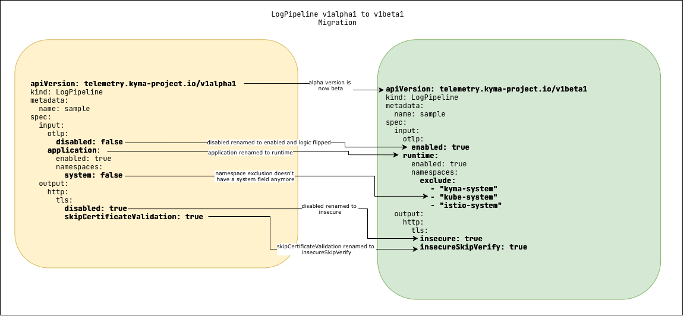
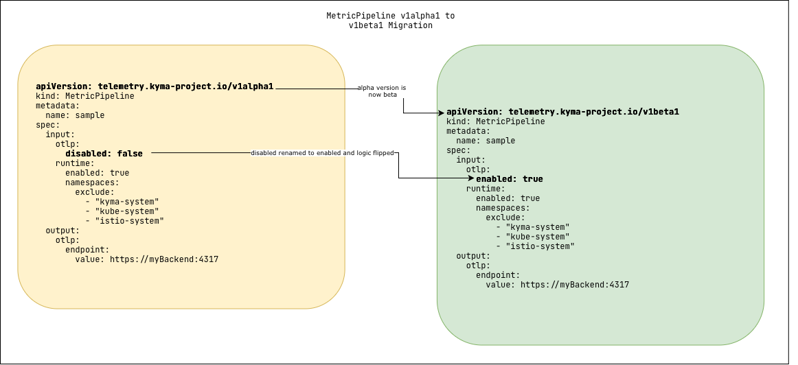

# Migrate Telemetry Pipelines to v1beta1

The Telemetry module now uses the stable v1beta1 API for pipeline resources. In some cases, you must update your pipeline manifests to use the new API version.

## Context

If your pipelines are already running in the cluster and you don't store their manifests, you don't have to take any action. The Telemetry module automatically migrates existing your pipeline resources to v1beta1.

> **Tip:** If you're unsure what your existing pipeline looks like in `v1beta1`, you can fetch the converted resource directly from your cluster:
> the converted resource directly from your cluster:
> ```bash
> kubectl get logpipeline <name> -o yaml
> kubectl get metricpipeline <name> -o yaml
> kubectl get tracepipeline <name> -o yaml
> ```


If you manage your Telemetry pipeline resources declaratively, you must manually adjust them; for example, in the following cases:
- Use GitOps, CI/CD, or tools like Argo CD to deploy your pipelines
- Store pipeline manifests in a Git repository that you re-apply
- Plan to create new pipelines and want to use the v1beta1 API

## Context

This migration involves breaking changes. To align your pipeline manifests with the new version, you must update the **apiVersion**, rename several fields, and, for LogPipeline, adjust how you configure namespace selection. The migration from v1alpha1 and v1beta1 mostly affects LogPipeline and MetricPipeline. For TracePipeline, only the **apiVersion** changes.




To identify the required updates for your manifests, review the breaking changes in the following table:

| Pipeline                    | v1alpha1 Field                                 | v1beta1 Field                           | Migration Action                                                     |
|-----------------------------|------------------------------------------------|-----------------------------------------|----------------------------------------------------------------------|
| LogPipeline, MetricPipeline | spec.input.otlp.disabled                       | spec.input.otlp.enabled                 | Rename the field and invert the boolean value (e.g., false -> true). |
| LogPipeline                 | spec.input.application                         | spec.input.runtime                      | Rename the field.                                                    | 
| LogPipeline                 | spec.input.application.namespaces.system       | (Removed)                               | To include system namespaces, use spec.input.runtime.namespaces: {}. |
| LogPipeline                 | spec.output.http.tls.disabled                  | spec.output.http.tls.insecure           | Rename the field.                                                    |
| LogPipeline                 | spec.output.http.tls.skipCertificateValidation | spec.output.http.tls.insecureSkipVerify | Rename the field.                                                    |


## Prerequisites

- You have an active Kyma cluster with the Telemetry module added.
- You have one or more Telemetry pipeline that use the `telemetry.kyma-project.io/v1alpha1` API.

## Procedure

1. In each of your LogPipeline, MetricPipeline, and TracePipeline YAML files, change the **apiVersion** to `telemetry.kyma-project.io/v1beta1`.

2. For LogPipeline and MetricPipeline resources, find and replace the fields that were renamed in v1beta1.
   1. Update the OTLP input field:
      - **spec.input.otlp.disabled** becomes **spec.input.otlp.enabled**.
      - You must also invert the boolean value (for example, `disabled: false` becomes `enabled: true`).

   2. For LogPipeline resources, also update the following fields:
      - **spec.input.application** becomes **spec.input.runtime**.
      - In the http output, **spec.output.http.tls.disabled** becomes **spec.output.http.tls.insecure**.
      - In the http output, **spec.output.http.tls.skipCertificateValidation** becomes **spec.output.http.tls.insecureSkipVerify**.

3.  For LogPipeline resources, if you want to include system namespaces for application logs, update the system namespace selection.
   By default, system namespaces are excluded (as in v1alpha1), but v1beta1 removes the **spec.input.application.namespaces.system** field. To include application logs from system namespaces (like `kyma-system`), you must now provide an empty object (`{}`) for the **namespaces** selector. For details, see [Filter Application Logs by Namespace](https://kyma-project.io/external-content/telemetry-manager/docs/user/filter-and-process/filter-logs.html#filter-application-logs-by-namespace).
   ```yaml
   spec:
    input:
      runtime:
        enabled: true
        namespaces: {}  # This includes system namespaces
   ```

4. Validate and apply your updated configuration with kubectl.

## Result
Your pipelines are now updated to the v1beta1 API. The Telemetry module begins using the new configuration.

To confirm the migration was successful, check the status conditions of your new pipelines. A healthy pipeline shows `True` for all conditions.
