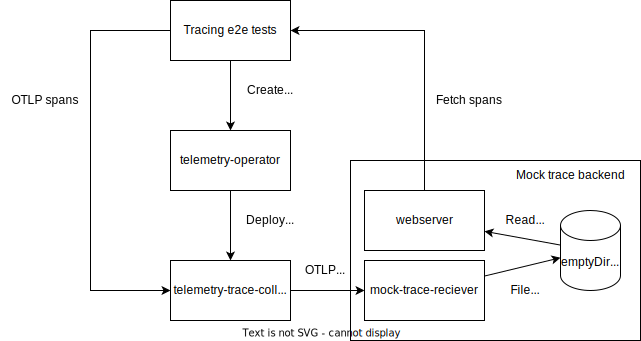

# End-to-end Tests

## Tracing

Tracing tests deploy a `TracePipeline`, which ships traces to a mock backend. The tests then use OpenTelemetry SDK to produce spans and send them to the trace gateway. The mock backend is another OpenTelemetry collector with a file exporter and an OTLP receiver. All received spans are written to a [JSON Lines](https://jsonlines.org) file. The received trace data is exposed using a webserver sidecar container and can be fetched and parsed by the tests.

### Exposing Internal Services

In order to send, receive, and analyze traces, the test must expose internal in-cluster services. Currently, it's done using `NodePort` services and k3d host port mapping. 
This approach is very easy to implement. However, it has a few major drawbacks and must be rethought:
* `NodePort` service exposure will only work on k3d and not on public cloud (Gardener).
* One must always keep a mind map with port map in their head. For every new internal service, a few places in the code must be updated.

#### Port Mapping

| Service                        | Container Port | Service Port | Node Port | Host Port |
|--------------------------------|----------------|--------------|-----------|-----------|
 | Trace gateway OTLP (grpc)    | 4317           | 4317         | 30017     | 4317      |
 | Trace gateway metrics (http) | 8888           | 8888         | 30088     | 8888      |    
| Webservice (http)              | 80             | 80           | 30090     | 9090      | 
